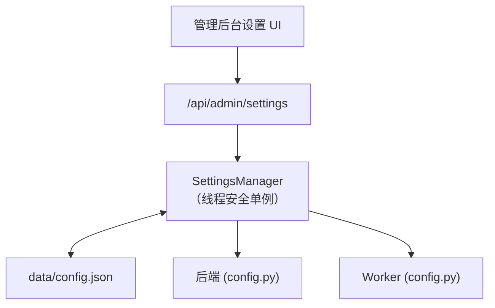

# 配置

所有配置存储在单个 JSON 文件（`data/config.json`）中，通过**管理后台设置**页面管理。无 `.env` 文件，无环境变量。

## 工作原理



`SettingsManager`（位于 `app/core/settings_manager.py`）是线程安全的 JSON 配置存储：

1. 首次访问时加载 `data/config.json`（如不存在则自动创建默认配置）。
2. 所有读取通过 `get("section.key")` 点分路径访问。
3. 所有写入立即持久化到磁盘。
4. 后端和 Worker 读取**同一个** `data/config.json`。

## 配置项

### IBKR Flex

| 键 | 默认值 | 描述 |
|----|--------|------|
| `ibkr.flex_token` | `""` | IBKR Flex Web Service 令牌。 |
| `ibkr.flex_query_ids` | `"1532356,1532359"` | 逗号分隔的 Flex 查询 ID。 |
| `ibkr.flex_base_url` | `https://www.interactivebrokers.com/AccountManagement/FlexWebService` | Flex API 基础 URL。 |
| `ibkr.flex_poll_interval_seconds` | `10` | 轮询重试间隔秒数。 |
| `ibkr.flex_max_poll_retries` | `60` | 最大轮询尝试次数。 |

### LLM

| 键 | 默认值 | 描述 |
|----|--------|------|
| `llm.api_key` | `""` | LLM 提供商的 API 密钥。 |
| `llm.base_url` | `https://api.openai.com/v1` | 聊天完成端点的基础 URL。 |
| `llm.default_model` | `gpt-4o` | 默认模型名称。 |
| `llm.temperature` | `0.1` | 采样温度。 |
| `llm.max_tokens` | `8192` | 最大响应 token 数。 |
| `llm.bls_api_key` | `""` | BLS API 密钥（经济数据）。 |

:::tip
任何 OpenAI 兼容 API 都可以使用。设置 `llm.base_url` 和 `llm.api_key` 即可使用 DeepSeek、Xiaomi MiMo 或自托管模型等提供商。
:::

### 调度器

| 键 | 默认值 | 描述 |
|----|--------|------|
| `scheduler.enabled` | `true` | 启用后台调度器。 |
| `scheduler.hour` | `12` | 运行每日任务的小时。 |
| `scheduler.minute` | `30` | 运行每日任务的分钟。 |
| `scheduler.timezone` | `Asia/Shanghai` | 调度器时区。 |

### 认证

| 键 | 默认值 | 描述 |
|----|--------|------|
| `auth.username` | `admin` | 登录用户名。 |
| `auth.password` | `""` | 密码。**留空则禁用认证。** |
| `auth.cookie_secure` | `false` | 会话 Cookie 是否需要 HTTPS。当 `advanced.app_env` 为 `production` 时自动设为 `true`。 |

### 邮件

| 键 | 默认值 | 描述 |
|----|--------|------|
| `email.smtp_host` | `""` | SMTP 服务器主机。 |
| `email.smtp_port` | `587` | SMTP 服务器端口。 |
| `email.smtp_username` | `""` | SMTP 用户名。 |
| `email.smtp_password` | `""` | SMTP 密码。 |
| `email.from_address` | `""` | 发件人邮箱地址。 |
| `email.to_addresses` | `[]` | 收件人邮箱地址列表。 |
| `email.enabled` | `false` | 启用邮件通知。 |

### Longbridge（可选）

| 键 | 默认值 | 描述 |
|----|--------|------|
| `longbridge.app_key` | `""` | Longbridge API app key。 |
| `longbridge.app_secret` | `""` | Longbridge API app secret。 |
| `longbridge.access_token` | `""` | Longbridge 访问令牌。 |

### 高级

| 键 | 默认值 | 描述 |
|----|--------|------|
| `advanced.app_name` | `"IBKR Dash"` | 应用显示名称。 |
| `advanced.app_env` | `"development"` | 环境名称。 |
| `advanced.debug` | `false` | 启用调试模式。 |
| `advanced.sqlite_path` | `"data/ibkr_dash.db"` | SQLite 数据库路径。 |
| `advanced.log_level` | `"INFO"` | 日志级别。 |
| `advanced.cors_origins` | `"http://localhost:5173"` | 允许的 CORS 来源。 |
| `advanced.data_dir` | `"data/flex_exports"` | Flex 数据导出目录。 |
| `advanced.cache_ttl_seconds` | `86400` | 内存缓存 TTL（24 小时）。 |
| `advanced.audit_llm_calls` | `false` | 记录所有 LLM API 调用。 |

### Worker

| 键 | 默认值 | 描述 |
|----|--------|------|
| `worker.backend_base_url` | `"http://localhost:8000"` | Worker 调用后端的 URL。 |
| `worker.daily_review_internal_token` | `""` | 触发每日回顾的内部令牌。 |

## 编辑配置

### 通过管理后台 UI（推荐）

在 Web 界面中导航到**管理 → 设置**。更改立即生效，无需重启。

### 通过 API

```bash
# 读取所有配置
curl -b cookies.txt http://localhost:8000/api/admin/settings

# 更新单个值
curl -b cookies.txt -X PATCH http://localhost:8000/api/admin/settings \
  -H "Content-Type: application/json" \
  -d '{"updates": {"llm.default_model": "gpt-4o-mini"}}'

# 重置为默认值
curl -b cookies.txt -X POST http://localhost:8000/api/admin/settings/reset/llm.default_model
```

### 通过文件（紧急情况）

直接编辑 `data/config.json`，然后重启后端。JSON 结构与上面的点分路径键一致。

## 最佳实践

### 开发

```json
{
  "advanced": { "app_env": "development", "debug": true },
  "auth": { "password": "" }
}
```

### 生产

```json
{
  "advanced": { "app_env": "production", "debug": false, "cors_origins": "https://your-domain.com" },
  "auth": { "password": "strong-random-secret", "cookie_secure": true }
}
```

:::warning
在生产环境中，始终设置强 `auth.password` 并将 `advanced.cors_origins` 限制为您的实际域名。永远不要在生产环境中留下 `debug: true`。
:::
