# 数据库

IBKR Dash 后端使用 **SQLite** 作为唯一数据存储。后端（读取）和 Worker（写入）共享同一个 `.db` 文件。

## 模式概览

数据库包含 **16 张表**，分为四组：

### 金融数据（由 Worker 写入）

这些表存储从 Flex CSV/XML 报告导入的原始 IBKR 数据。

| 表名 | 用途 | 冲突键 |
|------|------|--------|
| `account_snapshots` | 每日账户级权益、现金和资产细分。 | `(account_id, report_date)` |
| `position_snapshots` | 每代码持仓快照（数量、价格、盈亏）。 | `(account_id, report_date, symbol)` |
| `trade_records` | 单个交易执行（仅追加）。 | `(account_id, trade_date, symbol, trade_id)` |
| `cash_flows` | 存款、取款、股息和其他现金变动。 | -- |
| `price_history` | 每代码的每日 OHLC 价格数据。 | `(account_id, report_date, symbol)` |

### AI 代理输出（由后端写入）

| 表名 | 用途 | 主键 |
|------|------|------|
| `trade_reviews` | AI 生成的交易回顾结果 (JSON)。 | `id` (UUID) |
| `trade_decisions` | AI 生成的交易决策分析 (JSON)。 | `id` (UUID) |
| `daily_position_reviews` | AI 生成的每日投资组合审查 (JSON)。 | `id` (UUID) |
| `risk_assessments` | AI 生成的风险评估报告 (JSON)。 | `id` (UUID) |

### 代理基础设施

| 表名 | 用途 |
|------|------|
| `agent_prompts` | AI 代理的版本控制提示词模板。 |
| `agent_tasks` | 后台任务跟踪（状态、进度、结果）。 |
| `copilot_sessions` | 账户 Copilot 的聊天会话。 |
| `copilot_messages` | Copilot 会话中的单条消息。 |
| `copilot_memories` | Copilot 对话中提取的持久记忆。 |

### 配置

| 表名 | 用途 |
|------|------|
| `admin_settings` | 管理配置的键值存储（IBKR 令牌、邮件设置）。 |

## 完整 ER 图

此图显示所有 16 张表的列和关系：

```mermaid
erDiagram
    account_snapshots {
        INTEGER id PK
        TEXT account_id
        TEXT report_date
        TEXT currency
        REAL total_equity
        REAL cash
        REAL stock_value
        REAL options_value
        REAL cnav_mtm
        REAL cnav_twr
        REAL fifo_total_realized_pnl
        REAL fifo_total_unrealized_pnl
    }

    position_snapshots {
        INTEGER id PK
        TEXT account_id FK
        TEXT report_date
        TEXT symbol
        TEXT asset_class
        TEXT currency
        REAL quantity
        REAL mark_price
        REAL position_value
        REAL average_cost_price
        REAL fifo_pnl_unrealized
        REAL total_unrealized_pnl
        REAL total_realized_pnl
        REAL percent_of_nav
        REAL previous_day_change_percent
    }

    trade_records {
        INTEGER id PK
        TEXT account_id FK
        TEXT symbol
        TEXT trade_date
        TEXT trade_id
        TEXT buy_sell
        TEXT asset_class
        TEXT currency
        REAL quantity
        REAL trade_price
        REAL net_cash
        REAL fifo_pnl_realized
        REAL commission
    }

    cash_flows {
        INTEGER id PK
        TEXT account_id FK
        TEXT currency
        TEXT symbol
        TEXT date_time
        REAL amount
        TEXT flow_type
        TEXT flow_direction
        TEXT description
    }

    price_history {
        INTEGER id PK
        TEXT account_id FK
        TEXT report_date
        TEXT symbol
        REAL close_price
        REAL open_price
        REAL high_price
        REAL low_price
    }

    trade_reviews {
        TEXT id PK
        TEXT review_type
        TEXT symbol
        TEXT review_output
        TEXT evidence_summary
        TEXT run_trace
        TEXT created_at
    }

    trade_decisions {
        TEXT id PK
        TEXT decision_type
        TEXT symbol
        TEXT decision_output
        TEXT evidence_summary
        TEXT run_trace
        TEXT created_at
    }

    daily_position_reviews {
        TEXT id PK
        TEXT report_date
        TEXT review_output
        TEXT evidence_summary
        TEXT run_trace
        TEXT created_at
    }

    risk_assessments {
        TEXT id PK
        TEXT assessment_type
        TEXT risk_report
        TEXT run_trace
        TEXT created_at
    }

    agent_prompts {
        INTEGER id PK
        TEXT prompt_key
        INTEGER version
        TEXT content
        TEXT status
        TEXT created_at
    }

    agent_tasks {
        TEXT id PK
        TEXT agent_name
        TEXT status
        TEXT progress
        TEXT result
        TEXT error
        TEXT created_at
        TEXT started_at
        TEXT finished_at
    }

    copilot_sessions {
        TEXT id PK
        TEXT title
        TEXT created_at
    }

    copilot_messages {
        INTEGER id PK
        TEXT session_id FK
        TEXT role
        TEXT content
        TEXT metadata
        TEXT created_at
    }

    copilot_memories {
        TEXT id PK
        TEXT session_id FK
        TEXT memory_type
        TEXT content
        TEXT status
        TEXT created_at
    }

    admin_settings {
        TEXT key PK
        TEXT value
        TEXT updated_at
    }

    account_snapshots ||--o{ position_snapshots : "account_id + report_date"
    account_snapshots ||--o{ trade_records : "account_id"
    account_snapshots ||--o{ cash_flows : "account_id"
    account_snapshots ||--o{ price_history : "account_id + report_date"
    copilot_sessions ||--o{ copilot_messages : "session_id"
    copilot_sessions ||--o{ copilot_memories : "session_id"
```



## 索引

索引创建在最常见的查询模式上：

```sql
-- 来自 app/core/database.py
CREATE INDEX idx_account_snapshots_date      ON account_snapshots(report_date);
CREATE INDEX idx_position_snapshots_date     ON position_snapshots(report_date);
CREATE INDEX idx_position_snapshots_symbol   ON position_snapshots(symbol);
CREATE INDEX idx_trade_records_date          ON trade_records(trade_date);
CREATE INDEX idx_trade_records_symbol        ON trade_records(symbol);
CREATE INDEX idx_cash_flows_date             ON cash_flows(date_time);
CREATE INDEX idx_price_history_symbol_date   ON price_history(symbol, report_date);
CREATE INDEX idx_copilot_messages_session    ON copilot_messages(session_id, created_at);
```

:::tip
这些索引围绕最常见的查询模式设计：按日期过滤、按代码过滤和按会话排序。如果您添加了使用不同过滤器的新查询模式，请考虑添加相应的索引。
:::

## 迁移系统

迁移定义为 `app/core/database.py` 中的简单 `ALTER TABLE` / `CREATE INDEX` 语句列表。它们在启动时自动运行：

```python
# 来自 app/core/database.py
_MIGRATIONS = [
    "ALTER TABLE copilot_sessions ADD COLUMN title TEXT DEFAULT ''",
    "ALTER TABLE trade_records ADD COLUMN trade_id TEXT",
    "CREATE UNIQUE INDEX IF NOT EXISTS idx_trade_records_unique ...",
    "ALTER TABLE cash_flows ADD COLUMN flow_direction TEXT",
]
```

每个迁移都包装在 `try/except` 中，因此重新运行是安全的（列已存在的错误被静默忽略）。

### 如何添加新迁移

要添加新列或索引：

1. 打开 `app/core/database.py`
2. 找到 `_MIGRATIONS` 列表
3. 追加您的 `ALTER TABLE` 或 `CREATE INDEX` 语句
4. 迁移在下次后端启动时自动运行

```python
# 示例：添加新列
_MIGRATIONS = [
    # ... 现有迁移 ...
    "ALTER TABLE position_snapshots ADD COLUMN sector TEXT DEFAULT ''",
    "CREATE INDEX IF NOT EXISTS idx_position_snapshots_sector ON position_snapshots(sector)",
]
```

:::warning
没有正式的迁移框架（如 Alembic）。迁移是仅追加的 SQL 字符串。如果需要添加列，请将新的 `ALTER TABLE` 语句追加到 `_MIGRATIONS` 列表。永远不要修改或删除现有迁移。
:::

## 查询模式

### Upsert（INSERT 或 UPDATE）

`Database.upsert()` 方法使用 SQLite 的 `ON CONFLICT ... DO UPDATE SET` 语法：

```python
# 来自 app/core/database.py
db.upsert("admin_settings", {"key": "ibkr_flex_token", "value": "abc123"}, conflict_cols=["key"])
```

生成的 SQL：
```sql
INSERT INTO admin_settings (key, value) VALUES (?, ?)
ON CONFLICT(key) DO UPDATE SET value = excluded.value
```

### 批量 Upsert

用于一次导入多行（Worker 使用）：

```python
db.bulk_upsert("position_snapshots", rows, conflict_cols=["account_id", "report_date", "symbol"])
```

### 参数化查询

所有查询使用 `?` 占位符防止 SQL 注入：

```python
rows = db.execute(
    "SELECT * FROM position_snapshots WHERE report_date = ? AND symbol = ?",
    ("2025-06-01", "AAPL"),
)
```

:::warning
永远不要使用字符串格式化（f-strings 或 `.format()`）来构建 SQL 查询。始终使用带 `?` 占位符的参数化查询来防止 SQL 注入攻击。
:::

### 行工厂

所有连接使用 `sqlite3.Row` 作为行工厂，因此查询结果以字典形式返回：

```python
conn.row_factory = sqlite3.Row
# 之后：dict(row) 将 Row 转换为普通字典
```

## 连接配置

每个连接应用以下 PRAGMA：

```sql
-- 来自 app/core/database.py
PRAGMA journal_mode = WAL;      -- 用于并发访问的 Write-Ahead Logging
PRAGMA foreign_keys = ON;       -- 强制 FK 约束
PRAGMA busy_timeout = 5000;     -- 如果数据库锁定，最多等待 5 秒
```

:::tip
WAL 模式至关重要，因为后端和 Worker 并发访问同一个 SQLite 文件。WAL 允许多个读取器在单个写入器活动时继续进行。
:::

## 为什么选择 SQLite 而不是 ES/Redis？

项目有意选择 SQLite 以最小化运营复杂性：

- **无需管理基础设施**：无需数据库容器，无需集群配置。
- **单文件备份**：复制 `.db` 文件即可备份所有数据。
- **足够性能**：个人投资组合数据（数千条记录）完全在 SQLite 的能力范围内。
- **完整 SQL**：原生支持复杂查询（聚合、连接、窗口函数）。
