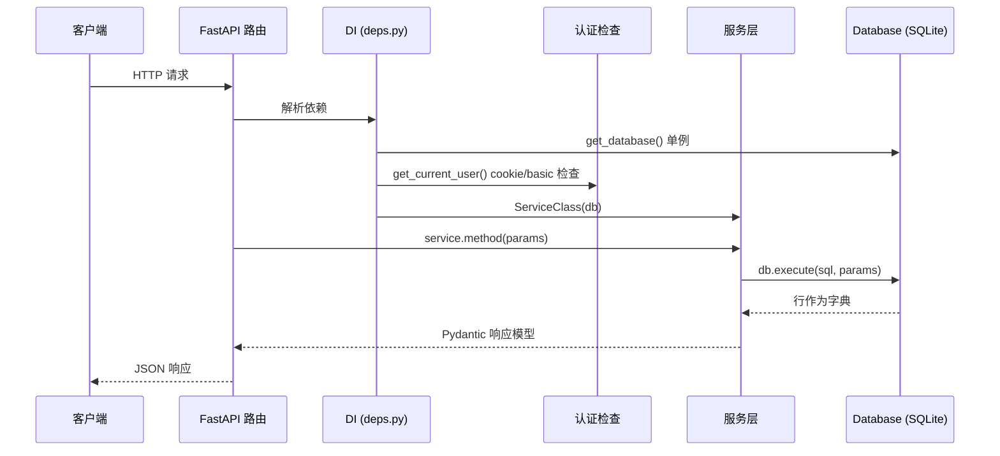
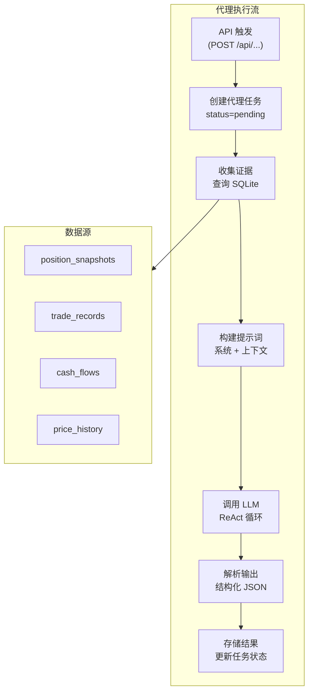

# 后端概览

IBKR Dash 后端是一个 **FastAPI** 应用，为仪表盘提供 REST API。它从共享的 **SQLite** 数据库（由 Worker 填充）读取金融数据，并通过类型化、经过验证的端点暴露。它还使用任何 OpenAI 兼容的 LLM 提供商运行 AI 代理进行投资组合分析。

## 目录布局

```
backend/
  app/
    main.py                 # FastAPI 应用工厂、中间件、路由注册
    core/
      config.py             # JSON 配置 (SettingsManager)
      database.py           # SQLite 连接、模式 DDL、Database 类
      auth.py               # HMAC 会话令牌辅助函数
      cors.py               # CORS 配置
      logger.py             # 日志设置
      rate_limit.py         # 内存滑动窗口速率限制器
    api/
      deps.py               # FastAPI 依赖注入提供者
      routes/
        account.py          # 账户概览和快照
        positions.py        # 持仓列表、摘要、详情
        trades.py           # 交易列表和摘要
        cash_flows.py       # 现金流列表
        dividends.py        # 股息列表
        charts.py           # 权益曲线和表现日历
        copilot.py          # 账户 Copilot 聊天
        agent_tasks.py      # 后台代理任务管理
        auth.py             # 登录/登出/会话检查
        health.py           # 健康检查端点
        symbols.py          # 代码自动补全
        daily_position_review.py  # 每日持仓审查代理
        trade_decision_agent.py   # 交易决策代理
        trade_review_agent.py     # 交易回顾代理
        risk_assessment_agent.py  # 风险评估代理
        admin_system.py     # 系统状态
        admin_prompts.py    # 提示词管理
        admin_llm.py        # LLM 提供商管理
        admin_ibkr.py       # IBKR 设置
        admin_email.py      # 邮件设置
    services/
      account_service.py    # 账户概览和快照查询
      position_service.py   # 持仓列表、摘要、详情
      trade_service.py      # 交易查询
      cash_flow_service.py  # 现金流查询
      dividend_service.py   # 股息查询
      chart_service.py      # 权益曲线和表现日历
      llm_service.py        # OpenAI 兼容 HTTP 客户端
      agent_services.py     # 后台任务管理
      ibkr_tool_service.py  # Copilot 代理的工具服务
    schemas/                # Pydantic 请求/响应模型
    agents/                 # AI 代理逻辑（每日审查、交易决策等）
    utils/                  # 日期辅助函数、分页、JSON 字段解析器
  tests/                    # pytest 测试套件
```

## 关键设计模式

### 1. 通过 FastAPI `Depends` 的依赖注入

每个路由处理函数都声明其依赖作为带 `Depends(...)` 注解的函数参数。FastAPI 在请求时自动解析这些依赖。

```python
# 来自 app/api/routes/positions.py
@router.get("", response_model=PositionListResponse)
def list_positions(
    report_date: str | None = Query(default=None),
    service: PositionService = Depends(get_position_service),   # 注入的服务
    _user: str | None = Depends(get_current_user),              # 认证检查
) -> PositionListResponse:
    return service.list_positions(report_date=report_date, ...)
```

依赖提供者位于 `app/api/deps.py`。每个提供者创建一个服务实例并注入共享的 `Database` 单例：

```python
# 来自 app/api/deps.py
def get_position_service(db: Database = Depends(get_db)) -> PositionService:
    return PositionService(db)
```

### 2. 服务层

所有业务逻辑都在**服务类**中（例如 `AccountService`、`PositionService`）。路由很薄 -- 它们验证输入、调用服务并返回结果。服务通过构造函数接收 `Database` 实例并直接执行 SQL 查询。

### 3. 模式验证

所有请求体和响应形状都定义为 `schemas/` 目录中的 **Pydantic 模型**。FastAPI 使用它们进行自动请求验证和响应序列化。

## 请求生命周期

以下是典型 API 请求在后端中的流转方式，从 HTTP 请求到达到 JSON 响应发送：



### 中间件栈

请求在到达路由处理函数之前经过三层中间件：


1. **CORS** (`app/core/cors.py`) -- 允许前端开发服务器调用 API。来源通过 `CORS_ORIGINS` 配置。
2. **GZip** -- 压缩大型 JSON 响应（阈值：1000 字节）。
3. **请求体大小限制** -- 拒绝大于 1 MB 的请求体（防止滥用）。

:::tip
CORS 中间件在开发期间至关重要。没有它，浏览器会因同源策略阻止从 `localhost:5173`（前端）到 `localhost:8000`（后端）的请求。`CORS_ORIGINS` 设置必须包含前端 URL。
:::

## 为什么选择 SQLite？

整个系统使用 **SQLite** 作为唯一数据存储。没有 Redis、Elasticsearch 或外部数据库。

- **零基础设施**：无需安装或维护数据库服务器。
- **WAL 模式**：在 Worker 写入数据时启用并发读取。
- **便携性**：整个数据库是一个 `.db` 文件。
- **足够规模**：个人投资组合数据足够小，SQLite 可以轻松处理。

:::tip
后端和 Worker 共享同一个 SQLite 文件。Worker 写入 IBKR 数据；后端读取它。WAL 模式确保它们可以在没有锁定问题的情况下并发操作。
:::

## 应用启动

当 FastAPI 应用启动时（通过 `lifespan` 上下文管理器），它：

1. 从 `data/config.json` 加载设置
2. 设置日志
3. 初始化 SQLite 数据库模式（如果不存在则创建表和索引）

```python
# 来自 app/main.py
@asynccontextmanager
async def lifespan(app: FastAPI):
    settings = get_settings()
    setup_logging()
    init_database(settings)
    yield
```

:::info
`init_database()` 函数（在 `app/core/database.py` 中）使用 `CREATE TABLE IF NOT EXISTS` 语句运行完整的 DDL 模式创建。它还运行 `_MIGRATIONS` 列表中的任何待处理迁移。
:::

## 技术栈

| 组件 | 技术 | 用途 |
|------|------|------|
| Web 框架 | FastAPI | 带自动 OpenAPI 文档的异步 REST API |
| 验证 | Pydantic v2 | 请求/响应模式验证 |
| 配置 | JSON 配置 (SettingsManager) | JSON 配置文件加载 |
| 数据库 | SQLite (stdlib) | 带 WAL 模式的零配置嵌入式数据库 |
| HTTP 客户端 | httpx | LLM API 调用的持久连接池 |
| 认证 | HMAC-SHA256 (stdlib) | 无外部依赖的轻量级会话令牌 |
| AI 代理 | OpenAI 兼容 API | 通过任何 LLM 提供商的投资组合分析 |

## AI 代理架构

后端包含五个专业化的 AI 代理，每个专为特定的投资组合分析任务设计：

| 代理 | 用途 | 触发 |
|------|------|------|
| **每日审查** | 总结给定日期的投资组合表现。 | `POST /api/daily-position-review/generate` |
| **交易决策** | 分析是否进入/退出仓位。 | `POST /api/trade-decision/analyze` |
| **交易回顾** | 回顾过去的交易以获取经验教训。 | `POST /api/trade-review/review` |
| **风险评估** | 评估投资组合风险和集中度。 | `POST /api/risk-assessment/assess` |
| **账户 Copilot** | 带工具使用的对话助手。 | `POST /api/copilot/chat` |

代理从数据库收集**证据**（持仓、交易、盈亏），构建带上下文的**提示词**，调用 LLM，并将**结构化输出**解析为类型化响应。结果持久化在专用数据库表中供后续检索。



## 测试

测试位于 `backend/tests/`，使用 **pytest**。测试套件涵盖：

- 服务层逻辑（账户、持仓、交易、现金流、图表、LLM、代理）
- API 路由行为（管理、Copilot、代理任务）
- 数据库操作
- 结构化输出解析
- 健康端点

运行测试：

```bash
cd backend
pytest tests/ -v
```

:::info
测试使用内存中的 SQLite 数据库 (`:memory:`) 避免接触生产数据。`Database` 类原生支持此模式。
:::
