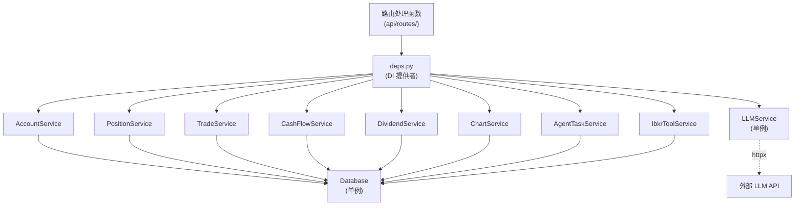
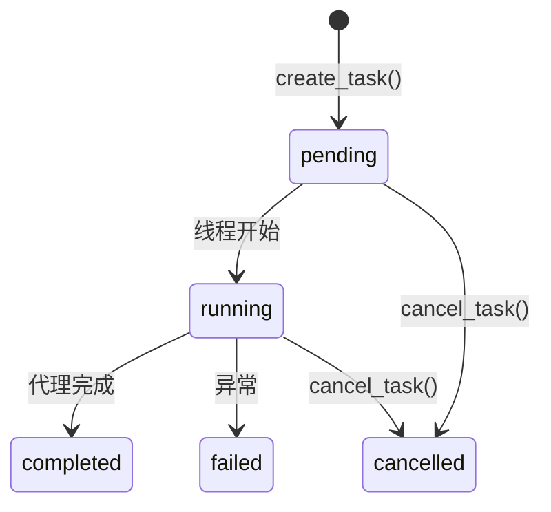

# 服务

服务层包含所有业务逻辑。路由很薄 -- 它们通过 Pydantic 模式验证输入，调用服务方法，并返回结果。服务通过构造函数接收 `Database` 实例。

## 服务层模式

每个服务遵循相同的结构：

```python
class SomeService:
    def __init__(self, db: Database) -> None:
        self.db = db

    def some_method(self, param: str) -> SomeResponse:
        rows = self.db.execute("SELECT ... WHERE ... = ?", (param,))
        return SomeResponse(items=[SomeItem(**row) for row in rows])
```

服务由 `app/api/deps.py` 中的**依赖提供者**实例化：

```python
def get_some_service(db: Database = Depends(get_db)) -> SomeService:
    return SomeService(db)
```

FastAPI 为每个请求创建新的服务实例。`Database` 单例在所有请求之间共享。

## 服务依赖图

此图显示了所有服务如何通过依赖注入连接在一起：



:::tip
`LLMService` 是进程级单例（通过 `deps.py` 中的 `lru_cache` 缓存）。这意味着 `httpx.Client` 连接池在所有请求之间共享，对高吞吐量场景很高效。
:::

## 关键服务

### AccountService

**文件：** `app/services/account_service.py`

提供账户级概览和快照查询。

**方法：**
- `get_overview()` -- 返回最新账户快照，含日环比变化。通过从 `trade_records` 和 `position_snapshots` 聚合计算已实现/未实现盈亏。
- `get_snapshots(limit)` -- 返回按日期降序排列的最近账户快照。

**如何计算盈亏：**
1. 已实现盈亏：`SUM(fifo_pnl_realized) FROM trade_records WHERE trade_date <= report_date`
2. 未实现盈亏：`SUM(total_unrealized_pnl) FROM position_snapshots WHERE report_date = ?`
3. 变化：比较当天与前一天的值。

### PositionService

**文件：** `app/services/position_service.py`

最复杂的服务。处理持仓列表、摘要和详情视图。

**方法：**
- `list_positions(...)` -- 全功能列表，支持过滤（日期、代码、资产类别）、排序（8 个排序字段）和分页。当缺少已实现盈亏时，从交易中丰富持仓数据。
- `get_positions_summary(...)` -- 返回按价值排列的前 5 个持仓、资产类别分布和聚合总计。
- `get_position_detail(symbol)` -- 返回单个代码的 OHLC K 线和交易标记。当 price_history 不可用时回退到 mark_price。

**排序字段：** `position_value`, `percent_of_nav`, `total_unrealized_pnl`, `total_realized_pnl`, `average_cost_price`, `previous_day_change_percent`, `symbol`, `quantity`。

### TradeService

**文件：** `app/services/trade_service.py`

**方法：**
- `list_trades(...)` -- 列出交易，支持日期范围、代码、资产类别和方向过滤。支持排序和分页。
- `summarize_trades(...)` -- 聚合过滤集的交易统计（总盈亏、胜率等）。

### CashFlowService

**文件：** `app/services/cash_flow_service.py`

**方法：**
- `list_cash_flows(...)` -- 列出现金流，支持日期范围、货币和方向过滤。

### DividendService

**文件：** `app/services/dividend_service.py`

**方法：**
- `list_dividends(...)` -- 列出股息支付，支持日期范围、货币和代码过滤。

### ChartService

**文件：** `app/services/chart_service.py`

为前端图表构建时间序列数据。

**方法：**
- `get_equity_curve(start_date, end_date)` -- 构建权益曲线，包含：
  - 总权益线
  - 净成本曲线（累计存款/取款）
  - 总盈亏（权益减净成本）
  - 已实现盈亏曲线
  - 每日 MTM 和 TWR（仅最新日历月）
- `get_performance_calendar(view, anchor)` -- 以三种视图构建表现日历：
  - `month` -- 单月的每日盈亏/TWR
  - `year` -- 单年的月度盈亏/TWR
  - `all-years` -- 所有年份的年度盈亏/TWR

**关键逻辑：**
- `Deposits/Withdrawals` 类型的现金流用于构建净成本曲线。
- 当数据中没有 `cnav_mtm` 时，从权益变化推断每日 MTM。
- TWR（时间加权收益率）从每日收益复合计算。

### LLMService

**文件：** `app/services/llm_service.py`

任何 OpenAI 兼容聊天完成端点的轻量级 HTTP 客户端。

**关键特性：**

- **持久 `httpx.Client`**：跨请求重用 TCP 连接（连接池：最多 10 个，5 个保持活跃）。
- **60 秒超时**：LLM 调用的每请求超时。
- **结构化错误处理**：抛出 `LLMClientError`，错误码：`TIMEOUT`, `AUTH_FAILED`, `RATE_LIMITED`, `PROVIDER_ERROR`。
- **元数据追踪**：`chat_with_metadata()` 返回内容、token 使用量和延迟。

```python
# 来自 app/services/llm_service.py
class LLMService:
    def __init__(self, settings: Settings) -> None:
        self._client = httpx.Client(
            timeout=60.0,
            limits=httpx.Limits(max_connections=10, max_keepalive_connections=5),
        )

    def chat(self, messages, *, model=None, temperature=None, max_tokens=None) -> str:
        """简单接口：返回助手内容字符串。"""

    def chat_with_metadata(self, messages, ...) -> dict:
        """返回 { "content": str, "usage": dict, "latency_ms": int }。"""
```

**代理中的使用模式：**

```python
result = llm_service.chat_with_metadata([
    {"role": "system", "content": system_prompt},
    {"role": "user", "content": user_message},
], response_format={"type": "json_object"})
```

### AgentTaskService

**文件：** `app/services/agent_services.py`

管理带状态跟踪的后台代理任务。

**方法：**
- `create_task(agent_name)` -- 在 `agent_tasks` 中创建状态为 `pending` 的任务记录。
- `run_in_background(agent_name, func, *args)` -- 生成守护线程运行异步代理函数。立即返回任务 ID。
- `get_task(task_id)` -- 获取任务状态、进度和结果。
- `list_tasks(agent_name, status, limit)` -- 列出带可选过滤器的任务。
- `cancel_task(task_id)` -- 取消待处理或运行中的任务。
- `update_progress(task_id, progress)` -- 更新运行中任务的进度字段。

**任务生命周期：**



## 服务如何使用数据库

所有服务通过 `Database` 类方法与数据库交互：

| 方法 | 用例 |
|------|------|
| `db.execute(sql, params)` | 返回多行的 SELECT 查询。 |
| `db.execute_one(sql, params)` | 返回单行的 SELECT 查询。 |
| `db.insert(table, data)` | INSERT 单行，返回 `lastrowid`。 |
| `db.upsert(table, data, conflict_cols)` | 冲突时 INSERT 或 UPDATE。 |
| `db.bulk_upsert(table, rows, conflict_cols)` | 批量 INSERT 或 UPDATE。 |

:::info
服务从不直接管理连接。`Database` 类处理连接生命周期、提交/回滚和关闭。
:::

## 添加新服务

要添加新服务：

1. 创建 `app/services/my_service.py`，类在 `__init__` 中接受 `db: Database`。

```python
# app/services/my_service.py
from app.core.database import Database
from app.schemas.my_schema import MyResponse

class MyService:
    def __init__(self, db: Database) -> None:
        self.db = db

    def my_method(self) -> MyResponse:
        rows = self.db.execute("SELECT * FROM my_table")
        return MyResponse(items=rows)
```

2. 在 `app/api/deps.py` 中添加提供者函数：

```python
def get_my_service(db: Database = Depends(get_db)) -> MyService:
    return MyService(db)
```

3. 在路由处理函数中使用：

```python
@router.get("/my-endpoint")
def my_endpoint(
    service: MyService = Depends(get_my_service),
    _user: str | None = Depends(get_current_user),
) -> MyResponse:
    return service.my_method()
```

4. 在 `app/schemas/my_schema.py` 中定义 Pydantic 模式用于请求/响应类型。
