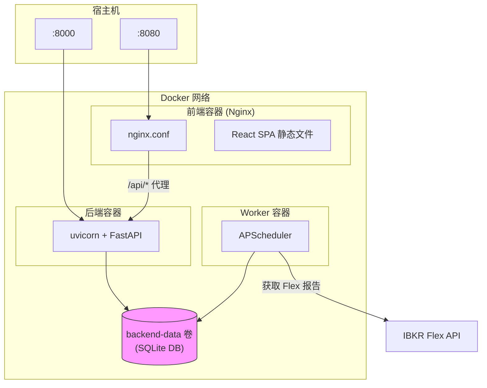

# Docker 部署

IBKR Dash 提供 Docker Compose 配置，用于在容器中运行所有三个服务（后端、前端、worker）。这是在本地不安装 Python 或 Node.js 的情况下运行完整技术栈的最简单方式。

---

## 架构



```
                    ┌─────────────────────────────────────┐
                    │            Docker 网络               │
                    │                                      │
    :8080 ──────────┤  ┌──────────┐                        │
                    │  │  前端    │ (Nginx)                │
                    │  │ :80      │                        │
                    │  └────┬─────┘                        │
                    │       │ /api/*                       │
                    │       ▼                              │
                    │  ┌──────────┐                        │
                    │  │  后端    │ (uvicorn)              │
                    │  │ :8000    │                        │
                    │  └────┬─────┘                        │
                    │       │                              │
                    │       ▼                              │
                    │  ┌──────────┐  ┌──────────┐          │
                    │  │  SQLite  │  │  Worker  │          │
                    │  │  (卷)    │  │ (cron)   │          │
                    │  └──────────┘  └──────────┘          │
                    └─────────────────────────────────────┘
```

- **前端** -- Nginx 提供构建好的 React 应用，并将 `/api/*` 代理到后端。
- **后端** -- FastAPI 在端口 8000 上提供 REST API。
- **Worker** -- 运行 IBKR Flex 调度器，每日导入数据。
- **共享卷** -- `backend-data` 存储 SQLite 数据库，后端和 worker 共享。

---

## 快速开始

### 1. 创建 `.env` 文件

```bash
cp .env.example .env
```

编辑 `.env` 配置。至少需要：

```env
LLM_API_KEY=your-api-key
FLEX_TOKEN=your-flex-token
AUTH_PASSWORD=your-password
```

### 2. 构建并启动

```bash
docker compose up --build -d
```

### 3. 初始化数据库

```bash
# 在 worker 容器内运行 init-db
docker compose exec worker python -m worker.main init-db
```

### 4. 访问应用

| 服务 | URL |
|------|-----|
| 前端 | `http://localhost:8080` |
| 后端 API | `http://localhost:8080/api/health` |
| API 文档 | `http://localhost:8000/docs`（直接访问后端） |

---

## Docker Compose 服务

### 后端

```yaml
# docker-compose.yml（后端部分）
backend:
  build:
    context: .
    dockerfile: docker/backend.Dockerfile
  ports:
    - "${BACKEND_PORT:-8000}:8000"
  volumes:
    - backend-data:/app/ibkr_dash_backend/data
  env_file: .env
  environment:
    - SQLITE_PATH=/app/ibkr_dash_backend/data/ibkr_dash.db
    - APP_ENV=${APP_ENV:-docker}
  restart: unless-stopped
```

- 运行 `uvicorn app.main:app --host 0.0.0.0 --port 8000`。
- 使用 Python 3.12 slim 镜像。
- 数据持久化在 `backend-data` 卷中。

### Worker

```yaml
# docker-compose.yml（worker 部分）
worker:
  build:
    context: .
    dockerfile: docker/worker.Dockerfile
  volumes:
    - backend-data:/app/ibkr_dash_backend/data
  env_file: .env
  environment:
    - SQLITE_PATH=/app/ibkr_dash_backend/data/ibkr_dash.db
  restart: unless-stopped
```

- 运行 `python -m worker.main run-scheduler`。
- 通过 `backend-data` 卷共享同一 SQLite 数据库。
- 按配置的计划导入 IBKR Flex 数据。

### 前端

```yaml
# docker-compose.yml（前端部分）
frontend:
  build:
    context: .
    dockerfile: docker/frontend.Dockerfile
  ports:
    - "${FRONTEND_PORT:-8080}:80"
  depends_on:
    - backend
```

- 多阶段构建：Node.js 编译 React 应用，然后 Nginx 提供静态文件。
- Nginx 将 `/api/*` 请求代理到后端服务。

---

## Dockerfile

### 后端 (`docker/backend.Dockerfile`)

```dockerfile
FROM python:3.12-slim
WORKDIR /app
COPY ibkr_dash_backend/requirements.txt .
RUN pip install --no-cache-dir -r requirements.txt
COPY ibkr_dash_backend/ .
CMD ["uvicorn", "app.main:app", "--host", "0.0.0.0", "--port", "8000"]
```

### Worker (`docker/worker.Dockerfile`)

```dockerfile
FROM python:3.12-slim
WORKDIR /app
COPY ibkr_dash_worker/requirements.txt .
RUN pip install --no-cache-dir -r requirements.txt
COPY ibkr_dash_worker/ .
CMD ["python", "-m", "worker.main", "run-scheduler"]
```

### 前端 (`docker/frontend.Dockerfile`)

```dockerfile
FROM node:20-alpine AS build
WORKDIR /app
COPY ibkr_dash_frontend/package*.json ./
RUN npm ci
COPY ibkr_dash_frontend/ .
RUN npm run build

FROM nginx:alpine
COPY --from=build /app/dist /usr/share/nginx/html
COPY docker/nginx.conf /etc/nginx/conf.d/default.conf
```

---

## Nginx 配置

前端使用 Nginx 提供 SPA 并代理 API 请求：

```nginx
# docker/nginx.conf
server {
    listen 80;
    server_name _;
    client_max_body_size 100m;

    root /usr/share/nginx/html;
    index index.html;

    # 将 API 请求代理到后端
    location /api/ {
        proxy_pass http://backend:8000/api/;
    }

    # SPA 回退 -- 对所有非文件路由提供 index.html
    location / {
        try_files $uri $uri/ /index.html;
    }
}
```

关键点：
- `/api/*` 请求被转发到后端容器。
- 所有其他路由提供 `index.html`（SPA 路由）。
- `client_max_body_size` 设置为 100 MB。

---

## 卷

| 卷 | 用途 |
|----|------|
| `backend-data` | SQLite 数据库和 Flex CSV 导出 |

该卷在后端和 worker 之间共享，以便它们可以读写同一个数据库。

检查卷：

```bash
docker volume inspect ibkr-dash_backend-data
```

备份数据库：

```bash
docker compose exec backend cp /app/ibkr_dash_backend/data/ibkr_dash.db /tmp/backup.db
docker compose cp backend:/tmp/backup.db ./backup.db
```

---

## 常用命令

```bash
# 启动所有服务
docker compose up -d

# 查看日志
docker compose logs -f backend
docker compose logs -f worker
docker compose logs -f frontend

# 重启单个服务
docker compose restart backend

# 停止所有服务
docker compose down

# 代码更改后重新构建
docker compose up --build -d

# 在 worker 内运行一次性导入
docker compose exec worker python -m worker.main import /path/to/file.csv

# 在后端容器中打开 shell
docker compose exec backend bash
```

---

## 环境变量

`.env` 中的所有环境变量都会传递给后端和 worker 容器。`docker-compose.yml` 中的关键覆盖：

| 变量 | Docker 默认值 | 说明 |
|------|---------------|------|
| `SQLITE_PATH` | `/app/ibkr_dash_backend/data/ibkr_dash.db` | 容器内的路径 |
| `APP_ENV` | `docker` | 环境名称 |
| `BACKEND_PORT` | `8000` | 后端的宿主机端口 |
| `FRONTEND_PORT` | `8080` | 前端的宿主机端口 |

---

## 故障排除

### 容器持续重启

查看日志：`docker compose logs backend`。常见原因：
- 缺少 `.env` 文件
- 环境变量无效
- 宿主机端口冲突

### 数据库未持久化

验证卷是否存在：`docker volume ls`。如果卷丢失，数据库会在每次重启时重置。

### 前端显示 502 Bad Gateway

后端容器可能尚未就绪。等待几秒后刷新。检查：`docker compose ps` 确认所有容器正在运行。

### Worker 未导入数据

查看 worker 日志：`docker compose logs worker`。确保 `.env` 中设置了 `FLEX_TOKEN` 和 `FLEX_QUERY_ID_DAILY`。
