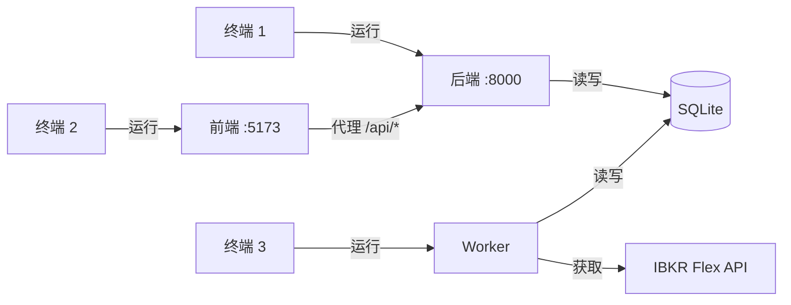

# 本地开发环境搭建

本指南将引导您搭建 IBKR Dash 的本地开发环境。项目包含三个模块：**后端**（Python/FastAPI）、**前端**（React/Vite）和 **worker**（Python ETL 调度器）。

---

## 前置条件

开始之前，请确保已安装以下工具：

- **Python 3.12+** -- 用于后端和 worker
- **Node.js 20+** -- 用于前端
- **Git** -- 用于版本控制

:::tip
本地开发不需要 Docker。每个模块独立运行。
:::

---

## 项目结构

```
ibkr-dash/
  ibkr_dash_backend/    # FastAPI REST API
  ibkr_dash_frontend/   # React + Vite SPA
  ibkr_dash_worker/     # ETL 调度器（IBKR Flex -> SQLite）
  data/                 # SQLite 数据库 + Flex CSV 导出
  .env.example          # 环境变量模板
  docker-compose.yml    # Docker 编排
```

---

## 步骤 1：克隆并配置

```bash
# 克隆仓库
git clone https://github.com/your-org/ibkr-dash.git
cd ibkr-dash
```

通过复制示例文件创建 `.env` 文件：

```bash
cp .env.example .env
```

编辑 `.env` 并至少填写以下内容：

```env
# AI 功能必需
LLM_API_KEY=your-api-key-here

# IBKR Flex Web Service（用于真实数据）
FLEX_TOKEN=your-flex-token
FLEX_QUERY_ID_DAILY=your-query-id

# 身份验证（开发期间留空以开放访问）
AUTH_PASSWORD=
```

### 关键环境变量

| 变量 | 默认值 | 说明 |
|------|--------|------|
| `APP_ENV` | `development` | 环境名称 |
| `DEBUG` | `false` | 启用调试日志 |
| `SQLITE_PATH` | `data/ibkr_dash.db` | SQLite 数据库文件路径 |
| `LLM_API_KEY` | （空） | OpenAI 兼容 LLM 的 API 密钥 |
| `LLM_BASE_URL` | `https://api.openai.com/v1` | LLM API 基础 URL |
| `LLM_DEFAULT_MODEL` | `gpt-4o` | 默认 LLM 模型 |
| `AUTH_USERNAME` | `admin` | 登录用户名 |
| `AUTH_PASSWORD` | （空） | 登录密码（空 = 无身份验证） |
| `CORS_ORIGINS` | `http://localhost:5173,http://localhost:3000` | 允许的 CORS 来源 |
| `LOG_LEVEL` | `INFO` | 日志级别 |

完整的 worker 专用变量列表请参见 `.env.example`。

---

## 步骤 2：启动后端

打开 **终端 1**：

```bash
cd ibkr_dash_backend

# 创建虚拟环境
python -m venv .venv
source .venv/bin/activate  # Linux/macOS
# .venv\Scripts\activate   # Windows

# 安装依赖
pip install -r requirements.txt

# 启动开发服务器（带自动重载）
uvicorn app.main:app --reload --port 8000
```

API 现在运行在 `http://localhost:8000`。您可以验证：

```bash
curl http://localhost:8000/api/health
# {"status":"ok","service":"ibkr_dash_backend"}
```

交互式 API 文档位于 `http://localhost:8000/docs`。

:::info
**您应该看到：** 终端显示 uvicorn 启动日志，包含 `Uvicorn running on http://0.0.0.0:8000`。`app/` 目录中的任何代码更改都会触发自动重载。
:::

---

## 步骤 3：启动前端

打开 **终端 2**：

```bash
cd ibkr_dash_frontend

# 安装依赖
npm install

# 启动开发服务器
npm run dev
```

前端现在运行在 `http://localhost:5173`。它会自动将 API 请求代理到后端（在 `vite.config.ts` 中配置）。

:::info
**您应该看到：** Vite 在终端中打印 `Local: http://localhost:5173/`。在浏览器中打开此 URL 将显示 IBKR Dash 仪表盘。如果 `AUTH_PASSWORD` 为空，您会自动登录。
:::

---

## 步骤 4：初始化数据库并导入数据

打开 **终端 3**：

### 方案 A：使用示例数据

如果您有 IBKR Flex CSV 示例文件：

```bash
cd ibkr_dash_worker

# 创建虚拟环境（如未创建）
python -m venv .venv
source .venv/bin/activate
pip install -r requirements.txt

# 初始化数据库架构
python -m worker.main init-db

# 导入 Flex CSV 文件
python -m worker.main import path/to/your/flex_export.csv
```

### 方案 B：使用 IBKR Flex Web Service

如果您有配置了 Flex Web Service 的 IBKR 账户：

```bash
cd ibkr_dash_worker
python -m worker.main init-db
python -m worker.main scan
```

这将从 IBKR 下载最新的 Flex 报告并导入。

### 方案 C：运行调度器

Worker 可以按计划轮询 IBKR：

```bash
python -m worker.main run-scheduler
```

默认在每天下午 12:30（亚洲/上海时区）运行。通过 `.env` 中的 `SCHEDULER_HOUR`、`SCHEDULER_MINUTE` 和 `SCHEDULER_TIMEZONE` 配置。

---

## 运行全部三个模块

您需要三个终端窗口：

| 终端 | 命令 | URL |
|------|------|-----|
| 1 | `cd ibkr_dash_backend && uvicorn app.main:app --reload --port 8000` | `http://localhost:8000` |
| 2 | `cd ibkr_dash_frontend && npm run dev` | `http://localhost:5173` |
| 3 | `cd ibkr_dash_worker && python -m worker.main run-scheduler` | （后台） |



---

## 数据库位置

SQLite 数据库默认存储在 `data/ibkr_dash.db`。后端和 worker 共享此文件。数据库在首次运行时自动创建。

使用内存数据库（用于测试）：

```bash
export SQLITE_PATH=":memory:"
```

---

## 验证设置

1. 在浏览器中打开 `http://localhost:5173`。
2. 如果 `AUTH_PASSWORD` 为空，您会自动登录。
3. 如果设置了 `AUTH_PASSWORD`，使用 `admin` / 您的密码登录。
4. 导航到仪表盘查看投资组合数据。
5. 尝试 Copilot 聊天以测试 LLM 集成。

---

## 常见问题

### 后端启动失败

- 检查端口 8000 是否被占用：`lsof -i :8000`
- 确认 `.env` 在项目根目录（不是在 `ibkr_dash_backend/` 内）
- 确保已激活虚拟环境

### 前端显示"网络错误"

- 确认后端在端口 8000 上运行
- 检查 `vite.config.ts` 中的代理配置
- 尝试从终端执行 `curl http://localhost:8000/api/health`

### 看不到数据

- 运行 `python -m worker.main init-db` 创建架构
- 使用 `python -m worker.main import <file>` 或 `python -m worker.main scan` 导入数据

### LLM 功能返回错误

- 确认 `.env` 中设置了 `LLM_API_KEY`
- 测试连接：`curl -X POST http://localhost:8000/api/admin/llm/test -H "Content-Type: application/json" -d '{"message":"hello"}'`
