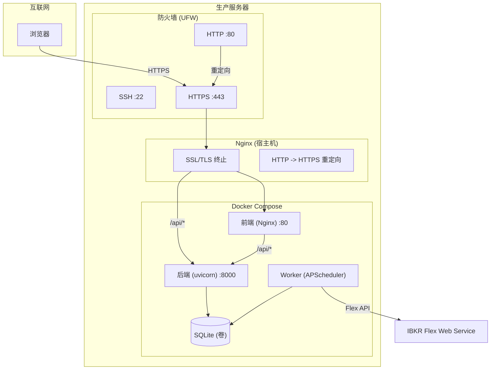

# 生产环境部署

本指南介绍如何将 IBKR Dash 部署到生产服务器。假设您有一台 Linux 服务器（推荐 Ubuntu 22.04+），具有 root 或 sudo 访问权限。

---

## 生产环境检查清单

部署前，请确保您已准备好：

- [ ] 安装了 Docker 和 Docker Compose 的 Linux 服务器
- [ ] 指向您服务器的域名（如 `dash.example.com`）
- [ ] IBKR Flex Web Service 令牌和查询 ID
- [ ] LLM API 密钥（OpenAI、DeepSeek 或兼容提供商）
- [ ] 准备好强密码用于 Admin Settings 中的 `AUTH_PASSWORD` 配置

---

## 部署架构



---

## 步骤 1：服务器设置

### 安装 Docker

```bash
# 更新系统软件包
sudo apt update && sudo apt upgrade -y

# 安装 Docker
curl -fsSL https://get.docker.com | sudo sh

# 将用户添加到 docker 组
sudo usermod -aG docker $USER

# 注销并重新登录，然后验证
docker --version
docker compose version
```

### 创建项目目录

```bash
sudo mkdir -p /opt/ibkr-dash
sudo chown $USER:$USER /opt/ibkr-dash
cd /opt/ibkr-dash

# 克隆仓库
git clone https://github.com/your-org/ibkr-dash.git .
```

---

## 步骤 2：配置应用

部署后，打开浏览器访问应用并通过 **Admin Settings UI** 进行配置：

1. 进入 `/admin/system` -- 设置 `AUTH_PASSWORD`（强密码）和 `LOG_LEVEL`
2. 进入 `/admin/llm` -- 配置 LLM API 密钥、Base URL 和默认模型
3. 进入 `/admin/ibkr` -- 设置 Flex Token 和 Query ID
4. 进入 `/admin/system` -- 配置 Worker 调度计划（时区、小时、分钟）
5. 进入 `/admin/system` -- 设置 CORS 允许的来源域名

所有配置存储在 `data/config.json` 中，通过 Docker 卷持久化。

:::warning
`data/config.json` 包含密钥，切勿将其提交到版本控制。
:::

---

## 步骤 3：构建并部署

```bash
# 构建所有容器
docker compose up --build -d

# 初始化数据库
docker compose exec worker python -m worker.main init-db

# 验证所有服务正在运行
docker compose ps
```

预期输出：

```
NAME                STATUS          PORTS
ibkr-dash-backend   Up (healthy)    0.0.0.0:8000->8000/tcp
ibkr-dash-worker    Up
ibkr-dash-frontend  Up              0.0.0.0:8080->80/tcp
```

---

## 步骤 4：Nginx 反向代理（带 SSL）

在宿主机上安装 Nginx，将流量代理到 Docker 容器并处理 SSL。

### 安装 Nginx 和 Certbot

```bash
sudo apt install -y nginx certbot python3-certbot-nginx
```

### 创建 Nginx 站点配置

```bash
sudo nano /etc/nginx/sites-available/ibkr-dash
```

添加以下配置：

```nginx
# /etc/nginx/sites-available/ibkr-dash

# HTTP -> HTTPS 重定向
server {
    listen 80;
    server_name dash.example.com;

    # 将 HTTP 重定向到 HTTPS
    return 301 https://$host$request_uri;
}

# HTTPS 服务器
server {
    listen 443 ssl http2;
    server_name dash.example.com;

    # SSL 证书（由 Certbot 管理）
    ssl_certificate /etc/letsencrypt/live/dash.example.com/fullchain.pem;
    ssl_certificate_key /etc/letsencrypt/live/dash.example.com/privkey.pem;

    # 现代 SSL 设置
    ssl_protocols TLSv1.2 TLSv1.3;
    ssl_ciphers ECDHE-ECDSA-AES128-GCM-SHA256:ECDHE-RSA-AES128-GCM-SHA256:ECDHE-ECDSA-AES256-GCM-SHA384:ECDHE-RSA-AES256-GCM-SHA384;
    ssl_prefer_server_ciphers off;

    # 安全头
    add_header X-Frame-Options "SAMEORIGIN" always;
    add_header X-Content-Type-Options "nosniff" always;
    add_header X-XSS-Protection "1; mode=block" always;
    add_header Strict-Transport-Security "max-age=31536000; includeSubDomains" always;
    add_header Referrer-Policy "strict-origin-when-cross-origin" always;

    # 代理到 Docker 前端（容器内的 Nginx）
    location / {
        proxy_pass http://127.0.0.1:8080;
        proxy_set_header Host $host;
        proxy_set_header X-Real-IP $remote_addr;
        proxy_set_header X-Forwarded-For $proxy_add_x_forwarded_for;
        proxy_set_header X-Forwarded-Proto $scheme;
    }

    # 直接代理到后端 API（可选，性能更好）
    # 绕过容器 Nginx 处理 API 请求
    location /api/ {
        proxy_pass http://127.0.0.1:8000/api/;
        proxy_set_header Host $host;
        proxy_set_header X-Real-IP $remote_addr;
        proxy_set_header X-Forwarded-For $proxy_add_x_forwarded_for;
        proxy_set_header X-Forwarded-Proto $scheme;
        proxy_read_timeout 120s;
    }
}
```

### 启用站点并获取 SSL 证书

```bash
# 启用站点
sudo ln -s /etc/nginx/sites-available/ibkr-dash /etc/nginx/sites-enabled/
sudo nginx -t
sudo systemctl reload nginx

# 获取 SSL 证书
sudo certbot --nginx -d dash.example.com

# 验证自动续期
sudo certbot renew --dry-run
```

### 更新 CORS

在 Admin Settings UI（`/admin/system`）中添加您的生产域名到 CORS 允许列表，例如 `https://dash.example.com`。更改后重启后端：

```bash
docker compose restart backend
```

---

## 步骤 5：防火墙

限制仅允许必要的端口访问：

```bash
# 允许 SSH、HTTP 和 HTTPS
sudo ufw allow 22/tcp
sudo ufw allow 80/tcp
sudo ufw allow 443/tcp

# 阻止外部直接访问后端和前端端口
# （宿主机上的 Nginx 处理所有流量）

# 启用防火墙
sudo ufw enable
```

---

## 数据库备份

SQLite 数据库存储在 Docker 卷中。请定期备份。

### 手动备份

```bash
# 将数据库从容器中复制出来
docker compose exec backend cp /app/backend/data/ibkr_dash.db /tmp/backup.db
docker compose cp backend:/tmp/backup.db ./backup-$(date +%Y%m%d).db
```

### 自动每日备份（cron）

创建备份脚本：

```bash
sudo nano /opt/ibkr-dash/backup.sh
```

```bash
#!/bin/bash
BACKUP_DIR="/opt/backups/ibkr-dash"
mkdir -p "$BACKUP_DIR"
DATE=$(date +%Y%m%d_%H%M%S)

docker compose -f /opt/ibkr-dash/docker-compose.yml \
  exec -T backend cp /app/backend/data/ibkr_dash.db /tmp/backup.db

docker compose -f /opt/ibkr-dash/docker-compose.yml \
  cp backend:/tmp/backup.db "$BACKUP_DIR/backup_$DATE.db"

# 仅保留最近 30 个备份
ls -t "$BACKUP_DIR"/backup_*.db | tail -n +31 | xargs rm -f
```

```bash
chmod +x /opt/ibkr-dash/backup.sh

# 添加到 crontab（每天凌晨 2 点）
crontab -e
# 添加：0 2 * * * /opt/ibkr-dash/backup.sh
```

### 从备份恢复

```bash
docker compose stop backend worker
docker compose cp ./backup.db backend:/app/backend/data/ibkr_dash.db
docker compose start backend worker
```

---

## 监控

### 健康检查端点

后端在 `/api/health` 暴露健康检查：

```bash
curl http://localhost:8000/api/health
# {"status":"ok","service":"backend"}
```

### 系统状态端点

获取详细的系统信息：

```bash
curl -u admin:password http://localhost:8000/api/admin/system/status
```

返回数据库健康状态、记录数、LLM 配置和运行时信息。

### Docker 健康检查

监控容器状态：

```bash
# 检查容器健康状态
docker compose ps

# 查看资源使用情况
docker stats

# 跟踪日志
docker compose logs -f --tail=100
```

### 日志管理

配置日志轮转以防止磁盘空间问题：

```bash
sudo nano /etc/docker/daemon.json
```

```json
{
  "log-driver": "json-file",
  "log-opts": {
    "max-size": "10m",
    "max-file": "3"
  }
}
```

```bash
sudo systemctl restart docker
```

---

## 更新

更新到新版本：

```bash
cd /opt/ibkr-dash

# 拉取最新代码
git pull

# 重新构建并重启
docker compose up --build -d

# 运行任何新的迁移
docker compose exec worker python -m worker.main init-db
```

`init-db` 命令可以安全地多次运行 -- 它使用 `CREATE TABLE IF NOT EXISTS`。

---

## 性能调优

### SQLite

默认 SQLite 配置使用 WAL 模式以获得更好的并发读取性能。对于大多数单用户部署，无需调优。

如果遇到大数据集查询缓慢的情况：

```bash
# 检查数据库大小
docker compose exec backend ls -lh /app/backend/data/ibkr_dash.db

# 运行 VACUUM 回收空间
docker compose exec backend python -c "
import sqlite3
conn = sqlite3.connect('/app/backend/data/ibkr_dash.db')
conn.execute('VACUUM')
conn.close()
"
```

### LLM 速率限制

默认速率为每 IP 每 60 秒 20 次请求。在后端源代码（`app/core/rate_limit.py`）中配置。对于单用户部署，这通常足够。

---

## 安全最佳实践

1. **强密码** -- 通过 Admin Settings UI 设置强 `AUTH_PASSWORD`。
2. **仅 HTTPS** -- 生产环境中始终使用 SSL。
3. **防火墙** -- 阻止直接访问端口 8000 和 8080。
4. **定期备份** -- 自动化每日数据库备份（包括 `data/config.json`）。
5. **保持更新** -- 定期拉取更新并重新构建容器。
6. **密钥管理** -- 切勿将 `data/config.json` 提交到版本控制。
7. **日志监控** -- 定期检查日志以发现错误或可疑活动。
