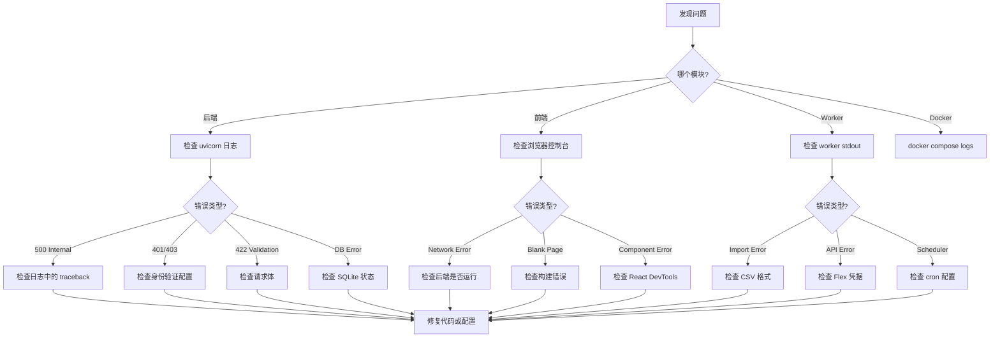

# 调试指南

本指南涵盖后端、前端和 worker 模块的调试技术，以及常见问题及其解决方案。

---

## 调试工作流



---

## 后端调试

### 启用调试模式

设置以下环境变量以获取更详细的日志：

```env
APP_ENV=development
DEBUG=true
LOG_LEVEL=DEBUG
```

更改这些值后重启后端：

```bash
cd backend
uvicorn app.main:app --reload --port 8000
```

### 日志输出

后端以以下格式输出日志到 stdout：

```
2024-01-15 10:30:00,123 [INFO] app.services.position_service: Fetching positions for date 2024-01-15
2024-01-15 10:30:00,125 [DEBUG] app.core.database: Executing SQL: SELECT * FROM position_snapshots WHERE ...
```

日志级别（从最详细到最简洁）：`DEBUG`、`INFO`、`WARNING`、`ERROR`、`CRITICAL`。

### 使用交互式 API 文档

FastAPI 在 `http://localhost:8000/docs` 提供 Swagger UI。这是测试端点最简单的方式：

1. 在浏览器中打开 `http://localhost:8000/docs`。
2. 点击任意端点展开。
3. 点击 "Try it out"。
4. 填写参数并点击 "Execute"。
5. 查看响应状态码、头部和正文。

### Python 调试器 (pdb)

在代码中添加断点：

```python
def list_positions(self, ...):
    # 在想要暂停的位置添加此行
    breakpoint()
    result = self.db.execute(sql, params)
    return result
```

当断点命中时，您会在终端获得交互式调试器：

```
(Pdb) p sql           # 打印 SQL 查询
(Pdb) p params        # 打印查询参数
(Pdb) p result        # 打印结果
(Pdb) n               # 下一行
(Pdb) c               # 继续执行
(Pdb) q               # 退出
```

### VS Code 调试

在项目根目录创建 `.vscode/launch.json`：

```json
{
  "version": "0.2.0",
  "configurations": [
    {
      "name": "Backend",
      "type": "debugpy",
      "request": "launch",
      "module": "uvicorn",
      "args": ["app.main:app", "--reload", "--port", "8000"],
      "cwd": "${workspaceFolder}/backend",
      "env": {
        "PYTHONPATH": "${workspaceFolder}/backend"
      }
    }
  ]
}
```

然后按 F5 开始调试。您可以通过点击行号旁的边栏来设置断点。

### 常见后端问题

**数据库锁定错误：**

```
sqlite3.OperationalError: database is locked
```

原因：另一个进程正在写入数据库。后端使用 WAL 模式和 5 秒忙超时，但长时间的写入仍可能导致此问题。

解决方案：确保 worker 在后端处理请求时没有运行长时间的导入。WAL 模式允许并发读取，但写入是串行的。

**拉取更新后的导入错误：**

```
ModuleNotFoundError: No module named 'app.schemas.new_feature'
```

解决方案：重新安装依赖：

```bash
pip install -r requirements.txt
```

**Admin Settings 更改未生效：**

配置通过 Admin Settings UI 修改后存储在 `data/config.json` 中。重启后端服务器以使更改生效。

---

## 前端调试

### 浏览器 DevTools

打开 Chrome/Firefox DevTools (F12) 并使用：

- **Console** -- 查看 JavaScript 错误和 `console.log` 输出。
- **Network** -- 检查 API 请求、查看状态码和响应体。
- **React DevTools** -- 安装浏览器扩展以检查组件状态和 props。

### Vite 开发服务器

Vite 开发服务器提供：

- **热模块替换 (HMR)** -- 更改立即生效，无需完整页面重载。
- **错误叠加层** -- 编译错误直接显示在浏览器中。
- **Source maps** -- 错误指向原始 TypeScript 源码。

### 代理配置

Vite 开发服务器将 `/api` 请求代理到后端。在 `vite.config.ts` 中配置：

```typescript
// vite.config.ts
server: {
  proxy: {
    '/api': {
      target: 'http://localhost:8000',
      changeOrigin: true,
    },
  },
},
```

如果前端的 API 请求失败但从 curl 可以工作，请检查：
1. 后端在端口 8000 上运行。
2. 代理配置匹配。
3. CORS 没有阻止请求（在浏览器控制台查看 CORS 错误）。

### TypeScript 错误

运行 TypeScript 编译器检查类型错误：

```bash
cd frontend
npx tsc --noEmit
```

这也是 `npm run build` 的一部分。

### 常见前端问题

**拉取更新后白屏：**

```bash
# 清除 node_modules 并重新安装
rm -rf node_modules
npm install
```

**API 请求返回 404：**

检查后端是否运行以及代理是否配置正确。在 DevTools 的 Network 标签中验证请求 URL 是否正确（应以 `/api/` 开头）。

**组件在状态更改后未更新：**

常见的 React 陷阱：
- 直接修改状态而不是使用 setter 函数。
- `useEffect` 依赖数组中缺少依赖。
- 陈旧闭包捕获了旧值。

---

## Worker 调试

### 手动导入

通过手动运行来测试导入管道：

```bash
cd worker

# 导入特定文件
python -m worker.main import path/to/flex_export.csv

# 扫描新文件
python -m worker.main scan
```

### 检查日志

Worker 输出日志到 stdout。获取更详细的输出：

```bash
LOG_LEVEL=DEBUG python -m worker.main import path/to/file.csv
```

### 验证数据库状态

使用 SQLite CLI 直接检查数据库：

```bash
sqlite3 data/ibkr_dash.db

# 列出表
.tables

# 统计记录数
SELECT COUNT(*) FROM position_snapshots;
SELECT COUNT(*) FROM trade_records;
SELECT COUNT(*) FROM account_snapshots;

# 检查最新数据
SELECT report_date, COUNT(*) FROM position_snapshots GROUP BY report_date ORDER BY report_date DESC LIMIT 5;

# 退出
.quit
```

### 常见 Worker 问题

**导入后无数据：**

检查 CSV 文件是否匹配预期的 IBKR Flex 格式。解析器期望特定的列标题。使用 `LOG_LEVEL=DEBUG` 运行以查看解析详情。

**调度器未运行：**

通过 Admin Settings UI（`/admin/system`）确认调度器已启用。检查 cron 计划是否正确配置（小时、分钟、时区）。

**Flex API 错误：**

确认 `FLEX_TOKEN` 和 `FLEX_QUERY_ID_DAILY` 正确。手动测试：

```bash
curl "https://www.interactivebrokers.com/AccountManagement/FlexWebService/StatementViewer?token=YOUR_TOKEN"
```

---

## AI 代理调试

### 检查 LLM 连接

通过管理 API 测试 LLM 连接：

```bash
curl -X POST "http://localhost:8000/api/admin/llm/test" \
  -H "Content-Type: application/json" \
  -d '{"message": "Hello"}'
```

### 查看代理任务

检查后台代理任务的状态：

```bash
# 列出最近的任务
curl "http://localhost:8000/api/agent/tasks?limit=10"

# 获取特定任务详情
curl "http://localhost:8000/api/agent/tasks/{task_id}"
```

### 查看代理输出

检查存储的代理结果：

```bash
# 列出交易决策
curl "http://localhost:8000/api/trade-decision/decisions?limit=5"

# 列出交易复盘
curl "http://localhost:8000/api/trade-review/reviews?limit=5"

# 列出每日审查
curl "http://localhost:8000/api/daily-position-review/dates"
```

### 常见代理问题

**代理返回空结果：**

代理可能没有足够的数据进行分析。确保：
- 数据库中有持仓和交易数据。
- 标的存在于您的投资组合中（针对交易相关代理）。

**代理耗时过长：**

LLM 调用可能很慢。默认超时由异步运行时处理。检查 LLM 提供商的状态页面是否有中断。

**超出速率限制：**

```
429 Too Many Requests
```

速率为每 IP 每 60 秒 20 次 LLM 调用。等待后重试。

---

## 数据库调试

### 检查架构

```bash
sqlite3 data/ibkr_dash.db ".schema"
```

显示所有 CREATE TABLE 语句。

### 检查表大小

```bash
sqlite3 data/ibkr_dash.db "
SELECT 'account_snapshots' as tbl, COUNT(*) FROM account_snapshots
UNION ALL
SELECT 'position_snapshots', COUNT(*) FROM position_snapshots
UNION ALL
SELECT 'trade_records', COUNT(*) FROM trade_records
UNION ALL
SELECT 'agent_tasks', COUNT(*) FROM agent_tasks;
"
```

### 查询代理提示词

```bash
sqlite3 data/ibkr_dash.db "
SELECT prompt_key, version, status, length(content) as content_length
FROM agent_prompts
ORDER BY prompt_key, version DESC;
"
```

### 重置数据库

如果需要全新开始：

```bash
# 停止后端和 worker
rm data/ibkr_dash.db

# 重新初始化
cd worker && python -m worker.main init-db

# 重新导入数据
python -m worker.main import path/to/file.csv
```

---

## Docker 调试

### 查看容器日志

```bash
# 所有服务
docker compose logs -f

# 特定服务
docker compose logs -f backend
docker compose logs -f worker
docker compose logs -f frontend
```

### 在容器内执行命令

```bash
# 在后端中打开 shell
docker compose exec backend bash

# 运行 Python 命令
docker compose exec backend python -c "from app.core.database import Database; db = Database('data/ibkr_dash.db'); print(db.execute('SELECT COUNT(*) FROM position_snapshots'))"

# 检查 worker 状态
docker compose exec worker python -m worker.main scan
```

### 检查容器健康状态

```bash
# 容器状态
docker compose ps

# 资源使用情况
docker stats --no-stream

# 检查容器详情
docker compose inspect backend
```

### 重启服务

```bash
# 重启一个服务
docker compose restart backend

# 重启所有服务
docker compose restart

# 代码更改后重新构建
docker compose up --build -d
```

---

## 获取帮助

如果您遇到困难：

1. 检查日志（后端、worker 或浏览器控制台）。
2. 搜索现有的 GitHub issues。
3. 创建新 issue，包含：
   - 重现步骤
   - 预期行为
   - 实际行为
   - 相关日志输出
   - 环境详情（操作系统、Python 版本、Node 版本）
