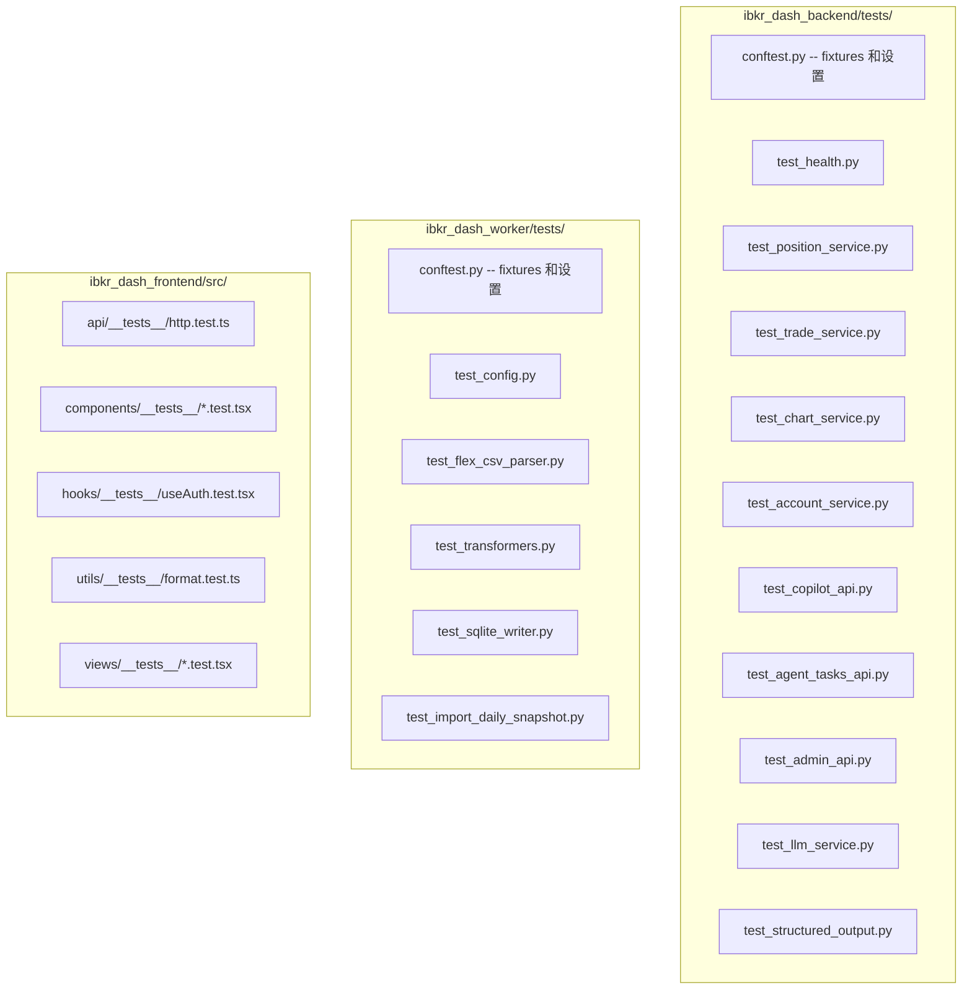

# 测试指南

IBKR Dash 使用 **pytest** 进行 Python（后端 + worker）测试，使用 **Vitest** 进行 TypeScript（前端）测试。本指南介绍如何运行测试、编写新测试以及理解测试基础设施。

---

## 快速参考

```bash
# 后端测试
cd ibkr_dash_backend && pytest

# Worker 测试
cd ibkr_dash_worker && pytest

# 前端测试
cd ibkr_dash_frontend && npm test
```

---

## 测试文件结构



---

## 后端测试 (pytest)

### 运行测试

```bash
cd ibkr_dash_backend

# 运行所有测试
pytest

# 带详细输出
pytest -v

# 运行特定测试文件
pytest tests/test_position_service.py

# 运行特定测试函数
pytest tests/test_position_service.py::test_list_positions_with_data

# 运行匹配模式的测试
pytest -k "position"

# 首次失败时停止
pytest -x

# 显示打印输出
pytest -s
```

### 测试基础设施

测试设置在 `tests/conftest.py` 中定义。每个测试获得：

1. **内存 SQLite 数据库** -- 无文件 I/O，快速且隔离。
2. **禁用身份验证** -- `AUTH_PASSWORD` 设为空。
3. **模拟 LLM 配置** -- `LLM_API_KEY` 设为 `test-key`。
4. **重置单例** -- 每个测试前重置数据库和设置。

```python
# tests/conftest.py
@pytest.fixture(autouse=True)
def _reset_singletons(monkeypatch):
    """每个测试前重置数据库和设置单例。"""
    db_mod._db_instance = None
    config_mod.get_settings.cache_clear()

    monkeypatch.setenv("SQLITE_PATH", ":memory:")
    monkeypatch.setenv("AUTH_PASSWORD", "")
    monkeypatch.setenv("LLM_API_KEY", "test-key")
    monkeypatch.setenv("LLM_BASE_URL", "https://api.example.com/v1")
    monkeypatch.setenv("LLM_DEFAULT_MODEL", "test-model")

    yield

    db_mod._db_instance = None
    config_mod.get_settings.cache_clear()
```

### 编写服务测试

服务测试创建内存数据库、插入测试数据并直接调用服务：

```python
# tests/test_position_service.py
from app.core.database import Database
from app.services.position_service import PositionService

def test_list_positions_with_data():
    # 1. 创建内存数据库
    db = Database(":memory:")
    db.init_schema()

    # 2. 插入测试数据
    db.insert("position_snapshots", {
        "account_id": "U123",
        "report_date": "2024-01-15",
        "symbol": "AAPL",
        "quantity": 100,
        "mark_price": 150.0,
        "position_value": 15000.0,
    })

    # 3. 调用服务
    service = PositionService(db)
    result = service.list_positions(
        report_date="2024-01-15",
        symbol=None,
        asset_class=None,
        sort_by="position_value",
        sort_order="desc",
        page=1,
        page_size=20,
    )

    # 4. 断言结果
    assert len(result.items) == 1
    assert result.items[0].symbol == "AAPL"
    assert result.items[0].position_value == 15000.0

def test_list_positions_empty():
    db = Database(":memory:")
    db.init_schema()

    service = PositionService(db)
    result = service.list_positions(
        report_date="2024-01-15",
        symbol=None,
        asset_class=None,
        sort_by="position_value",
        sort_order="desc",
        page=1,
        page_size=20,
    )

    assert len(result.items) == 0
    assert result.pagination.total == 0
```

### 编写 API 测试

API 测试使用 FastAPI 的 `TestClient` 发送 HTTP 请求：

```python
# tests/test_health.py
from fastapi.testclient import TestClient
from app.main import app

def test_health_endpoint():
    client = TestClient(app)
    response = client.get("/api/health")
    assert response.status_code == 200
    assert response.json()["status"] == "ok"

def test_positions_endpoint():
    client = TestClient(app)
    response = client.get("/api/positions")
    assert response.status_code == 200
    data = response.json()
    assert "items" in data
    assert "pagination" in data
```

### 可用测试文件

| 文件 | 测试内容 |
|------|----------|
| `test_health.py` | 健康检查端点 |
| `test_position_service.py` | 持仓列表、筛选、排序 |
| `test_trade_service.py` | 交易列表、摘要 |
| `test_chart_service.py` | 权益曲线、绩效日历 |
| `test_account_service.py` | 账户概览 |
| `test_cash_flow_service.py` | 现金流查询 |
| `test_dividend_service.py` | 股息查询 |
| `test_copilot_api.py` | Copilot 聊天、会话 |
| `test_agent_tasks_api.py` | 后台任务管理 |
| `test_admin_api.py` | 管理端点 |
| `test_llm_service.py` | LLM 客户端 |
| `test_structured_output.py` | 代理输出解析 |
| `test_risk_assessment_cards.py` | 风险评估卡片生成 |

---

## Worker 测试 (pytest)

### 运行测试

```bash
cd ibkr_dash_worker

# 运行所有测试
pytest

# 带详细输出
pytest -v

# 运行特定文件
pytest tests/test_flex_csv_parser.py
```

### 测试基础设施

Worker 测试复用后端的数据库模块进行架构管理：

```python
# tests/conftest.py
@pytest.fixture
def settings() -> Settings:
    return Settings(sqlite_path=":memory:", data_dir="/tmp/test_flex")

@pytest.fixture
def db(settings: Settings) -> Database:
    """返回已初始化的内存数据库（复用后端架构）。"""
    return init_database(settings)
```

### 编写 Worker 测试

```python
# tests/test_flex_csv_parser.py
from worker.parsers.flex_csv_parser import parse_flex_csv

def test_parse_flex_csv(tmp_path):
    # 创建示例 CSV 文件
    csv_file = tmp_path / "test.csv"
    csv_file.write_text("AccountID,Symbol,...\nU123,AAPL,...\n")

    # 解析
    result = parse_flex_csv(csv_file)

    # 断言
    assert len(result.positions) == 1
    assert result.positions[0]["symbol"] == "AAPL"

def test_parse_empty_csv(tmp_path):
    csv_file = tmp_path / "empty.csv"
    csv_file.write_text("AccountID,Symbol\n")

    result = parse_flex_csv(csv_file)
    assert len(result.positions) == 0
```

### 可用测试文件

| 文件 | 测试内容 |
|------|----------|
| `test_config.py` | Worker 设置加载 |
| `test_flex_csv_parser.py` | CSV 解析逻辑 |
| `test_transformers.py` | 数据转换 |
| `test_sqlite_writer.py` | 数据库写操作 |
| `test_import_daily_snapshot.py` | 端到端导入流程 |

---

## 前端测试 (Vitest)

### 运行测试

```bash
cd ibkr_dash_frontend

# 运行所有测试（单次运行）
npm test

# 监听模式
npm run test:watch

# 运行特定文件
npx vitest run src/components/__tests__/StatCard.test.tsx
```

### 测试基础设施

前端使用：
- **Vitest** 作为测试运行器
- **jsdom** 作为 DOM 环境
- **@testing-library/react** 进行组件测试
- **@testing-library/jest-dom/vitest** 提供 DOM 匹配器

设置文件 (`src/test/setup.ts`)：

```typescript
import '@testing-library/jest-dom/vitest'
```

### 编写组件测试

```typescript
// src/components/__tests__/StatCard.test.tsx
import { render, screen } from '@testing-library/react'
import { StatCard } from '../StatCard'

describe('StatCard', () => {
  it('renders title and value', () => {
    render(<StatCard title="Total Equity" value="$250,000" />)
    expect(screen.getByText('Total Equity')).toBeInTheDocument()
    expect(screen.getByText('$250,000')).toBeInTheDocument()
  })

  it('renders loading state', () => {
    render(<StatCard title="Total Equity" loading={true} />)
    expect(screen.getByTestId('loading')).toBeInTheDocument()
  })

  it('renders delta with positive change', () => {
    render(<StatCard title="P&L" value="$5,000" delta={2.5} />)
    expect(screen.getByText('+2.5%')).toBeInTheDocument()
  })
})
```

### 编写 Hook 测试

```typescript
// src/hooks/__tests__/useAuth.test.tsx
import { renderHook, waitFor } from '@testing-library/react'
import { useAuth } from '../useAuth'

describe('useAuth', () => {
  it('returns unauthenticated by default', () => {
    const { result } = renderHook(() => useAuth())
    expect(result.current.isAuthenticated).toBe(false)
  })

  it('sets loading to true initially', () => {
    const { result } = renderHook(() => useAuth())
    expect(result.current.loading).toBe(true)
  })
})
```

### 编写工具函数测试

```typescript
// src/utils/__tests__/format.test.ts
import { formatCurrency, formatPercent } from '../format'

describe('formatCurrency', () => {
  it('formats USD values', () => {
    expect(formatCurrency(250000)).toBe('$250,000.00')
  })

  it('handles zero', () => {
    expect(formatCurrency(0)).toBe('$0.00')
  })

  it('handles negative values', () => {
    expect(formatCurrency(-1500)).toBe('-$1,500.00')
  })
})

describe('formatPercent', () => {
  it('formats positive percentages', () => {
    expect(formatPercent(0.05)).toBe('+5.00%')
  })

  it('formats negative percentages', () => {
    expect(formatPercent(-0.025)).toBe('-2.50%')
  })
})
```

### 可用测试文件

| 文件 | 测试内容 |
|------|----------|
| `src/api/__tests__/http.test.ts` | HTTP 客户端工具 |
| `src/components/__tests__/AppHeader.test.tsx` | 应用头部组件 |
| `src/components/__tests__/ErrorBlock.test.tsx` | 错误显示组件 |
| `src/components/__tests__/ErrorBoundary.test.tsx` | 错误边界 |
| `src/components/__tests__/LoadingBlock.test.tsx` | 加载指示器 |
| `src/components/__tests__/StatCard.test.tsx` | 统计卡片组件 |
| `src/hooks/__tests__/useAuth.test.tsx` | 认证 Hook |
| `src/utils/__tests__/format.test.ts` | 格式化工具 |
| `src/views/__tests__/DashboardView.test.tsx` | 仪表盘页面 |
| `src/views/__tests__/PositionsView.test.tsx` | 持仓页面 |

---

## 测试覆盖率

### 后端覆盖率

```bash
cd ibkr_dash_backend
pytest --cov=app --cov-report=html
# 在浏览器中打开 htmlcov/index.html
```

### 前端覆盖率

```bash
cd ibkr_dash_frontend
npx vitest run --coverage
```

---

## 最佳实践

1. **测试隔离** -- 每个测试应该是独立的。使用 fixtures 进行设置和清理。
2. **内存数据库** -- 测试中永远不要使用真实数据库。
3. **描述性名称** -- 测试函数名称应描述测试内容：`test_list_positions_filters_by_symbol`。
4. **Arrange-Act-Assert** -- 测试结构为：设置数据、调用函数、检查结果。
5. **边界情况** -- 测试空结果、缺失数据、无效输入和边界条件。
6. **快速测试** -- 单元测试中避免 sleep、网络调用或文件 I/O。
