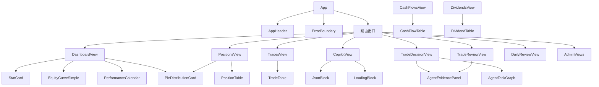
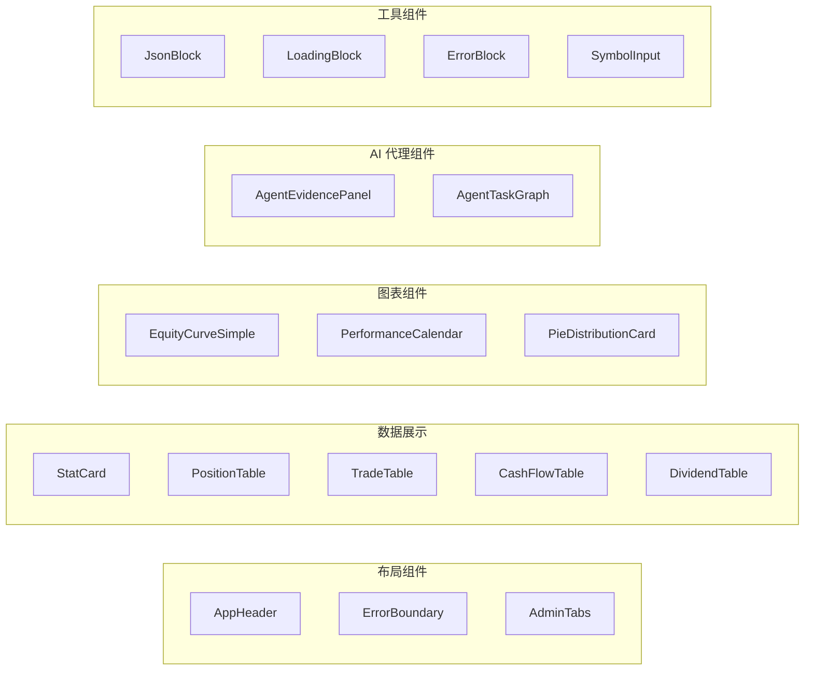
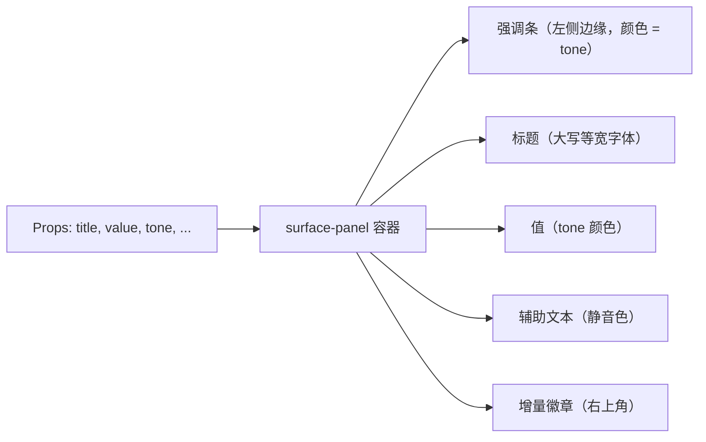

# 组件

前端使用 `src/components/` 中的可复用组件库。这些组件遵循终端奢华设计系统，使用 CSS 变量实现一致的样式。

## 组件层级



## 组件分类



## 核心组件

### AppHeader

**文件**: `src/components/AppHeader.tsx`

显示在每个页面上的主导航头部。包含：

- **标题和副标题**: "IBKR Dashboard" / "Portfolio Analytics"
- **账户指标条**: 报告日期、总权益、总盈亏（来自 `useAccountOverview` hook）
- **导航按钮**: Dashboard、Positions、Trades、Cash Flows、Dividends、AI Decision、AI Review、Copilot、Admin
- **认证控件**: 登录/登出按钮，用户名显示
- **语言切换**: 在英文和中文之间切换
- **登录模态框**: 用于用户名/密码认证的内联模态框

头部使用 `useAuth` hook 获取认证状态，使用 `useAccountOverview` hook 获取账户指标。

```tsx
// ibkr_dash_frontend/src/App.tsx
<AppHeader />
// 在 <App /> 内作为第一个子组件渲染，在 <Outlet /> 之上
```

**内部结构（简化版）：**

```tsx
function AppHeader() {
  const { authenticated, username, logout } = useAuth()
  const { data: overview } = useAccountOverview()
  const navigate = useNavigate()
  const location = useLocation()
  const { t, i18n } = useTranslation()

  return (
    <header className="app-header">
      <div className="app-header__title">
        <h1>{t('app.title')}</h1>
        <span>{t('app.subtitle')}</span>
      </div>
      <div className="app-header__metrics">
        {/* 报告日期、总权益、总盈亏 */}
      </div>
      <nav className="app-header__nav">
        {/* 每个路由的导航按钮 */}
      </nav>
      <div className="app-header__controls">
        {/* 语言切换 + 认证控件 */}
      </div>
    </header>
  )
}
```

### StatCard

**文件**: `src/components/StatCard.tsx`

一个样式化的卡片，显示单个指标，包含标题、值、辅助文本和可选的增量指示器。用于 Dashboard 显示总权益、现金、总盈亏、YTD TWR 等。

```tsx
<StatCard
  title="Total Equity"
  value="$123,456"
  helper="As of 2024-12-15"
  tone="positive"
  deltaPercent="+2.3%"
  deltaAmount="+$2,800"
  deltaTone="positive"
/>
```

| Prop | 类型 | 描述 |
|---|---|---|
| `title` | string | 指标标签（以大写等宽字体显示） |
| `value` | string | 主要指标值 |
| `helper` | string? | 值下方的辅助文本 |
| `tone` | `'neutral' \| 'positive' \| 'negative' \| 'accent'` | 强调条和值的颜色调性 |
| `deltaAmount` | string? | 增量金额徽章（右上角） |
| `deltaPercent` | string? | 增量百分比徽章（右上角） |
| `deltaTone` | string? | 增量徽章的颜色 |
| `icon` | string? | 可选的图标前缀 |

**渲染流程：**



### ErrorBoundary

**文件**: `src/components/ErrorBoundary.tsx`

一个 React 类组件，捕获渲染错误并显示回退 UI，而不是让整个应用崩溃。

```tsx
<ErrorBoundary>
  <SomeComponent />
</ErrorBoundary>
```

功能：
- 捕获子组件树中的错误
- 显示错误消息和"重新加载页面"按钮
- 将错误记录到控制台，包含组件堆栈跟踪
- 通过 `fallback` prop 支持自定义回退

使用场景：
- `App.tsx`: 包裹路由出口
- `router/index.tsx`: 包裹每个懒加载视图

### PositionTable

**文件**: `src/components/PositionTable.tsx`

可排序的数据表格，显示当前投资组合持仓。支持点击排序数值列（日变化、已实现盈亏、未实现盈亏、成本、市值、% NAV）。

功能：
- 使用 `useMemo` 进行客户端排序
- 点击任何行查看持仓详情图表
- 盈亏颜色编码（绿色为正，红色为负）
- 等宽数字，使用 tabular-nums

```tsx
// ibkr_dash_frontend/src/views/PositionsView.tsx
<PositionTable
  positions={positions}
  onSelectSymbol={(symbol) => setSelectedSymbol(symbol)}
/>
```

**排序实现：**

```tsx
// PositionTable.tsx 内部
const [sortKey, setSortKey] = useState<string>('marketValue')
const [sortDir, setSortDir] = useState<'asc' | 'desc'>('desc')

const sorted = useMemo(() => {
  return [...positions].sort((a, b) => {
    const av = a[sortKey] ?? 0
    const bv = b[sortKey] ?? 0
    return sortDir === 'asc' ? av - bv : bv - av
  })
}, [positions, sortKey, sortDir])
```

### TradeTable

**文件**: `src/components/TradeTable.tsx`

显示交易历史，包含日期、标的、方向（买入/卖出）、数量、价格和盈亏列。

```tsx
<TradeTable trades={trades} />
```

### CashFlowTable

**文件**: `src/components/CashFlowTable.tsx`

显示现金流记录，包括存款、取款及其详情。

### DividendTable

**文件**: `src/components/DividendTable.tsx`

显示股息收入记录，包含总金额、预扣税和净收入。

### PieDistributionCard

**文件**: `src/components/PieDistributionCard.tsx`

基于 ECharts 的饼图卡片，显示分布数据（如持仓集中度、资产类别配置）。支持交互式悬停提示和图例。

```tsx
<PieDistributionCard
  title="Position Concentration"
  data={[
    { name: 'AAPL', value: 45000 },
    { name: 'MSFT', value: 30000 },
    { name: 'GOOGL', value: 25000 },
  ]}
/>
```

### EquityCurveSimple

**文件**: `src/components/EquityCurveSimple.tsx`

ECharts 折线图，显示随时间变化的权益曲线。支持多系列（权益、盈亏、成本基础）和范围选择。

```tsx
<EquityCurveSimple
  data={equityCurveData}
  series={['equity', 'pnl', 'costBasis']}
/>
```

### PerformanceCalendar

**文件**: `src/components/PerformanceCalendar.tsx`

ECharts 日历热力图，显示每日盈亏。正收益日为绿色，负收益日为红色。支持月视图、年视图和全部年份视图。

```tsx
<PerformanceCalendar data={calendarData} year={2025} />
```

### AgentEvidencePanel

**文件**: `src/components/AgentEvidencePanel.tsx`

显示 AI 代理运行的证据包。展示数据源、带有可用性状态的证据部分、缺失数据和数据限制。用于交易决策、交易复盘和每日复盘视图。

### AgentTaskGraph

**文件**: `src/components/AgentTaskGraph.tsx`

将代理运行的执行跟踪可视化为时间线图。显示 LLM 调用、工具调用、延迟和错误。

### JsonBlock

**文件**: `src/components/JsonBlock.tsx`

可折叠的 JSON 查看器组件。显示一个切换按钮，展开后显示格式化的 JSON。用于显示原始代理输出、证据包和调试数据。

```tsx
<JsonBlock data={rawAgentOutput} label="Raw Output" />
```

### LoadingBlock

**文件**: `src/components/LoadingBlock.tsx`

带有微光动画的加载占位符。在数据获取期间使用。

### ErrorBlock

**文件**: `src/components/ErrorBlock.tsx`

错误显示组件，包含错误消息和可选的重试按钮。

```tsx
<ErrorBlock
  message="Failed to load positions"
  onRetry={() => refetch()}
/>
```

### SymbolInput

**文件**: `src/components/SymbolInput.tsx`

用于输入股票代码的文本输入框，带有自动完成建议。

```tsx
<SymbolInput
  value={symbol}
  onChange={setSymbol}
  onSelect={(s) => handleSearch(s)}
/>
```

### AdminTabs

**文件**: `src/components/AdminTabs.tsx`

管理区域的导航标签。提供到 System、LLM、IBKR、Email、Longbridge、Prompts、Monitoring 和 Harness 视图的链接。

## 组件如何使用 i18n

组件使用 `react-i18next` 的 `useTranslation` hook：

```tsx
import { useTranslation } from 'react-i18next'

function MyComponent() {
  const { t } = useTranslation()

  return (
    <div>
      <h1>{t('dashboard.title')}</h1>
      <p>{t('dashboard.loading')}</p>
    </div>
  )
}
```

翻译键遵循与 JSON 语言文件匹配的层级结构：
- `app.title` -> "IBKR Dashboard" (en) / "IBKR 仪表盘" (zh-CN)
- `nav.positions` -> "Positions" (en) / "持仓" (zh-CN)
- `dashboard.totalEquity` -> "Total Equity" (en) / "总权益" (zh-CN)

插值（动态值）：

```tsx
// en.json: "ytdTwrHelper": "{{startDate}} to date"
t('dashboard.ytdTwrHelper', { startDate: '2024-01-01' })
// -> "2024-01-01 to date"
```

## 样式模式

组件使用三种样式方法：

1. **CSS 类** 来自 `base.css` 和 `theme.css`（如 `.btn`、`.surface-panel`、`.data-table`）
2. **内联样式** 使用 CSS 变量（如 `color: 'var(--color-text-muted)'`）
3. **组件范围的内联样式** 用于布局特定的样式

设计系统使用 `theme.css` 中定义的 CSS 自定义属性来设置颜色、间距、排版和阴影。这使得跨组件维护视觉一致性变得容易。

```tsx
// 示例：组合 CSS 类和内联样式
<div className="surface-panel" style={{ padding: 'var(--space-5)' }}>
  <StatCard
    title={t('dashboard.totalEquity')}
    value={formatCurrency(overview.totalEquity)}
    tone={overview.totalPnl >= 0 ? 'positive' : 'negative'}
  />
</div>
```
