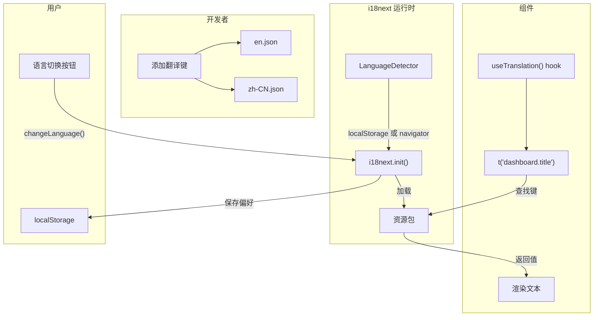
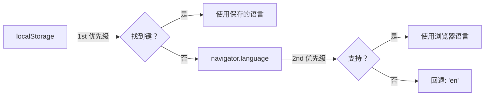
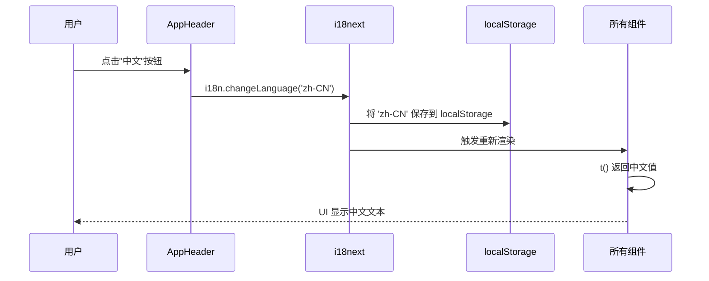
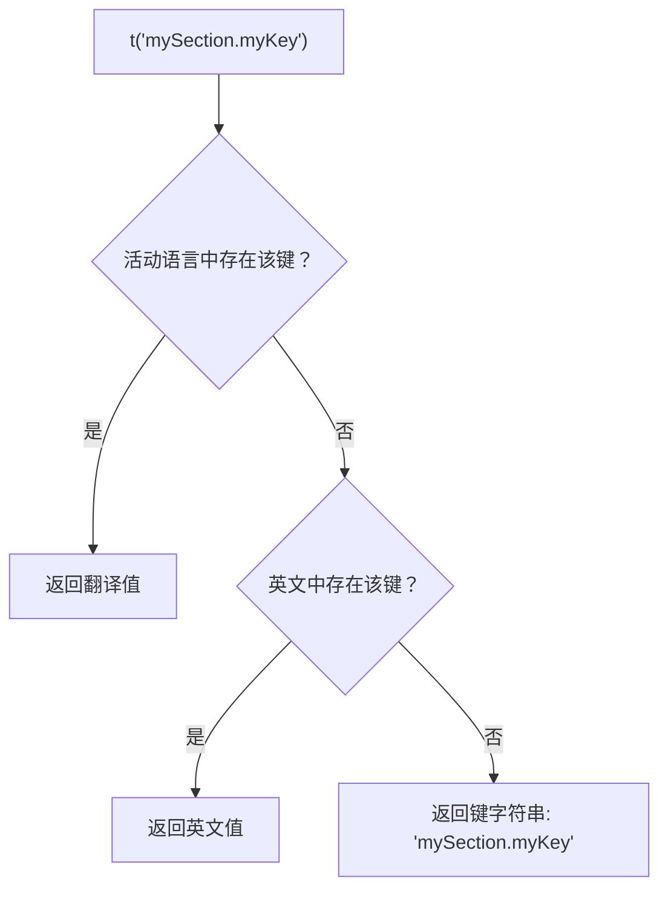

# 国际化 (i18n)

前端使用 **react-i18next** 支持英文和简体中文。所有面向用户的文本都被提取到 JSON 语言文件中，便于添加新语言。

## 翻译工作流图



## 配置

i18n 配置在 `src/i18n/index.ts` 中：

```typescript
// frontend/src/i18n/index.ts
import i18n from 'i18next'
import { initReactI18next } from 'react-i18next'
import LanguageDetector from 'i18next-browser-languagedetector'

import en from './locales/en.json'
import zhCN from './locales/zh-CN.json'

i18n
  .use(LanguageDetector)
  .use(initReactI18next)
  .init({
    resources: {
      en: { translation: en },
      'zh-CN': { translation: zhCN },
    },
    fallbackLng: 'en',
    interpolation: {
      escapeValue: false, // React 已经处理转义
    },
    detection: {
      order: ['localStorage', 'navigator'],
      caches: ['localStorage'],
    },
  })

export default i18n
```

### 关键配置

| 设置 | 值 | 用途 |
|---|---|---|
| `fallbackLng` | `'en'` | 翻译键缺失时使用英文 |
| `interpolation.escapeValue` | `false` | React 处理 XSS 转义 |
| `detection.order` | `['localStorage', 'navigator']` | 先检查 localStorage，再检查浏览器语言 |
| `detection.caches` | `['localStorage']` | 将语言偏好保存到 localStorage |

### 语言检测流程



## 语言文件

翻译存储在 `src/i18n/locales/` 下的 JSON 文件中：

| 文件 | 语言 |
|---|---|
| `en.json` | 英文（554 行） |
| `zh-CN.json` | 简体中文 |

### 结构

语言文件使用层级键结构：

```json
{
  "app": {
    "title": "IBKR Dashboard",
    "subtitle": "Portfolio Analytics",
    "version": "IBKR DASH v0.1.0",
    "techStack": "SQLite · FastAPI · React"
  },
  "nav": {
    "dashboard": "Dashboard",
    "positions": "Positions",
    "trades": "Trades",
    "cashFlows": "Cash Flows"
  },
  "dashboard": {
    "title": "Dashboard",
    "totalEquity": "Total Equity",
    "cash": "Cash",
    "loading": "Loading..."
  }
}
```

### 顶层分区

| 分区 | 描述 |
|---|---|
| `app` | 应用标题、副标题、版本、技术栈 |
| `nav` | 导航标签 |
| `auth` | 登录/登出标签 |
| `header` | 头部指标标签 |
| `dashboard` | 仪表盘页面文本 |
| `positions` | 持仓页面文本 |
| `trades` | 交易页面文本 |
| `cashFlows` | 现金流页面文本 |
| `dividends` | 股息页面文本 |
| `copilot` | 账户 Copilot 文本 |
| `tradeDecision` | 交易决策代理文本 |
| `tradeReview` | 交易复盘代理文本 |
| `dailyReview` | 每日复盘代理文本 |
| `riskAssessment` | 风险评估文本 |
| `admin` | 管理区域标签 |
| `adminSystem` | 系统状态页面 |
| `adminLlm` | LLM 配置页面 |
| `adminIbkr` | IBKR 设置页面 |
| `adminEmail` | 邮件配置页面 |
| `adminPrompts` | 提示词管理页面 |
| `adminHarness` | 测试台控制台页面 |
| `adminLongbridge` | Longbridge MCP 页面 |
| `adminMonitoring` | 代理监控页面 |
| `bootstrap` | 初始设置页面 |
| `stockResearch` | 股票研究页面 |
| `common` | 共享标签（加载、错误、保存、取消） |
| `errors` | 错误消息 |

## 在组件中使用翻译

### 基本用法

```tsx
// frontend/src/views/DashboardView.tsx
import { useTranslation } from 'react-i18next'

function DashboardView() {
  const { t } = useTranslation()

  return (
    <div>
      <h1>{t('dashboard.title')}</h1>
      <p>{t('dashboard.loading')}</p>
    </div>
  )
}
```

### 插值

使用 `{{variable}}` 语法传递动态值：

```json
{
  "dashboard": {
    "ytdTwrHelper": "{{startDate}} to date"
  }
}
```

```tsx
t('dashboard.ytdTwrHelper', { startDate: '2024-01-01' })
// -> "2024-01-01 to date"
```

### 复数形式

使用 `_one` 和 `_other` 后缀：

```json
{
  "dashboard": {
    "validPeriods": "{{count}} valid {{period}}"
  }
}
```

```tsx
t('dashboard.validPeriods', { count: 5, period: t('dashboard.tradingDays') })
// -> "5 valid trading days"
```

### 数组

某些翻译返回数组（如 Copilot 的欢迎问题）：

```json
{
  "copilot": {
    "welcomeQuestions": [
      "What is my total equity?",
      "What are my top 5 positions?",
      "What is my risk level?"
    ]
  }
}
```

```tsx
const questions: string[] = t('copilot.welcomeQuestions', { returnObjects: true })
```

## 语言切换器

`AppHeader.tsx` 中的语言切换按钮在英文和中文之间切换：

```tsx
// frontend/src/components/AppHeader.tsx
function toggleLanguage() {
  const next = i18n.language === 'zh-CN' ? 'en' : 'zh-CN'
  void i18n.changeLanguage(next)
}

<button onClick={toggleLanguage} className="btn btn--ghost btn--sm">
  {i18n.language === 'zh-CN' ? 'EN' : '中文'}
</button>
```

语言偏好保存到 `localStorage`，页面重新加载时恢复。

**语言切换流程：**



## 如何添加新翻译

### 1. 将键添加到两个语言文件

**en.json:**
```json
{
  "mySection": {
    "myKey": "My English text"
  }
}
```

**zh-CN.json:**
```json
{
  "mySection": {
    "myKey": "我的中文文本"
  }
}
```

### 2. 在组件中使用该键

```tsx
const { t } = useTranslation()
return <p>{t('mySection.myKey')}</p>
```

### 3. 回退行为

如果活动语言中缺少某个键，i18next 会回退到英文（`fallbackLng: 'en'`）。如果英文中也缺少该键，则显示键字符串本身。



## 如何添加新语言

1. 创建新的语言文件：`src/i18n/locales/ja.json`（日语示例）
2. 从 `en.json` 复制结构并翻译所有值
3. 在 `src/i18n/index.ts` 中注册语言：

```typescript
import ja from './locales/ja.json'

i18n.init({
  resources: {
    en: { translation: en },
    'zh-CN': { translation: zhCN },
    'ja': { translation: ja },
  },
  // ...
})
```

4. 更新 `AppHeader.tsx` 中的语言切换器以包含新选项
5. `LanguageDetector` 插件将从浏览器自动检测新语言

## 翻译键命名约定

- 使用 **camelCase** 作为键名：`totalEquity`、`failedToLoad`
- 按**页面/分区**分组：`dashboard.title`、`positions.subtitle`
- 使用**点号表示法**进行嵌套：`admin.system.database`
- 标签值使用**句首大写**："Total Equity"
- UI 中的分区标题值使用**全大写**："KEY REASONS"、"RISKS"
- 使用 `{{variable}}` 进行插值：`"Page {{page}} of {{totalPages}}"`
