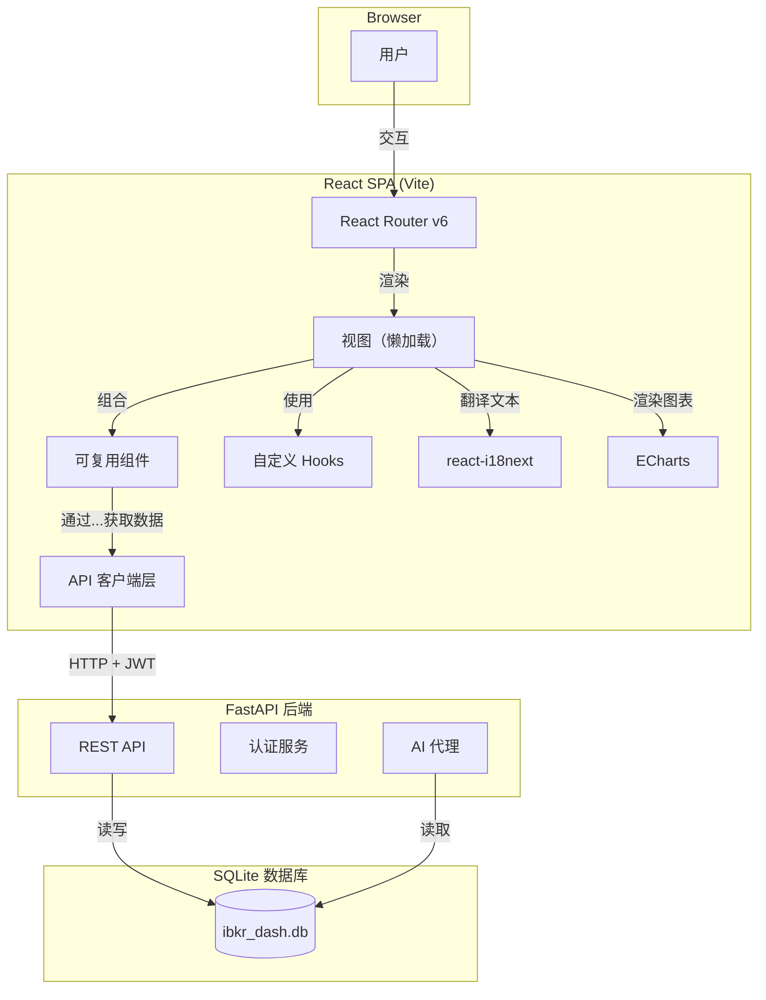
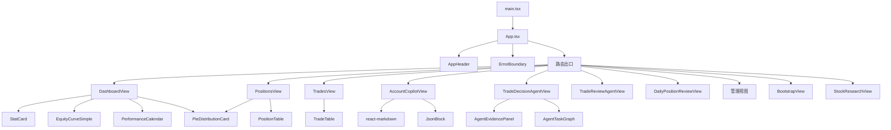
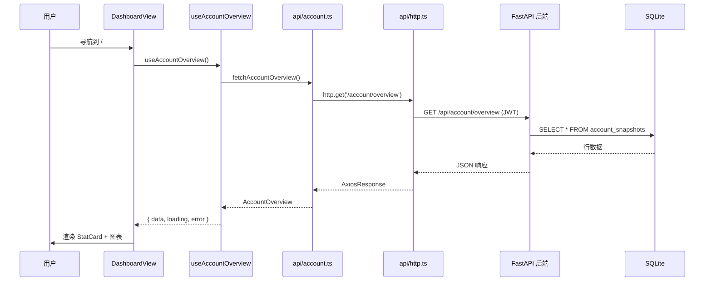

# 前端概览

IBKR Dashboard 前端是一个基于 **React 18**、**TypeScript** 和 **Vite** 构建的单页应用。它提供了一个终端奢华主题的界面，用于查看投资组合数据并与 AI 代理交互。

## 技术栈

| 技术 | 版本 | 用途 |
|---|---|---|
| React | 18.3 | UI 框架 |
| TypeScript | 5.5 | 类型安全 |
| Vite | 5.4 | 构建工具和开发服务器 |
| React Router | 6.23 | 客户端路由 |
| react-i18next | 17.0 | 国际化 |
| ECharts | 5.5 | 图表和数据可视化 |
| react-markdown | 10.1 | Markdown 渲染（Copilot） |
| Vitest | 4.1 | 单元测试 |

## 应用架构图



## 模块结构

源代码位于 `frontend/src/`，按功能划分组织：

```
frontend/src/
├── api/              # API 客户端函数（每个领域一个文件）
│   ├── http.ts       # 共享 Axios 实例，带 JWT 拦截器
│   ├── account.ts    # 账户概览和快照
│   ├── positions.ts  # 持仓数据
│   ├── trades.ts     # 交易记录
│   ├── charts.ts     # 权益曲线、日历数据
│   ├── auth.ts       # 登录/登出
│   └── ...           # 另有 18 个领域专用文件
├── auth/             # 认证工具（令牌存储、刷新）
├── components/       # 可复用 UI 组件（StatCard、表格、图表等）
│   ├── AppHeader.tsx
│   ├── StatCard.tsx
│   ├── PositionTable.tsx
│   ├── ErrorBoundary.tsx
│   └── ...
├── composables/      # 共享组合逻辑
├── hooks/            # 自定义 React hooks
│   ├── useAuth.ts         # 认证状态管理
│   ├── useAccountOverview.ts  # 账户指标获取
│   └── ...
├── i18n/             # 国际化配置和语言文件
│   ├── index.ts      # i18next 初始化
│   └── locales/      # en.json, zh-CN.json
├── router/           # React Router 配置
│   └── index.tsx     # 所有路由定义（含懒加载）
├── styles/           # CSS 文件
│   ├── theme.css     # 设计令牌（CSS 变量）
│   ├── base.css      # 基础样式和组件类
│   └── primevue-overrides.css
├── test/             # 测试工具
├── types/            # TypeScript 类型定义（每个领域一个文件）
│   ├── account.ts    # AccountOverview, AccountSnapshot
│   ├── positions.ts  # PositionItem, PositionDetail
│   ├── common.ts     # PaginatedResponse, ApiResponse
│   └── ...
├── utils/            # 工具函数（格式化、指标计算）
├── views/            # 页面级组件（每个路由一个）
│   ├── DashboardView.tsx
│   ├── PositionsView.tsx
│   ├── TradesView.tsx
│   ├── AccountCopilotView.tsx
│   ├── TradeDecisionAgentView.tsx
│   └── ...
├── App.tsx           # 根组件（布局 + 头部 + 出口）
├── main.tsx          # 入口点（渲染 App，导入样式）
└── vite-env.d.ts     # Vite 类型声明
```

## 组件层级



## 核心依赖

### UI 和路由

- **react-router-dom**: 使用 `createBrowserRouter` 进行客户端路由。支持懒加载、嵌套路由和受保护路由。
- **react-markdown**: 在 Copilot 聊天界面中渲染 Markdown。通过 `remark-gfm` 支持 GitHub 风格 Markdown。

### 数据可视化

- **echarts**: 功能完整的图表库，用于权益曲线、P&L 日历、饼图和绩效可视化。图表被封装在 React 组件中管理 ECharts 实例的生命周期。

### 国际化

- **i18next**: 核心 i18n 框架
- **react-i18next**: i18next 的 React 绑定
- **i18next-browser-languagedetector**: 从 localStorage 和浏览器设置自动检测用户语言

### 测试

- **vitest**: 与 Vite 兼容的快速单元测试运行器
- **@testing-library/react**: React 测试工具
- **@testing-library/jest-dom**: 用于 DOM 断言的自定义 Jest 匹配器
- **jsdom**: 用于 Node.js 测试的 DOM 实现

## 构建配置

Vite 配置（`vite.config.ts`）设置了：

- React 插件用于 JSX 转换
- 路径别名 `@` 指向 `src/`
- 开发服务器带 API 代理到后端
- 生产构建带代码分割

### vite.config.ts

```typescript
// frontend/vite.config.ts
import { defineConfig } from 'vite'
import react from '@vitejs/plugin-react'
import path from 'path'

export default defineConfig({
  plugins: [react()],
  resolve: {
    alias: {
      '@': path.resolve(__dirname, 'src'),
    },
  },
  server: {
    port: 5173,
    proxy: {
      '/api': {
        target: 'http://localhost:8000',
        changeOrigin: true,
      },
    },
  },
  build: {
    rollupOptions: {
      output: {
        manualChunks: {
          vendor: ['react', 'react-dom'],
          charts: ['echarts'],
        },
      },
    },
  },
})
```

### 开发环境

```bash
cd frontend
npm install
npm run dev
```

开发服务器启动在 `http://localhost:5173`，API 请求代理到后端。

### 生产构建

```bash
npm run build
```

这会生成优化的静态文件到 `dist/`，包含：
- 按路由的代码分割（懒加载视图）
- CSS 提取和压缩
- 资源哈希用于缓存失效

## API 层

每个后端领域在 `src/api/` 中有一个对应的 API 客户端文件：

| 文件 | 领域 |
|---|---|
| `account.ts` | 账户概览和快照 |
| `positions.ts` | 持仓数据 |
| `trades.ts` | 交易记录 |
| `cashFlows.ts` | 现金流记录 |
| `dividends.ts` | 股息记录 |
| `charts.ts` | 图表数据（权益曲线、日历） |
| `tradeDecision.ts` | 交易决策代理 |
| `tradeReview.ts` | 交易复盘代理 |
| `dailyPositionReview.ts` | 每日持仓复盘代理 |
| `accountCopilot.ts` | 账户 Copilot 聊天 |
| `symbolAnalysis.ts` | 股票研究 |
| `auth.ts` | 认证 |
| `adminSystem.ts` | 系统状态 |
| `adminLlm.ts` | LLM 配置 |
| `adminIbkr.ts` | IBKR 设置 |
| `adminEmail.ts` | 邮件配置 |
| `adminPrompts.ts` | 提示词管理 |
| `adminHarness.ts` | 评估测试台 |
| `adminLongbridgeMcp.ts` | Longbridge MCP 设置 |
| `agentTasks.ts` | 代理任务历史 |

### HTTP 客户端

所有 API 调用通过共享的 HTTP 客户端（`src/api/http.ts`），该客户端处理认证头、错误响应和基础 URL 配置。

```typescript
// frontend/src/api/http.ts
import axios from 'axios'

const http = axios.create({
  baseURL: '/api',
  headers: { 'Content-Type': 'application/json' },
})

// 从 localStorage 附加 JWT 令牌
http.interceptors.request.use((config) => {
  const token = localStorage.getItem('token')
  if (token) {
    config.headers.Authorization = `Bearer ${token}`
  }
  return config
})

// 处理 401 错误（重定向到登录）
http.interceptors.response.use(
  (response) => response,
  (error) => {
    if (error.response?.status === 401) {
      localStorage.removeItem('token')
      window.location.href = '/'
    }
    return Promise.reject(error)
  },
)

export default http
```

### API 调用示例

```typescript
// frontend/src/api/account.ts
import http from './http'
import type { AccountOverview } from '@/types/account'

export async function fetchAccountOverview(): Promise<AccountOverview> {
  const { data } = await http.get('/account/overview')
  return data
}
```

## 类型定义

TypeScript 类型定义在 `src/types/` 中，每个领域一个文件：

| 文件 | 类型 |
|---|---|
| `account.ts` | AccountOverview, AccountSnapshot |
| `positions.ts` | PositionItem, PositionDetail |
| `trades.ts` | TradeRecord, TradeSummary |
| `cashFlows.ts` | CashFlowRecord, CashFlowSummary |
| `dividends.ts` | DividendRecord |
| `charts.ts` | EquityCurvePoint, CalendarData |
| `tradeDecision.ts` | TradeDecision, ScoreDetail |
| `tradeReview.ts` | TradeReview, MistakeTag |
| `dailyPositionReview.ts` | DailyReview, SymbolAnalysis |
| `accountCopilot.ts` | CopilotSession, CopilotMessage |
| `agentTasks.ts` | AgentTask, AgentTaskStatus |
| `common.ts` | PaginatedResponse, ApiResponse |
| `auth.ts` | AuthState, LoginCredentials |

## 数据流



## 设计理念

前端遵循以下原则：

- **终端奢华主题**: 深黑曜石底色配琥珀/金色点缀，等宽字体排版，彭博终端风格布局
- **响应式**: 支持桌面和平板，在移动端优雅降级
- **无障碍**: 语义化 HTML，键盘导航，颜色对比度
- **高性能**: 懒加载路由，记忆化计算，高效重渲染
- **类型安全**: 完整的 TypeScript 覆盖，严格模式
