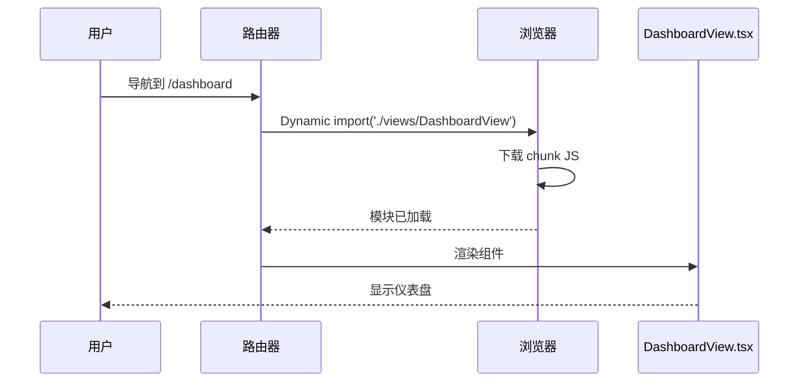
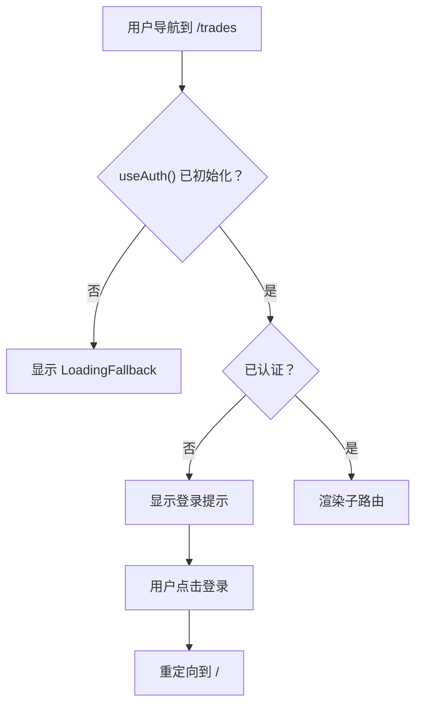

# 路由

前端使用 **React Router v6** 的 `createBrowserRouter` 进行客户端路由。所有路由定义在 `src/router/index.tsx` 中。

## 路由架构图

```mermaid
graph TB
    Root["createBrowserRouter"] --> App["App.tsx（布局）"]
    App --> Header["AppHeader"]
    App --> Outlet["Outlet"]

    Outlet --> Public["公开路由"]
    Outlet --> Protected["受保护路由"]
    Outlet --> Admin["管理路由"]
    Outlet --> CatchAll["兜底路由: * -> /"]

    Public --> Dashboard["/ -> DashboardView"]
    Public --> Positions["/positions -> PositionsView"]
    Public --> Bootstrap["/bootstrap -> BootstrapView"]

    Protected --> Trades["/trades -> TradesView"]
    Protected --> CashFlows["/cash-flows -> CashFlowsView"]
    Protected --> Dividends["/dividends -> DividendsView"]
    Protected --> Research["/stock-research -> StockResearchView"]
    Protected --> DailyReview["/daily-position-review -> DailyPositionReviewView"]
    Protected --> Decision["/trade-decision -> TradeDecisionAgentView"]
    Protected --> Review["/trade-review -> TradeReviewAgentView"]
    Protected --> Copilot["/copilot -> AccountCopilotView"]

    Admin --> System["/admin/system"]
    Admin --> LLM["/admin/llm"]
    Admin --> Ibkr["/admin/ibkr"]
    Admin --> Email["/admin/email"]
    Admin --> Longbridge["/admin/longbridge-mcp"]
    Admin --> Prompts["/admin/prompts"]
    Admin --> Monitor["/admin/agent-monitoring"]
    Admin --> Harness["/admin/harness"]
```



## 路由器配置

```tsx
// ibkr_dash_frontend/src/router/index.tsx
import { createBrowserRouter, Navigate } from 'react-router-dom'
import App from '@/App'

export const router = createBrowserRouter([
  {
    path: '/',
    element: <App />,
    children: [
      // 所有页面路由都是 App 的子路由
    ],
  },
])
```

`<App />` 组件作为布局包装器，渲染 `<AppHeader />` 和用于活动路由的 `<Outlet />`。

```tsx
// ibkr_dash_frontend/src/App.tsx
function App() {
  return (
    <ErrorBoundary>
      <AppHeader />
      <main className="app-shell">
        <Outlet />
      </main>
    </ErrorBoundary>
  )
}
```

## 懒加载

所有视图使用 React 的 `lazy()` 和 `Suspense` 进行懒加载：

```tsx
// ibkr_dash_frontend/src/router/index.tsx
const DashboardView = lazy(() => import('@/views/DashboardView'))
const PositionsView = lazy(() => import('@/views/PositionsView'))
const TradesView = lazy(() => import('@/views/TradesView'))
// ... 更多视图
```

每个懒加载视图被包装在一个提供加载回退和错误边界的辅助函数中：

```tsx
function lazyViewWithErrorBoundary(Component: React.LazyExoticComponent<any>) {
  return (
    <ErrorBoundary>
      <Suspense fallback={<LoadingFallback />}>
        <Component />
      </Suspense>
    </ErrorBoundary>
  )
}
```

**懒加载流程：**



这意味着：
- 每个视图仅在用户导航到该页面时才加载
- 如果视图加载失败，错误边界会捕获它
- 视图获取期间显示加载动画

## 受保护路由

某些路由需要认证。这些路由被包装在 `ProtectedRoute` 组件中：

```tsx
// ibkr_dash_frontend/src/router/index.tsx
function ProtectedRoute({ children }: { children: React.ReactNode }) {
  const { authenticated, initialized } = useAuth()

  // 等待认证状态确定
  if (!initialized) return <LoadingFallback />

  // 未认证时显示登录提示
  if (!authenticated) {
    return (
      <div className="surface-panel" style={{ padding: 'var(--space-6)', textAlign: 'center' }}>
        <p style={{ color: 'var(--color-text-secondary)' }}>
          Please log in to access this page.
        </p>
        <button className="btn btn--accent" onClick={() => window.location.href = '/'}>
          Go to Login
        </button>
      </div>
    )
  }

  return <>{children}</>
}
```

**受保护路由决策流程：**



## 所有路由

### 公开路由

| 路径 | 视图 | 描述 |
|---|---|---|
| `/` | `DashboardView` | 主仪表盘，包含权益曲线、P&L 日历、统计数据 |
| `/positions` | `PositionsView` | 当前投资组合持仓和配置 |
| `/bootstrap` | `BootstrapView` | 初始管理员账户创建 |

### 受保护路由（需要登录）

| 路径 | 视图 | 描述 |
|---|---|---|
| `/trades` | `TradesView` | 带筛选的交易历史 |
| `/cash-flows` | `CashFlowsView` | 现金流记录 |
| `/dividends` | `DividendsView` | 股息收入记录 |
| `/stock-research` | `StockResearchView` | 股票研究和分析 |
| `/daily-position-review` | `DailyPositionReviewView` | AI 每日持仓复盘 |
| `/trade-decision` | `TradeDecisionAgentView` | AI 交易决策分析 |
| `/trade-review` | `TradeReviewAgentView` | AI 交易复盘 |
| `/copilot` | `AccountCopilotView` | 账户 Copilot 聊天 |

### 管理路由（需要登录）

| 路径 | 视图 | 描述 |
|---|---|---|
| `/admin/system` | `AdminSystemView` | 系统状态和健康检查 |
| `/admin/llm` | `AdminLlmView` | LLM 提供商配置 |
| `/admin/ibkr` | `AdminIbkrView` | IBKR Flex Web Service 设置 |
| `/admin/email` | `AdminEmailView` | SMTP 邮件配置 |
| `/admin/longbridge-mcp` | `AdminLongbridgeMcpView` | Longbridge MCP 集成 |
| `/admin/prompts` | `AdminPromptsView` | 提示词版本管理 |
| `/admin/agent-monitoring` | `AdminAgentMonitoringView` | 代理执行监控 |
| `/admin/harness` | `AdminHarnessView` | 评估测试台控制台 |

### 兜底路由

任何不匹配的路径重定向到 `/`：

```tsx
{ path: '*', element: <Navigate to="/" replace /> }
```

## 导航

`AppHeader` 组件渲染使用 `useNavigate()` 进行编程式路由的导航按钮：

```tsx
const navigate = useNavigate()

<button onClick={() => navigate('/positions')}>
  Positions
</button>
```

活动路由高亮使用 `useLocation()`：

```tsx
const location = useLocation()

function isActive(path: string): boolean {
  if (location.pathname === path) return true
  // 管理路由：对任何 /admin/* 路径高亮"Admin"按钮
  if (path.startsWith('/admin')) return location.pathname.startsWith('/admin')
  return false
}
```

## 添加新路由

要添加新页面：

1. 在 `src/views/MyNewView.tsx` 中创建视图组件

2. 在 `src/router/index.tsx` 中添加懒加载导入：
   ```tsx
   const MyNewView = lazy(() => import('@/views/MyNewView'))
   ```

3. 将路由添加到 children 数组：
   ```tsx
   { path: 'my-new-page', element: lazyViewWithErrorBoundary(MyNewView) }
   ```

4. 如果需要受保护，用 `<ProtectedRoute>` 包装：
   ```tsx
   {
     path: 'my-new-page',
     element: <ProtectedRoute>{lazyViewWithErrorBoundary(MyNewView)}</ProtectedRoute>
   }
   ```

5. 如有需要，在 `AppHeader.tsx` 中添加导航按钮

6. 在 `en.json` 和 `zh-CN.json` 中添加翻译键
