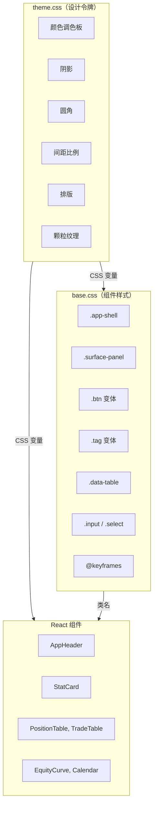

# 样式

前端使用**终端奢华**设计系统，灵感来自彭博终端和奢华手表界面。样式基于 CSS 自定义属性（设计令牌）构建，以实现一致性和可维护性。

## CSS 架构

样式组织在三个文件中：

| 文件 | 用途 |
|---|---|
| `src/styles/theme.css` | 设计令牌（CSS 变量）和字体导入 |
| `src/styles/base.css` | 基础样式、组件类、布局工具、动画 |
| `src/styles/primevue-overrides.css` | PrimeVue 组件覆盖（如使用） |

`theme.css` 和 `base.css` 都在 `main.tsx` 中导入：

```tsx
// frontend/src/main.tsx
import './styles/theme.css'
import './styles/base.css'
```

## 设计令牌架构



## 设计令牌（CSS 变量）

所有视觉属性都在 `theme.css` 中定义为 CSS 自定义属性。这使得维护一致性和调整主题变得容易。

### 颜色调色板参考

| 变量 | 值 | 用途 |
|---|---|---|
| `--color-bg` | `#080b12` | 页面背景 |
| `--color-bg-elevated` | `rgba(12, 16, 28, 0.96)` | 提升的表面 |
| `--color-bg-panel` | `rgba(14, 18, 32, 0.92)` | 面板背景 |
| `--color-bg-panel-strong` | `rgba(18, 24, 42, 0.96)` | 更强的面板背景 |
| `--color-bg-muted` | `rgba(20, 26, 44, 0.72)` | 静音背景 |
| `--color-bg-glass` | `rgba(18, 24, 42, 0.56)` | 玻璃效果背景 |
| `--color-border` | `rgba(255, 191, 80, 0.08)` | 默认边框 |
| `--color-border-strong` | `rgba(255, 191, 80, 0.18)` | 强调边框 |
| `--color-border-subtle` | `rgba(255, 255, 255, 0.04)` | 微妙边框 |
| `--color-text-primary` | `#e8e4dc` | 主要文本 |
| `--color-text-secondary` | `#8a8d9e` | 次要文本 |
| `--color-text-muted` | `#5a5d6e` | 静音文本 |
| `--color-text-bright` | `#fff8ef` | 亮色/高亮文本 |
| `--color-accent` | `#d4a843` | 主强调色（琥珀/金色） |
| `--color-accent-soft` | `rgba(212, 168, 67, 0.12)` | 柔和强调背景 |
| `--color-accent-strong` | `#f0c55e` | 强调色 |
| `--color-accent-glow` | `rgba(212, 168, 67, 0.06)` | 强调发光效果 |
| `--color-positive` | `#3dd68c` | 收益、成功 |
| `--color-positive-soft` | `rgba(61, 214, 140, 0.10)` | 正面背景 |
| `--color-negative` | `#f25c5c` | 亏损、错误 |
| `--color-negative-soft` | `rgba(242, 92, 92, 0.10)` | 负面背景 |
| `--color-warning` | `#f0a030` | 警告 |

### 颜色调色板 CSS

```css
/* frontend/src/styles/theme.css */
:root {
  /* 表面色板 */
  --color-bg:              #080b12;     /* 页面背景 */
  --color-bg-elevated:     rgba(12, 16, 28, 0.96);
  --color-bg-panel:        rgba(14, 18, 32, 0.92);
  --color-bg-panel-strong: rgba(18, 24, 42, 0.96);
  --color-bg-muted:        rgba(20, 26, 44, 0.72);
  --color-bg-glass:        rgba(18, 24, 42, 0.56);

  /* 边框 */
  --color-border:        rgba(255, 191, 80, 0.08);
  --color-border-strong: rgba(255, 191, 80, 0.18);
  --color-border-subtle: rgba(255, 255, 255, 0.04);

  /* 文本 */
  --color-text-primary:   #e8e4dc;
  --color-text-secondary: #8a8d9e;
  --color-text-muted:     #5a5d6e;
  --color-text-bright:    #fff8ef;

  /* 强调色 — 琥珀/金色 */
  --color-accent:       #d4a843;
  --color-accent-soft:  rgba(212, 168, 67, 0.12);
  --color-accent-strong:#f0c55e;
  --color-accent-glow:  rgba(212, 168, 67, 0.06);

  /* 语义色 */
  --color-positive:      #3dd68c;     /* 收益、成功 */
  --color-positive-soft: rgba(61, 214, 140, 0.10);
  --color-negative:      #f25c5c;     /* 亏损、错误 */
  --color-negative-soft: rgba(242, 92, 92, 0.10);
  --color-warning:       #f0a030;     /* 警告 */
}
```

### 阴影

```css
:root {
  --shadow-panel:    0 1px 0 rgba(255,191,80,0.04), 0 8px 32px rgba(0,0,0,0.35);
  --shadow-card:     0 1px 0 rgba(255,191,80,0.03), 0 4px 20px rgba(0,0,0,0.25);
  --shadow-elevated: 0 12px 48px rgba(0,0,0,0.5), 0 1px 0 rgba(255,191,80,0.06);
  --shadow-glow:     0 0 30px rgba(212,168,67,0.06);
}
```

### 圆角

```css
:root {
  --radius-sm: 6px;
  --radius-md: 10px;
  --radius-lg: 14px;
  --radius-xl: 20px;
}
```

### 间距比例

| 变量 | 值 | 像素 |
|---|---|---|
| `--space-1` | `0.25rem` | 4px |
| `--space-2` | `0.5rem` | 8px |
| `--space-3` | `0.75rem` | 12px |
| `--space-4` | `1rem` | 16px |
| `--space-5` | `1.5rem` | 24px |
| `--space-6` | `2rem` | 32px |
| `--space-7` | `3rem` | 48px |

### 排版

```css
:root {
  --font-mono: 'JetBrains Mono', 'SF Mono', 'Cascadia Code', monospace;
  --font-body: 'DM Sans', -apple-system, sans-serif;
}
```

- **JetBrains Mono**: 用于数字、代码、标签和终端风格文本
- **DM Sans**: 用于正文和标题

## 基础样式

### 应用外壳

`.app-shell` 类居中内容并限制宽度：

```css
/* frontend/src/styles/base.css */
.app-shell {
  width: min(1520px, calc(100% - 48px));
  margin: 0 auto;
  padding: 20px 0 60px;
}
```

### 表面面板（玻璃卡片）

主要容器组件使用毛玻璃效果：

```css
.surface-panel {
  border-radius: var(--radius-xl);
  background: linear-gradient(168deg, rgba(22, 28, 50, 0.88), rgba(12, 16, 30, 0.94));
  border: 1px solid var(--color-border);
  box-shadow: var(--shadow-panel);
  backdrop-filter: blur(12px);
}
```

通过 `::before` 伪元素在顶部边缘显示环境发光。

### 按钮

三种按钮变体：

| 类 | 描述 |
|---|---|
| `.btn` | 默认按钮，带微弱边框 |
| `.btn--accent` | 琥珀/金色强调按钮 |
| `.btn--ghost` | 透明背景，无边框 |
| `.btn--sm` | 小尺寸变体 |

```tsx
<button className="btn">Default</button>
<button className="btn btn--accent">Accent</button>
<button className="btn btn--ghost btn--sm">Small Ghost</button>
```

### 标签

小型状态徽章：

```tsx
<span className="tag">DEFAULT</span>
<span className="tag tag--positive">POSITIVE</span>
<span className="tag tag--negative">NEGATIVE</span>
<span className="tag tag--accent">ACCENT</span>
<span className="tag tag--warning">WARNING</span>
```

### 数据表格

用于数据展示的样式化表格：

```css
.data-table {
  width: 100%;
  min-width: 1100px;
  border-collapse: collapse;
}

.data-table thead th {
  font-family: var(--font-mono);
  font-size: 0.68rem;
  letter-spacing: 0.12em;
  text-transform: uppercase;
  color: var(--color-text-muted);
}
```

### 表单输入

```tsx
<input className="input" placeholder="Enter symbol..." />
<select className="select">...</select>
<label className="field-stack">
  <span className="field-stack__label">USERNAME</span>
  <input className="input" />
</label>
```

## 主题切换示例

虽然当前应用使用固定的暗色主题，但 CSS 变量架构使添加主题切换变得简单。以下是实现亮色主题切换的示例：

```typescript
// 示例：主题切换工具
const themes = {
  dark: {
    '--color-bg': '#080b12',
    '--color-text-primary': '#e8e4dc',
    '--color-accent': '#d4a843',
  },
  light: {
    '--color-bg': '#f5f3ee',
    '--color-text-primary': '#1a1a2e',
    '--color-accent': '#b8860b',
  },
}

function applyTheme(themeName: 'dark' | 'light') {
  const root = document.documentElement
  const vars = themes[themeName]
  for (const [key, value] of Object.entries(vars)) {
    root.style.setProperty(key, value)
  }
  localStorage.setItem('theme', themeName)
}
```

## 组件样式模式

### 模式 1：内联样式中使用 CSS 变量

组件经常在内联样式中使用 CSS 变量来实现动态布局：

```tsx
<div style={{
  color: 'var(--color-text-muted)',
  fontFamily: 'var(--font-mono)',
  fontSize: '0.82rem',
  padding: 'var(--space-4)',
  borderRadius: 'var(--radius-md)',
  border: '1px solid var(--color-border)',
}}>
```

### 模式 2：基于调性的颜色映射

组件将语义调性映射到 CSS 变量：

```tsx
const toneColorMap = {
  positive: 'var(--color-positive)',
  negative: 'var(--color-negative)',
  accent: 'var(--color-accent-strong)',
  neutral: 'var(--color-text-bright)',
}

<span style={{ color: toneColorMap[tone] }}>{value}</span>
```

### 模式 3：响应式网格布局

```css
.stats-grid {
  display: grid;
  grid-template-columns: repeat(auto-fit, minmax(200px, 1fr));
  gap: var(--space-4);
}

.filters-grid {
  display: grid;
  grid-template-columns: repeat(6, minmax(0, 1fr));
  gap: var(--space-3);
}

@media (max-width: 768px) {
  .filters-grid { grid-template-columns: repeat(2, minmax(0, 1fr)); }
}
```

### 模式 4：悬停效果

交互元素使用 CSS 过渡：

```tsx
<div
  onMouseEnter={e => {
    e.currentTarget.style.borderColor = 'var(--color-border)'
    e.currentTarget.style.boxShadow = '0 0 24px rgba(212,168,67,0.04)'
  }}
  onMouseLeave={e => {
    e.currentTarget.style.borderColor = 'var(--color-border-subtle)'
    e.currentTarget.style.boxShadow = 'none'
  }}
>
```

### 模式 5：动画

预定义的动画关键帧：

| 动画 | 描述 |
|---|---|
| `fadeIn` | 从透明淡入 |
| `slideUp` | 从下方 16px 处向上滑入 |
| `slideInLeft` | 从左侧滑入 |
| `shimmer` | 加载微光效果 |
| `runner-pulse` | 脉冲透明度 |
| `glowPulse` | 脉冲盒阴影发光 |

列表的交错显示：

```css
.stagger-reveal > * { animation: slideInLeft 0.4s ease both; }
.stagger-reveal > *:nth-child(1) { animation-delay: 0s; }
.stagger-reveal > *:nth-child(2) { animation-delay: 0.06s; }
.stagger-reveal > *:nth-child(3) { animation-delay: 0.12s; }
```

## 颗粒覆盖

通过 `body::before` 在整个页面上应用微妙的噪点纹理：

```css
body::before {
  content: '';
  position: fixed;
  inset: 0;
  z-index: 9999;
  pointer-events: none;
  background: var(--grain);
  opacity: 0.4;
}
```

这创造了终端奢华美学，带有微妙的胶片颗粒效果。

## 网格图案

通过 `body::after` 应用淡淡的网格图案：

```css
body::after {
  background:
    linear-gradient(rgba(212,168,67,0.012) 1px, transparent 1px),
    linear-gradient(90deg, rgba(212,168,67,0.012) 1px, transparent 1px);
  background-size: 60px 60px;
}
```

## Copilot Markdown 样式

Copilot 视图通过 `.copilot-markdown` 类使用自定义样式渲染 Markdown。这确保 Markdown 内容与终端奢华主题一致：

- 标题：亮色文本，等宽字体
- 代码块：深色背景配琥珀色强调
- 表格：等宽表头，微妙边框
- 引用块：琥珀色左边框
- 链接：琥珀色带下划线

## 响应式断点

| 断点 | 调整 |
|---|---|
| `<= 1200px` | 筛选器网格：4 列 |
| `<= 900px` | 摘要布局：单列 |
| `<= 768px` | 更窄的内边距，2 列筛选器，更小的文本 |
