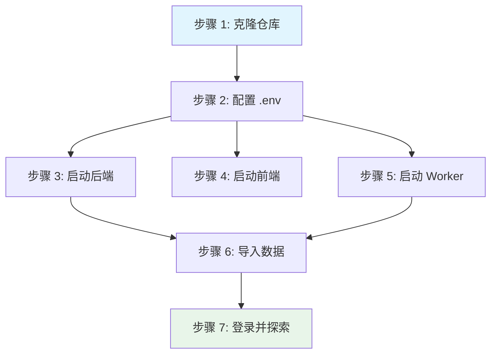

# 快速开始

本指南将引导您从零开始设置 IBKR Dash。完成后，您将拥有一个运行中的仪表盘，包含示例数据和所有三个服务（后端、前端、Worker）。

---

## 先决条件

在开始之前，请确保您的机器上已安装以下工具：

| 工具 | 最低版本 | 检查方式 | 安装链接 |
|------|----------|----------|----------|
| **Python** | 3.11+ | `python --version` | [python.org](https://www.python.org/downloads/) |
| **Node.js** | 18+ | `node --version` | [nodejs.org](https://nodejs.org/) |
| **npm** | 9+ | `npm --version` | 随 Node.js 附带 |
| **Git** | 2.30+ | `git --version` | [git-scm.com](https://git-scm.com/) |

:::tip
我们建议使用 Python 版本管理器如 `pyenv` 或 `conda` 来管理 Python 安装。对于 Node.js，`nvm` 是一个流行的选择。
:::

:::warning
需要 Python 3.11 或更高版本。代码库使用了 `type | None` 联合语法和 `dataclasses` 的 `frozen=True` 等现代 Python 特性，这些在旧版本中不可用。
:::

---

## 设置流程概览

以下是设置过程的可视化概览：



---

## 步骤 1：克隆仓库

打开终端并克隆项目：

```bash
# 克隆仓库
git clone https://github.com/your-username/ibkr-dash.git
cd ibkr-dash
```

克隆后，您的目录结构应如下所示：

```
ibkr-dash/
├── ibkr_dash_backend/       # FastAPI 服务器 + AI 代理
├── ibkr_dash_frontend/      # React 仪表盘
├── ibkr_dash_worker/        # 数据 ETL Worker
├── data/                    # SQLite 数据库 + Flex 导出
├── docker/                  # Docker 配置
├── scripts/                 # 实用脚本
├── .env.example             # 环境配置示例
└── docker-compose.yml       # Docker Compose 配置
```

---

## 步骤 2：配置环境变量

IBKR Dash 使用 `.env` 文件进行配置。您需要从提供的示例创建它们。

### 2.1 复制示例配置

```bash
cp .env.example .env
```

### 2.2 编辑根目录 `.env`

在文本编辑器中打开 `.env` 并填写值：

```env
# --- LLM（AI 功能必需）---
LLM_API_KEY=your-api-key-here
LLM_BASE_URL=https://api.openai.com/v1
LLM_DEFAULT_MODEL=gpt-4o

# --- 认证（留空则禁用登录）---
AUTH_USERNAME=admin
AUTH_PASSWORD=your-secure-password

# --- SQLite ---
SQLITE_PATH=data/ibkr_dash.db
```

:::info
如果您没有 OpenAI API 密钥，仍然可以使用数据仪表盘功能。AI 代理将被禁用，但所有其他功能正常工作。您也可以通过更改 `LLM_BASE_URL` 和 `LLM_DEFAULT_MODEL` 使用任何 OpenAI 兼容提供商（DeepSeek、MiMo 等）。
:::

### 2.3 将配置复制到每个模块

每个模块（后端和 Worker）读取自己的 `.env` 文件。复制根配置：

```bash
cp .env ibkr_dash_backend/.env
cp .env ibkr_dash_worker/.env
```

### 2.4 （可选）配置 IBKR Flex Web Service

如果您想从 IBKR 自动拉取数据（而不是手动 CSV 导入），请将以下内容添加到 `ibkr_dash_worker/.env`：

```env
# 从以下位置获取令牌：IBKR Account Management > Settings > Flex Web Service
FLEX_TOKEN=your-flex-token
FLEX_QUERY_ID_DAILY=your-query-id
```

---

## 步骤 3：启动后端

后端是一个 FastAPI 服务器，提供 REST API 和 AI 代理编排。

打开**新的终端窗口**并运行：

```bash
# 导航到后端目录
cd ibkr_dash_backend

# 创建 Python 虚拟环境
python -m venv .venv

# 激活虚拟环境
# 在 macOS/Linux 上：
source .venv/bin/activate
# 在 Windows 上：
# .venv\Scripts\activate

# 安装依赖
pip install -r requirements.txt

# 启动服务器
uvicorn app.main:app --reload --port 8000
```

您应看到如下输出：

```
INFO:     Uvicorn running on http://127.0.0.1:8000 (Press CTRL+C to quit)
INFO:     Started reloader process
INFO:     Application startup complete.
```

验证后端正在运行：

```bash
curl http://localhost:8000/api/health
```

预期响应：

```json
{"status": "ok", "version": "0.1.0"}
```

:::tip
`--reload` 标志在编辑代码时启用自动重载。这在开发期间很有用。对于生产环境，请移除此标志。
:::

---

## 步骤 4：启动前端

前端是一个使用 Vite 构建的 React + TypeScript 应用。

打开**第二个终端窗口**并运行：

```bash
# 导航到前端目录
cd ibkr_dash_frontend

# 安装 npm 依赖
npm install

# 启动开发服务器
npm run dev
```

您应看到如下输出：

```
  VITE v5.x.x  ready in 300 ms

  ➜  Local:   http://localhost:5173/
```

打开浏览器并导航到 `http://localhost:5173`。您应看到 IBKR Dash 登录页面（或仪表盘，如果认证已禁用）。

### 首次打开时的预期

当您首次打开仪表盘时，您将看到：

- **登录页面**（如果设置了 `AUTH_PASSWORD`）-- 输入凭据以继续
- **仪表盘概览** -- 投资组合摘要卡片，显示总权益、现金、盈亏
- **持仓表** -- 所有持仓列表（导入数据前为空）
- **导航侧边栏** -- 所有视图的链接（持仓、交易、现金流、Copilot、管理）

---

## 步骤 5：启动 Worker（可选）

Worker 处理从 IBKR Flex CSV 文件导入数据。您只需要在导入数据时使用它。

打开**第三个终端窗口**并运行：

```bash
# 导航到 Worker 目录
cd ibkr_dash_worker

# 创建 Python 虚拟环境
python -m venv .venv

# 激活虚拟环境
source .venv/bin/activate

# 安装依赖
pip install -r requirements.txt
```

Worker 不作为持久服务器运行。相反，您通过 CLI 命令使用它（见步骤 6）。

---

## 步骤 6：导入数据

IBKR Dash 需要投资组合数据来显示。有三种方式获取数据。

### 选项 A：使用示例数据（首次运行推荐）

项目包含用于测试的示例数据：

```bash
cd ibkr_dash_worker
python -m worker.main import worker/fixtures/daily_sample.csv
```

:::tip
这是看到仪表盘运行的最快方式。示例数据包含真实的账户快照、持仓、交易和现金流。
:::

### 选项 B：导入 Flex CSV 文件

如果您从 IBKR Flex Queries 导出了 CSV：

1. 登录 [IBKR Account Management](https://www.interactivebrokers.com/AccountManagement/AmAccountManagement)
2. 导航到 **Reports > Flex Queries**
3. 创建或运行包含持仓、交易和现金流的 Flex Query
4. 将结果导出为 CSV
5. 将文件放在 `data/flex_exports/` 目录中
6. 运行导入：

```bash
cd ibkr_dash_worker
python -m worker.main import ../data/flex_exports/your_file.csv
```

### 选项 C：从 IBKR Flex Web Service 自动拉取

如果您在步骤 2.4 中配置了 `FLEX_TOKEN` 和 `FLEX_QUERY_ID_DAILY`，您可以运行调度器自动拉取数据：

```bash
cd ibkr_dash_worker
python -m worker.main run-scheduler
```

这将在预定时间（默认：配置时区的 12:30 PM）从 IBKR 拉取数据。您也可以触发即时扫描：

```bash
python -m worker.main scan
```

---

## 步骤 7：登录

如果您在 `.env` 文件中设置了 `AUTH_PASSWORD`，您需要登录：

1. 在浏览器中打开 `http://localhost:5173`
2. 输入您配置的用户名和密码
3. 点击 **Login**

如果您将 `AUTH_PASSWORD` 留空，仪表盘无需登录即可访问。

:::warning
出于安全考虑，如果您将仪表盘暴露到 localhost 之外，请始终设置密码。
:::

---

## 下一步

一切运行后，探索仪表盘：

- **仪表盘** (`/`) -- 投资组合概览和关键指标
- **持仓** (`/positions`) -- 所有持仓的详细表格
- **交易** (`/trades`) -- 带盈亏的交易历史
- **现金流** (`/cash-flows`) -- 存款、取款、股息
- **Copilot** (`/copilot`) -- 与 AI 投资组合助手聊天
- **每日审查** (`/daily-position-review`) -- AI 生成的持仓审查

---

## Docker 部署（替代方案）

如果您更喜欢 Docker 而不是手动运行服务：

```bash
# 构建并启动所有服务
docker compose up -d --build

# 访问 http://localhost:8080
```

Docker Compose 设置在容器中运行所有三个服务（后端、前端、Worker），共享 SQLite 卷。

```bash
# 查看日志
docker compose logs -f backend
docker compose logs -f worker

# 停止所有服务
docker compose down
```

---

## 运行测试

要验证您的设置是否正确，请运行测试套件：

### 后端测试

```bash
cd ibkr_dash_backend
.venv/bin/python -m pytest tests/ -v
```

预期输出：

```
tests/test_health.py::test_health_endpoint PASSED
tests/test_database.py::test_init_schema PASSED
tests/test_position_service.py::test_get_positions PASSED
...
43 passed
```

### 前端测试

```bash
cd ibkr_dash_frontend
npx vitest run
```

预期输出：

```
 ✓ src/api/__tests__/http.test.ts (5 tests)
 ✓ src/components/__tests__/StatCard.test.tsx (3 tests)
 ✓ src/views/__tests__/DashboardView.test.tsx (8 tests)
 ...
 Test Files  10 passed (10)
      Tests  74 passed (74)
```

---

## 环境变量参考

以下是所有环境变量的完整参考。

### 后端 (`ibkr_dash_backend/.env`)

| 变量 | 默认值 | 描述 |
|------|--------|------|
| `APP_ENV` | `development` | 应用环境 |
| `DEBUG` | `false` | 启用调试模式 |
| `SQLITE_PATH` | `data/ibkr_dash.db` | SQLite 数据库路径 |
| `CACHE_TTL_SECONDS` | `86400` | 内存缓存 TTL（秒） |
| `LLM_API_KEY` | (空) | OpenAI 兼容 API 密钥 |
| `LLM_BASE_URL` | `https://api.openai.com/v1` | LLM API 端点 |
| `LLM_DEFAULT_MODEL` | `gpt-4o` | 默认模型名称 |
| `LLM_TEMPERATURE` | `0.1` | LLM 温度 |
| `LLM_MAX_TOKENS` | `8192` | 每次 LLM 响应的最大 token |
| `AUTH_USERNAME` | `admin` | 登录用户名 |
| `AUTH_PASSWORD` | (空) | 登录密码（空 = 无认证） |
| `CORS_ORIGINS` | `http://localhost:5173` | 允许的 CORS 来源 |

### Worker (`ibkr_dash_worker/.env`)

| 变量 | 默认值 | 描述 |
|------|--------|------|
| `APP_ENV` | `development` | 应用环境 |
| `DEBUG` | `false` | 启用调试模式 |
| `SQLITE_PATH` | `data/ibkr_dash.db` | SQLite 数据库路径（与后端共享） |
| `DATA_DIR` | `data/flex_exports` | Flex CSV 文件目录 |
| `SCHEDULER_ENABLED` | `true` | 启用后台调度器 |
| `SCHEDULER_HOUR` | `12` | 每日导入的小时 |
| `SCHEDULER_MINUTE` | `30` | 每日导入的分钟 |
| `SCHEDULER_TIMEZONE` | `Asia/Shanghai` | 调度器时区 |
| `FLEX_TOKEN` | (空) | IBKR Flex Web Service 令牌 |
| `FLEX_QUERY_ID_DAILY` | (空) | 每日快照查询 ID |
| `FLEX_POLL_INTERVAL_SECONDS` | `10` | Flex API 轮询间隔 |
| `FLEX_MAX_POLL_RETRIES` | `60` | Flex API 最大重试次数 |
| `LOG_LEVEL` | `INFO` | 日志级别 |

---

## 故障排除

### "ModuleNotFoundError: No module named 'app'"

您在错误的目录中运行命令。启动后端时请确保在 `ibkr_dash_backend/` 内：

```bash
cd ibkr_dash_backend
uvicorn app.main:app --reload --port 8000
```

### "Address already in use: port 8000"

另一个进程正在使用端口 8000。停止该进程或使用不同端口：

```bash
# 查找占用端口 8000 的进程
lsof -i :8000

# 或使用不同端口
uvicorn app.main:app --reload --port 8001
```

如果更改后端端口，请更新 `.env` 中的 `CORS_ORIGINS` 和前端 API 基础 URL。

### "pip: command not found"

使用 `pip3` 代替 `pip`，或确保虚拟环境已激活：

```bash
source .venv/bin/activate
pip install -r requirements.txt
```

### 前端显示 "Network Error" 或空白页

1. 确保后端在端口 8000 上运行
2. 检查 `ibkr_dash_backend/.env` 中的 `CORS_ORIGINS` 是否包含 `http://localhost:5173`
3. 打开浏览器开发者工具 (F12) 并检查 Console 选项卡的错误

### 导入后 "没有数据显示"

1. 验证导入命令完成且没有错误
2. 检查 SQLite 数据库文件是否存在：

```bash
ls -la data/ibkr_dash.db
```

3. 直接查询数据库确认数据：

```bash
sqlite3 data/ibkr_dash.db "SELECT COUNT(*) FROM position_snapshots;"
```

### "LLM provider authentication failed"

您的 `LLM_API_KEY` 无效或已过期。仔细检查 `.env` 文件中的密钥。如果使用非 OpenAI 提供商，还需验证 `LLM_BASE_URL` 是否正确。

### Worker 导入失败，提示 "File does not exist"

检查文件路径。Worker 从 `ibkr_dash_worker/` 运行，因此从那里使用相对路径：

```bash
# 正确
python -m worker.main import ../data/flex_exports/my_file.csv

# 或使用绝对路径
python -m worker.main import /home/user/ibkr-dash/data/flex_exports/my_file.csv
```

### SQLite "database is locked"

这通常意味着两个进程同时写入数据库。SQLite 使用 WAL 模式来最小化这种情况，但如果发生：

1. 如果 Worker 正在运行导入，请停止它
2. 等待几秒钟
3. 重试

:::info
IBKR Dash 使用启用了 WAL（Write-Ahead Logging）模式的 SQLite。这允许在写入进行时并发读取，但同一时间只能有一个写入器。
:::

### Docker: "Cannot connect to the Docker daemon"

确保 Docker 已安装并正在运行：

```bash
docker --version
docker compose version
```

在 Linux 上，您可能需要将用户添加到 `docker` 组：

```bash
sudo usermod -aG docker $USER
# 注销并重新登录以使更改生效
```

### "npm ERR! ERESOLVE unable to resolve dependency tree"

这通常由 Node.js 版本不匹配引起。确保使用 Node.js 18+：

```bash
node --version
# 应为 v18.x.x 或更高
```

如果使用 `nvm`，切换到正确版本：

```bash
nvm use 18
```

---

## 快速参考

以下是所有命令的摘要：

```bash
# --- 设置 ---
git clone https://github.com/your-username/ibkr-dash.git
cd ibkr-dash
cp .env.example .env
cp .env ibkr_dash_backend/.env
cp .env ibkr_dash_worker/.env
# 编辑 .env 文件设置您的配置

# --- 后端 ---
cd ibkr_dash_backend
python -m venv .venv && source .venv/bin/activate
pip install -r requirements.txt
uvicorn app.main:app --reload --port 8000

# --- 前端 ---
cd ibkr_dash_frontend
npm install && npm run dev

# --- Worker（导入示例数据）---
cd ibkr_dash_worker
python -m venv .venv && source .venv/bin/activate
pip install -r requirements.txt
python -m worker.main import worker/fixtures/daily_sample.csv

# --- 访问 ---
# 仪表盘：  http://localhost:5173
# API 文档：http://localhost:8000/docs
# 健康检查：http://localhost:8000/api/health
```
