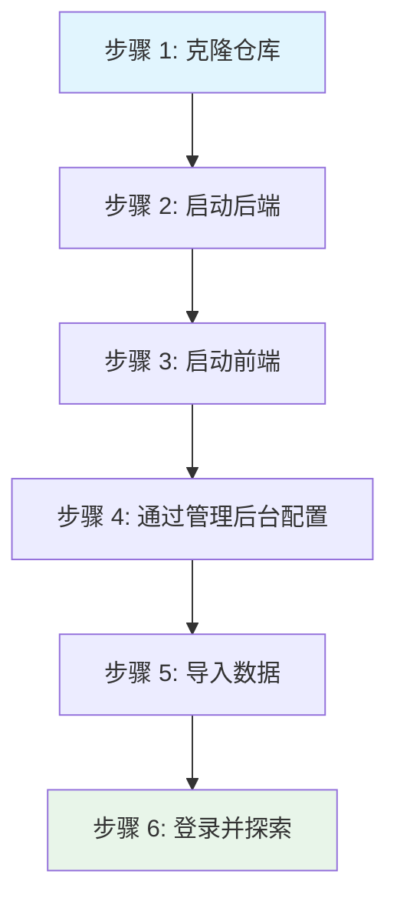

# 快速开始

本指南将引导您从零开始设置 IBKR Dash。完成后，您将拥有一个运行中的仪表盘，包含示例数据和所有三个服务（后端、前端、Worker）。

---

## 先决条件

| 工具 | 最低版本 | 检查方式 | 安装链接 |
|------|----------|----------|----------|
| **Python** | 3.11+ | `python --version` | [python.org](https://www.python.org/downloads/) |
| **Node.js** | 18+ | `node --version` | [nodejs.org](https://nodejs.org/) |
| **npm** | 9+ | `npm --version` | 随 Node.js 附带 |
| **Git** | 2.30+ | `git --version` | [git-scm.com](https://git-scm.com/) |

:::tip
建议使用 `pyenv` 或 `conda` 管理 Python 安装，`nvm` 管理 Node.js。
:::

:::warning
需要 Python 3.11+。代码库使用了 `type | None` 联合语法和 `dataclasses` 的 `frozen=True` 等现代特性。
:::

---

## 设置流程



---

## 步骤 1：克隆仓库

```bash
git clone https://github.com/your-username/ibkr-dash.git
cd ibkr-dash
```

```
ibkr-dash/
├── backend/       # FastAPI 服务器 + AI 代理
├── frontend/      # React 仪表盘
├── worker/        # 数据 ETL Worker
├── data/                    # SQLite 数据库 + Flex 导出 + config.json
├── docker/                  # Docker 配置
├── scripts/                 # 实用脚本
└── docker-compose.yml       # Docker Compose 配置
```

---

## 步骤 2：启动后端

```bash
cd backend
python -m venv .venv
source .venv/bin/activate   # macOS/Linux
# .venv\Scripts\activate    # Windows
pip install -r requirements.txt
uvicorn app.main:app --reload --port 8000
```

验证：

```bash
curl http://localhost:8000/api/health
# {"status": "ok", "version": "0.1.0"}
```

---

## 步骤 3：启动前端

打开**第二个终端**：

```bash
cd frontend
npm install
npm run dev
```

打开浏览器访问 **http://localhost:5173**。

---

## 步骤 4：通过管理后台配置

IBKR Dash 使用 JSON 配置文件（`data/config.json`），通过**管理后台设置**页面管理。无需 `.env` 文件。

1. 导航到 **http://localhost:5173/admin/settings**
2. 至少填写：
   - **LLM API Key** — AI 功能必需（Copilot、审查、交易决策）
   - **LLM Base URL** — 默认 OpenAI；可改为 DeepSeek、MiMo 等
   - **Auth Password** — 留空则禁用登录

更改立即生效，无需重启。

:::info
如果没有 LLM API 密钥，数据仪表盘仍然可用。AI 代理将被禁用，但其他功能（持仓、交易、图表、现金流）完全正常。
:::

### 可选：IBKR Flex Web Service

如需从 IBKR 自动拉取数据（而非手动 CSV 导入），在管理后台设置 → IBKR Flex 中配置：

- **Flex Token** — 从 IBKR Account Management > Settings > Flex Web Service 获取
- **Flex Query IDs** — 逗号分隔的查询 ID

---

## 步骤 5：导入数据

### 选项 A：示例数据（首次运行推荐）

```bash
cd worker
python -m venv .venv && source .venv/bin/activate
pip install -r requirements.txt
python -m worker.main import worker/fixtures/daily_sample.csv
```

### 选项 B：导入 Flex CSV 文件

1. 从 [IBKR Flex Queries](https://www.interactivebrokers.com/AccountManagement/AmAccountManagement) 导出 CSV
2. 放入 `data/flex_exports/`
3. 运行：

```bash
cd worker
python -m worker.main import ../data/flex_exports/your_file.csv
```

### 选项 C：自动拉取（需要 Flex Token）

如在步骤 4 中配置了 Flex Token：

```bash
cd worker
python -m worker.main run-scheduler   # 定时拉取
python -m worker.main scan            # 立即拉取
```

---

## 步骤 6：登录

如在管理后台设置了 `auth.password`，在 **http://localhost:5173** 登录。留空则无需登录。

:::warning
如果将仪表盘暴露到 localhost 之外，请始终设置密码。
:::

---

## 下一步

- **仪表盘** (`/`) — 投资组合概览和关键指标
- **持仓** (`/positions`) — 详细持仓表格
- **交易** (`/trades`) — 带盈亏的交易历史
- **现金流** (`/cash-flows`) — 存款、取款、股息
- **Copilot** (`/copilot`) — 与 AI 投资组合助手聊天
- **每日审查** (`/daily-position-review`) — AI 生成的持仓审查

---

## Docker 部署（替代方案）

```bash
docker compose up -d --build
# 访问 http://localhost:8080
```

启动后通过管理后台设置页面配置：`http://localhost:8080/admin/settings`。

```bash
docker compose logs -f backend
docker compose logs -f worker
docker compose down
```

---

## 运行测试

### 后端

```bash
cd backend
.venv/bin/python -m pytest tests/ -v
```

### 前端

```bash
cd frontend
npx vitest run
```

---

## 配置参考

所有配置存储在 `data/config.json` 中。完整参考请参见[配置](./backend/config.md)。

| 配置段 | 描述 |
|--------|------|
| `ibkr` | Flex 令牌、查询 ID、轮询设置 |
| `llm` | API 密钥、基础 URL、模型、温度 |
| `scheduler` | 每日任务时间和时区 |
| `auth` | 用户名、密码、Cookie 设置 |
| `email` | SMTP 配置 |
| `longbridge` | 市场数据 API 密钥 |
| `advanced` | 应用环境、调试、SQLite 路径、CORS、缓存 |

---

## 故障排除

### "ModuleNotFoundError: No module named 'app'"

在 `backend/` 目录内运行：

```bash
cd backend
uvicorn app.main:app --reload --port 8000
```

### "Address already in use: port 8000"

```bash
lsof -i :8000
# 或使用不同端口
uvicorn app.main:app --reload --port 8001
```

### 前端显示 "Network Error"

1. 确保后端在端口 8000 上运行
2. 检查管理后台设置中 `advanced.cors_origins` 是否包含 `http://localhost:5173`

### "LLM provider authentication failed"

LLM API 密钥无效。在管理后台设置 → LLM 中检查。如使用非 OpenAI 提供商，还需验证 Base URL。

### 导入后没有数据显示

```bash
ls -la data/ibkr_dash.db
sqlite3 data/ibkr_dash.db "SELECT COUNT(*) FROM position_snapshots;"
```

### SQLite "database is locked"

两个进程同时写入。停止 Worker，等待几秒后重试。

---

## 快速参考

```bash
# --- 后端 ---
cd backend
python -m venv .venv && source .venv/bin/activate
pip install -r requirements.txt
uvicorn app.main:app --reload --port 8000

# --- 前端 ---
cd frontend
npm install && npm run dev

# --- Worker（导入示例数据）---
cd worker
python -m venv .venv && source .venv/bin/activate
pip install -r requirements.txt
python -m worker.main import worker/fixtures/daily_sample.csv

# --- 配置 ---
# 打开 http://localhost:5173/admin/settings
```
