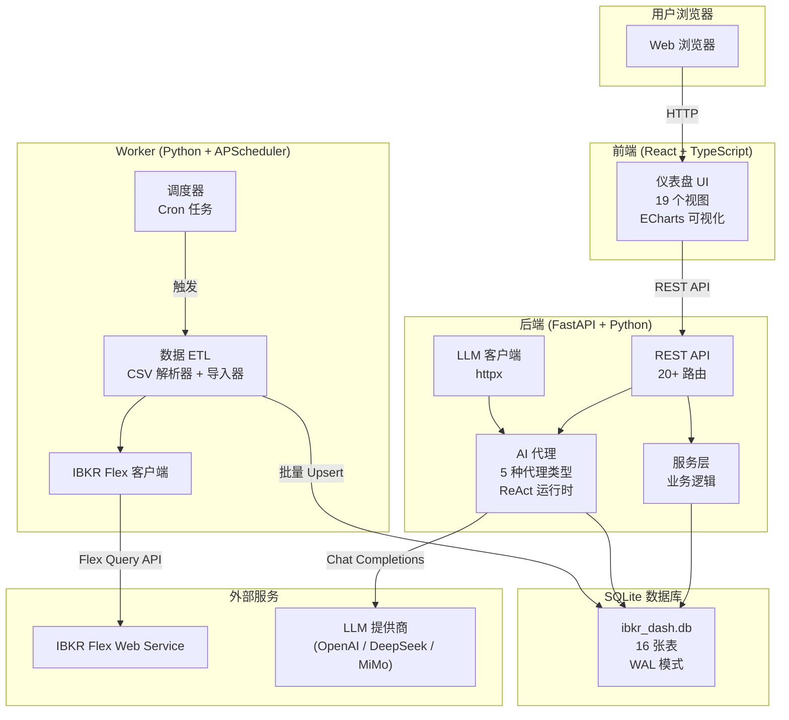
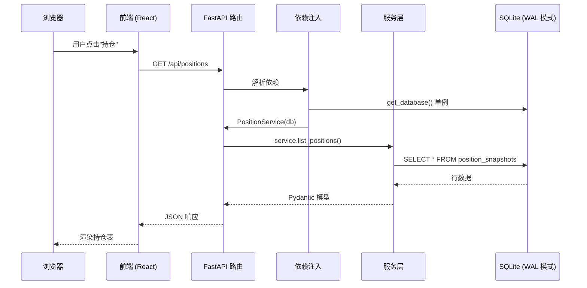

# IBKR Dash

欢迎使用 **IBKR Dash** -- 一个基于 Interactive Brokers (IBKR) 数据构建的个人投资组合仪表盘，配备 AI 分析代理。

IBKR Dash 连接到您的 IBKR 经纪账户，导入您的投资组合数据，并以清晰、交互式的仪表盘呈现。在数据层之上，它提供 AI 代理来分析您的持仓、审查交易、评估风险，甚至用自然语言与您讨论投资组合。

---

## 为什么选择 IBKR Dash？

如果您使用 Interactive Brokers 进行投资，您一定知道其内置的报告工具令人眼花缭乱。Web 界面有数十个屏幕，数据分散在多个报告中，没有简单的方式来快速了解您的投资组合健康状况。

IBKR Dash 解决了这些问题：

- **单页仪表盘** -- 一目了然地查看关键指标（总权益、盈亏、现金余额），无需在多个 IBKR 页面之间切换
- **AI 驱动的分析** -- 使用大语言模型自动审查您的持仓、交易决策和投资组合风险
- **历史追踪** -- 每天的快照都会存储，您可以查看投资组合随时间的变化
- **自然语言界面** -- 使用 AI 副驾驶提问，例如"我的 AAPL 持仓值多少钱？"或"这个月我赚了多少股息？"
- **完全数据所有权** -- 一切在本地运行。您的财务数据永远不会离开您的网络（除非您启用 AI 功能的 LLM API 调用）
- **可定制** -- 开源、文档完善的代码库，您可以根据需要进行修改

---

## 功能对比：IBKR Dash vs. 其他方案

| 功能 | IBKR Dash | IBKR Web Portal | Bloomberg Terminal | Yahoo Finance |
|------|-----------|----------------|-------------------|---------------|
| **费用** | 免费（开源） | 免费（内置） | $24,000/年 | 有免费版 |
| **AI 分析** | 5 个专业代理 | 无 | 有限 | 无 |
| **自然语言聊天** | 有（Copilot） | 无 | 无 | 无 |
| **历史追踪** | 每日本地快照 | 有限（90 天） | 有 | 有限 |
| **数据所有权** | 完全（本地 SQLite） | IBKR 服务器 | Bloomberg 服务器 | Yahoo 服务器 |
| **可定制性** | 完整源代码 | 无 | 有限 | 无 |
| **部署方式** | 本地 / Docker | N/A | 桌面应用 | Web |
| **离线访问** | 有 | 无 | 部分 | 无 |
| **投资组合隐私** | 完全 | IBKR 可访问 | Bloomberg 可访问 | Yahoo 可访问 |

---

## 功能概览

### 数据仪表盘

仪表盘提供投资组合的全面视图：

| 功能 | 描述 |
|------|------|
| **投资组合概览** | 总权益、现金余额、股票价值、期权价值和盈亏一目了然 |
| **持仓表** | 所有持仓的详细视图，包括数量、成本基础、市值、未实现盈亏和 NAV 百分比 |
| **交易历史** | 买卖交易的完整日志，包括日期、价格、佣金和已实现盈亏 |
| **现金流追踪** | 存款、取款、股息、利息和其他现金变动 |
| **股息历史** | 追踪所有持仓的股息支付，包括日期和金额 |
| **权益曲线** | 交互式折线图，显示投资组合价值随时间的变化，支持缩放和平移 |
| **表现日历** | 每日盈亏热力图日历，快速识别盈利和亏损日 |
| **资产分布** | 饼图显示按资产类别和行业的配置 |

### AI 代理

IBKR Dash 包含五个 AI 代理，每个专注于不同的分析任务：

| 代理 | 功能 | 使用场景 |
|------|------|----------|
| **账户副驾驶** | 对话式 AI 助手，查询投资组合数据并用自然语言回答问题 | 任何时候有投资组合问题 |
| **每日持仓审查** | 自动审查所有持仓，提供买入/持有/卖出信号和推理 | 每天收盘后 |
| **交易决策分析** | 潜在入场的预交易分析，包括风险/回报评估和入场/出场目标 | 开新仓前 |
| **交易回顾** | 已执行交易的事后评估，总结经验教训和评分 | 平仓后 |
| **风险评估** | 投资组合层面的风险分析，包括集中度风险、波动性和分散化评分 | 每周或每月审查 |

所有代理使用**结构化输出管道**确保可靠的 JSON 输出。如果 LLM 产生格式错误的 JSON，系统会自动尝试修复后返回结果。

:::tip
结构化输出管道（定义在 `app/agents/structured_output/runtime.py`）使用四阶段流程：解析、验证、修复、回退。这确保即使 LLM 产生略有格式错误的 JSON，系统仍能提取有效结果。
:::

### 管理面板

管理面板让您控制系统配置：

- **LLM 配置** (`/admin/llm`) -- 无需修改代码即可切换 AI 提供商（OpenAI、DeepSeek、MiMo）
- **提示词管理** (`/admin/prompts`) -- 查看和编辑每个代理的版本控制提示词
- **代理监控** (`/admin/agent-monitoring`) -- 查看代理任务历史、执行追踪和性能指标
- **IBKR 设置** (`/admin/ibkr`) -- 配置 Flex Web Service 令牌和查询 ID
- **邮件通知** (`/admin/email`) -- 可选的每日审查邮件提醒
- **评估工具** (`/admin/harness`) -- 测试代理输出与预期结果的质量保证
- **系统状态** (`/admin/system`) -- 查看数据库大小、运行时间和系统健康状况

---

## 系统架构

IBKR Dash 由三个独立模块组成，通过共享的 SQLite 数据库通信。这种分离意味着每个模块可以独立开发、测试和部署。



### 请求生命周期

以下是典型 API 请求在系统中的流转过程，从用户点击链接到数据出现在屏幕上：



### 模块职责

| 模块 | 技术 | 用途 | 端口 |
|------|------|------|------|
| **前端** | React 18, TypeScript, Vite, ECharts | 交互式仪表盘 UI | 5173 (开发) / 8080 (Docker) |
| **后端** | FastAPI, SQLite, Pydantic, httpx | REST API + AI 代理编排 | 8000 |
| **Worker** | Python, APScheduler, requests | IBKR Flex CSV 数据导入 (ETL) | N/A (CLI) |

### 关键设计原则

1. **SQLite 作为唯一数据源** -- 后端和 Worker 读写同一个 SQLite 文件。没有消息队列，没有独立数据库。
2. **解耦模块** -- 后端和 Worker 在运行时不共享 Python 代码。它们仅通过数据库通信。
3. **OpenAI 兼容的 AI** -- LLM 客户端适用于任何 OpenAI 兼容提供商。通过 Admin Settings UI 切换模型。
4. **结构化输出** -- 所有 AI 代理输出都通过 Pydantic 模式验证，支持自动修复和回退。
5. **本地优先** -- 设计为在您的机器上运行。无需云服务（除非您启用 AI 功能的 LLM API）。

:::warning
SQLite 的 WAL 模式可以很好地处理并发读取和单个写入器，但它不是为高并发写入工作负载设计的。对于个人投资仪表盘来说，这绰绰有余。如果您需要多用户并发写入，请考虑迁移到 PostgreSQL。
:::

---

## 您将学到什么

本文档旨在引导您从零开始构建一个运行中的仪表盘。以下是推荐阅读顺序：

### 快速开始

**[快速开始](./getting-started.md)** -- 最快到达运行仪表盘的路径。涵盖：

- 安装先决条件（Python 3.11+, Node.js 18+）
- 克隆和配置项目
- 启动两个服务（后端 + Worker、前端）
- 导入示例数据
- 登录并探索仪表盘
- 故障排除常见问题

### 架构

**[架构概览](./architecture/overview.md)** -- 理解全局：

- 三个模块（后端、前端、Worker）如何协同工作
- 包含 16 张表及其关系的完整数据库模式
- 每个模块的目录结构
- 设计决策（为什么选择 SQLite、为什么不选 LangGraph、为什么选择 React）
- 安全模型和认证

**[数据流](./architecture/data-flow.md)** -- 追踪数据在每一层的流转：

- IBKR Flex API 到 Worker 到 SQLite（金融数据管道）
- 用户到前端到后端到 LLM 并返回（AI 代理流）
- 每个主要流的详细序列图
- Copilot 记忆系统和工具调度
- 代理任务生命周期（pending -> running -> completed）
- 每一层的错误处理

**[技术栈](./architecture/tech-stack.md)** -- 深入了解每项技术：

- 后端：FastAPI, SQLite, Pydantic, httpx
- 前端：React, TypeScript, Vite, ECharts
- Worker：APScheduler, requests
- AI：OpenAI 兼容 API、结构化输出管道、ReAct 运行时
- DevOps：Docker, pytest, Vitest
- 版本要求和依赖矩阵

---

## 快速链接

| 资源 | URL | 描述 |
|------|-----|------|
| 前端仪表盘 | `http://localhost:5173` | 主仪表盘 UI |
| 后端 API 文档 (Swagger) | `http://localhost:8000/docs` | 交互式 API 文档 |
| 后端 API 文档 (ReDoc) | `http://localhost:8000/redoc` | 替代 API 文档 |
| 健康检查 | `http://localhost:8000/api/health` | 后端健康端点 |
| Docker 仪表盘 | `http://localhost:8080` | 使用 Docker 时的仪表盘 |

---

## 适用人群

IBKR Dash 面向多类用户：

### 个人投资者

如果您使用 Interactive Brokers 并希望获得更好的投资组合可视化，IBKR Dash 为您提供清晰的仪表盘和 AI 驱动的洞察。您不需要是开发者 -- [快速开始](./getting-started.md) 指南有分步说明。

### 开发者

如果您想理解、定制或扩展仪表盘，[架构](./architecture/overview.md) 文档解释了代码库结构、设计决策和关键模式。代码库组织良好，关注点分离清晰。

### 数据爱好者

如果您想将金融数据与 AI 分析相结合，IBKR Dash 提供了从 IBKR 数据到 LLM 驱动洞察的现成管道。结构化输出管道和代理系统设计为可扩展新的分析类型。

---

## 项目结构

以下是项目目录的高级概览：

```
ibkr-dash/
├── backend/          # FastAPI 服务器 + AI 代理
│   ├── app/
│   │   ├── agents/             # AI 代理系统（5 种代理类型）
│   │   ├── api/routes/         # REST API 端点（20+ 路由）
│   │   ├── services/           # 业务逻辑层
│   │   ├── schemas/            # Pydantic 请求/响应模型
│   │   ├── core/               # 配置、数据库、认证
│   │   └── utils/              # 日期、分页、JSON 辅助函数
│   └── tests/                  # 后端测试套件（43 个测试）
│
├── frontend/         # React + TypeScript 仪表盘
│   ├── src/
│   │   ├── views/              # 页面组件（19 个视图）
│   │   ├── components/         # 可复用 UI 组件
│   │   ├── api/                # API 客户端函数
│   │   ├── types/              # TypeScript 类型定义
│   │   ├── hooks/              # 自定义 React Hooks
│   │   ├── router/             # 路由配置
│   │   ├── i18n/               # 国际化
│   │   └── utils/              # 格式化辅助函数
│   └── package.json
│
├── worker/           # 数据 ETL Worker
│   ├── worker/
│   │   ├── parsers/            # IBKR Flex CSV/XML 解析器
│   │   ├── importers/          # 导入管道
│   │   ├── writers/            # SQLite 写入器
│   │   ├── clients/            # IBKR Flex API 客户端
│   │   ├── jobs/               # 定时导入任务
│   │   └── core/               # 配置、调度器、日志
│   └── tests/                  # Worker 测试套件
│
├── data/                       # 运行时数据目录
│   ├── ibkr_dash.db            # SQLite 数据库（运行时创建）
│   ├── config.json             # 应用配置（通过 Admin Settings UI 管理）
│   └── flex_exports/           # IBKR Flex CSV 文件
│
├── docker/                     # Docker 构建配置
├── scripts/                    # 实用脚本
├── wiki/                       # 本文档 (Docusaurus)
├── docker-compose.yml          # Docker Compose 配置
└── README.md                   # 项目 README
```

---

## 技术概要

| 层级 | 技术 | 原因 |
|------|------|------|
| 前端 UI | React 18 + TypeScript | 组件模型、生态系统、TypeScript 支持 |
| 前端构建 | Vite 5 | 快速开发服务器、即时 HMR、原生 ESM |
| 前端图表 | ECharts 5.5 | 丰富的交互性、多种图表类型 |
| 后端框架 | FastAPI | 异步支持、自动文档、Pydantic 集成 |
| 后端数据库 | SQLite (stdlib) | 零配置、单文件、WAL 模式并发 |
| 后端验证 | Pydantic v2 | 类型安全的数据验证、JSON Schema 生成 |
| 后端 HTTP | httpx | 提供商无关的 LLM 客户端 |
| Worker 调度 | APScheduler | 支持时区的 Cron 调度 |
| Worker HTTP | requests | 简单的 IBKR Flex API HTTP 客户端 |
| AI 协议 | OpenAI 兼容 | 适用于任何提供商（OpenAI、DeepSeek、MiMo） |
| 测试 | pytest + Vitest | 快速、现代的测试框架 |
| 部署 | Docker Compose | 单命令部署 |

---

## 获取帮助

如果遇到问题：

1. 查看 **[故障排除](./getting-started.md#故障排除)** 部分
2. 探索 **Swagger UI** (`http://localhost:8000/docs`) 测试 API 端点
3. 检查**浏览器控制台** (F12) 查看前端错误
4. 检查**终端输出** 查看后端/Worker 错误

:::tip
如果您只想让仪表盘运行起来，请直接前往 **[快速开始](./getting-started.md)** 指南。您可以在稍后想了解底层工作原理时再回来查看架构文档。
:::

:::info
IBKR Dash **不是**交易平台。它不执行交易或下单。它仅读取您的 IBKR 数据用于分析和可视化。您的经纪账户凭据永远不会被此应用程序存储或传输。
:::

---

## 项目状态

IBKR Dash 是一个持续开发中的活跃个人项目。

| 组件 | 状态 | 备注 |
|------|------|------|
| 数据导入 (Worker) | 稳定 | CSV 解析、Flex API 客户端、调度器 |
| REST API (后端) | 稳定 | 20+ 端点、认证、管理面板 |
| 仪表盘 (前端) | 稳定 | 19 个视图、图表、i18n |
| AI 代理 | 积极开发中 | 5 种代理类型、结构化输出管道 |
| 文档 | 进行中 | 您正在阅读！ |
