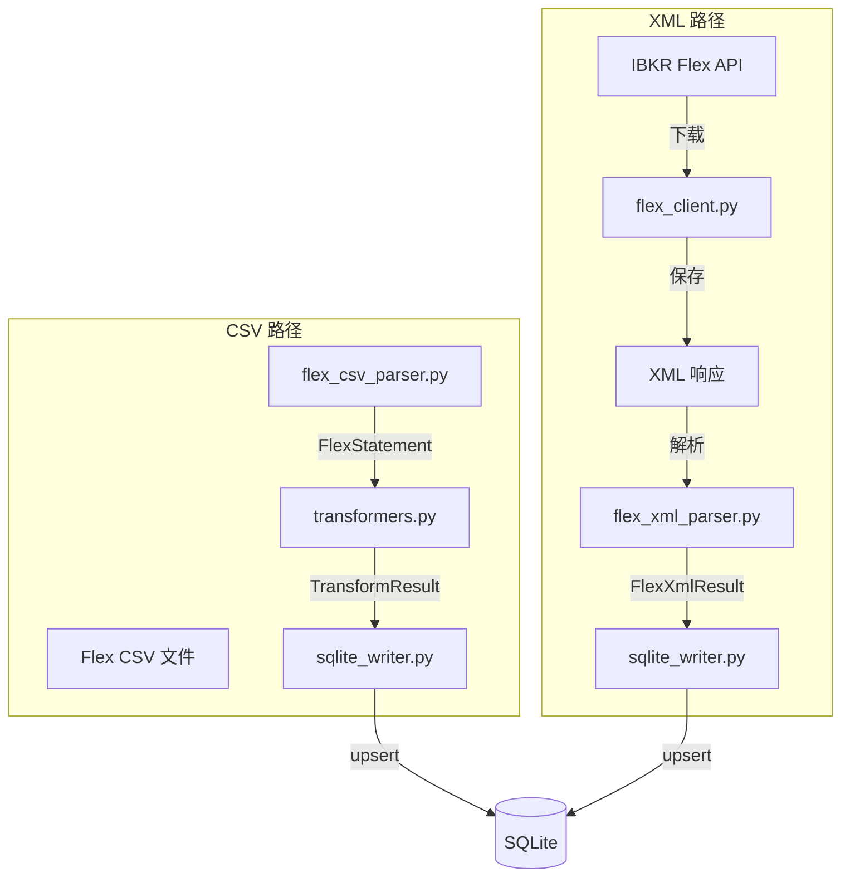
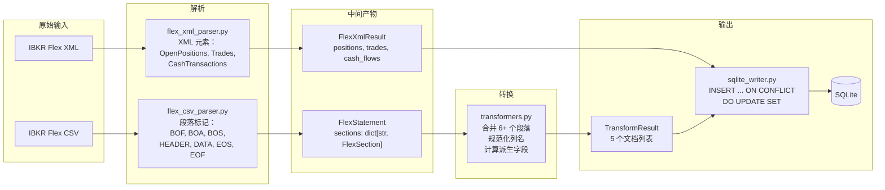

# 数据流水线

Worker 的数据流水线将原始 IBKR 数据转换为规范化的 SQLite 记录。有两条输入路径：**Flex CSV 文件**（手动导出）和 **Flex XML 响应**（从 IBKR 自动拉取）。

## 流水线流程



## 端到端数据转换



## CSV 解析 (`flex_csv_parser.py`)

IBKR Flex 导出使用带记录类型标记的多段 CSV 格式：

| 标记 | 含义 |
|--------|---------|
| `BOF` | 文件开始（元数据） |
| `BOA` | 账户开始（键值元数据对） |
| `BOS` | 段落开始 |
| `HEADER` | 当前列标题 |
| `DATA` | 当前段落的数据行 |
| `EOS` | 段落结束 |
| `EOF` | 文件结束 |

### CSV 结构示例

```csv
BOF,U1234567,Daily Snapshot,20250101,20250601
BOA,QueryName,Daily Snapshot,FromDate,20250101,ToDate,20250601
BOS,ACCT
HEADER,ACCT,AccountId,Account
DATA,ACCT,U1234567,Individual
EOS
BOS,POST
HEADER,POST,Symbol,Description,Quantity,MarkPrice
DATA,POST,AAPL,Apple Inc,100,185.50
DATA,POST,MSFT,Microsoft Corp,50,420.00
EOS
EOF
```

### 解析器代码示例

```python
# ibkr_dash_worker/worker/parsers/flex_csv_parser.py
def parse_flex_csv(file_path: Path) -> FlexStatement:
    """将 IBKR Flex CSV 文件解析为 FlexStatement。"""
    sections: dict[str, FlexSection] = {}
    current_section: str | None = None
    current_headers: list[str] = []
    current_rows: list[dict] = []

    for row in csv.reader(file_path.open(encoding="utf-8")):
        marker = row[0]

        if marker == "BOS":
            current_section = row[1]
            current_headers = []
            current_rows = []
        elif marker == "HEADER":
            current_headers = row[2:]  # 跳过标记和段落名
        elif marker == "DATA":
            values = row[2:]  # 跳过标记和段落名
            current_rows.append(dict(zip(current_headers, values)))
        elif marker == "EOS":
            if current_section:
                sections[current_section] = FlexSection(
                    name=current_section,
                    headers=current_headers,
                    rows=current_rows,
                )

    return FlexStatement(source_file=file_path, sections=sections, ...)
```

### 解析输出

解析器产生一个 `FlexStatement` dataclass：

```python
@dataclass
class FlexStatement:
    source_file: Path
    metadata: FlexStatementMetadata  # query_name, from_date, to_date, account_ids
    sections: dict[str, FlexSection]  # section_name -> FlexSection
    record_counts: dict[str, int]     # record_type -> count
```

每个 `FlexSection` 包含：
- `name` -- 段落名称（如 `POST`、`TRNT`、`EQUT`）
- `headers` -- 来自 `HEADER` 行的列名
- `rows` -- 映射列名到单元格值的字典列表

### 关键段落

| 段落 | 内容 |
|---------|---------|
| `ACCT` | 账户元数据 |
| `EQUT` | 权益摘要（总权益、现金、股票价值等） |
| `POST` | 持仓 |
| `TRNT` | 交易记录 |
| `CTRN` | 现金交易（存款、股息） |
| `FIFO` | 每个持仓的 FIFO 盈亏 |
| `MYTD` | 月度/年初至今盈亏 |
| `NETP` | 净持仓（IB 持股、借入、借出） |
| `SECU` | 证券详情（ISIN、FIGI、发行人） |
| `PPPO` | 价格历史 |
| `CNAV` | NAV 变化（MTM、TWR、股息、佣金） |
| `CRTT` | 现金报告（MTD/YTD 股息、利息、佣金） |
| `UNBC` | 非捆绑佣金详情 |

## XML 解析 (`flex_xml_parser.py`)

当 Worker 从 IBKR Flex Web Service 拉取数据时，响应为 XML。XML 解析器处理：

- `OpenPositions` -- 当前持仓
- `Trades` -- 交易记录
- `TradeConfirms` -- 当日交易确认
- `CashTransactions` -- 现金流动

### XML 解析代码示例

```python
# ibkr_dash_worker/worker/parsers/flex_xml_parser.py
def parse_flex_xml(xml_text: str) -> FlexXmlResult:
    """将 IBKR Flex XML 响应解析为 FlexXmlResult。"""
    root = ET.fromstring(xml_text)
    account_id = root.findtext(".//AccountId", "")

    positions = []
    for pos in root.findall(".//OpenPositions/OpenPosition"):
        positions.append({
            "symbol": pos.get("symbol"),
            "quantity": float(pos.get("position", "0")),
            "mark_price": float(pos.get("markPrice", "0")),
            "conid": pos.get("conid"),
            # ... 更多字段
        })

    trades = []
    for trade in root.findall(".//Trades/Trade"):
        trades.append({
            "symbol": trade.get("symbol"),
            "date_time": _convert_ibkr_datetime(trade.get("dateTime")),
            "quantity": float(trade.get("quantity", "0")),
            "price": float(trade.get("tradePrice", "0")),
            # ... 更多字段
        })

    return FlexXmlResult(
        account_id=account_id,
        report_date=_convert_ibkr_date(root.findtext(".//Date", "")),
        positions=positions,
        trades=trades,
        cash_flows=cash_flows,
    )
```

### XML 解析输出

```python
@dataclass
class FlexXmlResult:
    account_id: str
    report_date: str       # YYYY-MM-DD
    positions: list[dict]  # 准备好进行 SQLite upsert
    trades: list[dict]     # 准备好进行 SQLite insert
    cash_flows: list[dict] # 准备好进行 SQLite insert
```

XML 解析器转换 IBKR 日期格式（`YYYYMMDD` -> `YYYY-MM-DD`）和日期时间格式（`YYYYMMDD;HHMMSS` -> `YYYY-MM-DDTHH:MM:SS`）。

## 数据转换 (`transformers.py`)

转换器是最复杂的模块。它将解析后的 `FlexStatement` 转换为包含五个文档字典列表的 `TransformResult`，准备好进行 SQLite 插入。

### TransformResult

```python
@dataclass
class TransformResult:
    account_documents: list[dict]      # -> account_snapshots
    position_documents: list[dict]     # -> position_snapshots
    trade_documents: list[dict]        # -> trade_records
    cash_flow_documents: list[dict]    # -> cash_flows
    price_history_documents: list[dict] # -> price_history
```

### 关键转换

**账户快照：**
- 合并 `EQUT`、`CNAV`、`CRTT` 和 `FIFO` 段落的数据。
- 通过对所有持仓求和计算 FIFO 总计。
- 处理单日和多日报表。

**持仓快照：**
- 合并 `POST`（持仓）与 `FIFO`（盈亏）、`MYTD`（MTD/YTD）、`NETP`（持股）、`SECU`（证券详情）和 `PPPO`（价格历史）。
- 当直接不可用时，从 `cost_basis_money / quantity` 计算 `average_cost_price`。
- 从价格历史计算 `previous_day_change_percent`。
- 使用 `conid` 作为主合并键（回退到 `symbol + asset_class`）。

**交易记录：**
- 从 `TRNT` 段落读取，合并 `SECU` 和 `UNBC`（非捆绑佣金）。
- 跳过汇总级别的行（`LevelOfDetail = SUMMARY`）。
- 将 IBKR 字段名映射到规范化的列名。

**现金流：**
- 从 `CTRN` 段落读取。
- 过滤到支持的类型：`Deposits/Withdrawals`、股息、预扣税。
- 从金额符号确定 `flow_direction`（存款/取款）。

**价格历史：**
- 从 `PPPO` 段落读取。
- 按证券分组，按日期排序。
- 当 OHLC 不可用时，从收盘价推导开/高/低价。

### 列名规范化

IBKR 导出使用不一致的列名。转换器通过模糊匹配处理：

```python
# ibkr_dash_worker/worker/parsers/transformers.py
def _normalize_key(value: str) -> str:
    """小写并去除所有非字母数字字符。"""
    return re.sub(r"[^a-z0-9]+", "", value.lower())

def _get_value(row: dict, *aliases: str) -> str | None:
    """通过尝试多个列名别名来查找值。"""
    normalized = { _normalize_key(k): v for k, v in row.items() }
    for alias in aliases:
        key = _normalize_key(alias)
        if key in normalized and normalized[key]:
            return normalized[key]
    return None

# 用法：处理 "MarkPrice"、"Mark Price"、"ClosePrice" 等
price = _get_value(row, "MarkPrice", "Mark Price", "ClosePrice", "Close Price")
```

## SQLite 写入 (`sqlite_writer.py`)

写入器执行**批量 upsert** 操作。每个写入方法：

1. 以 WAL 模式打开连接。
2. 遍历文档。
3. 为每行执行 `INSERT ... ON CONFLICT ... DO UPDATE SET`。
4. 提交并关闭连接。

### Upsert 代码示例

```python
# ibkr_dash_worker/worker/writers/sqlite_writer.py
def write_position_snapshots(self, documents: list[dict]) -> int:
    """将持仓快照 upsert 到数据库。"""
    conn = sqlite3.connect(self.db_path)
    conn.execute("PRAGMA journal_mode=WAL")

    for doc in documents:
        doc["raw_json"] = json.dumps(doc, default=str)
        conn.execute("""
            INSERT INTO position_snapshots
                (account_id, report_date, symbol, quantity, mark_price, ...)
            VALUES
                (:account_id, :report_date, :symbol, :quantity, :mark_price, ...)
            ON CONFLICT (account_id, report_date, symbol)
            DO UPDATE SET
                quantity = excluded.quantity,
                mark_price = excluded.mark_price,
                ...
        """, doc)

    conn.commit()
    conn.close()
    return len(documents)
```

### Upsert 语义

| 表 | 冲突列 | 行为 |
|-------|-----------------|----------|
| `account_snapshots` | `(account_id, report_date)` | 冲突时更新所有字段。 |
| `position_snapshots` | `(account_id, report_date, symbol)` | 冲突时更新所有字段。 |
| `trade_records` | （无 -- 仅追加） | 仅插入。不太可能有重复。 |
| `cash_flows` | （无 -- 仅追加） | 仅插入。 |
| `price_history` | `(account_id, report_date, symbol)` | 冲突时更新所有字段。 |

### raw_json 字段

每条记录将完整文档存储为 `raw_json` TEXT 列。这对于调试和审计很有用 -- 您始终可以看到原始转换后的数据。

```python
row["raw_json"] = json.dumps(doc, default=str)
```

:::tip
`raw_json` 字段在排查数据问题时特别有用。直接查询：`SELECT raw_json FROM position_snapshots WHERE symbol = 'AAPL' ORDER BY report_date DESC LIMIT 1`。
:::
