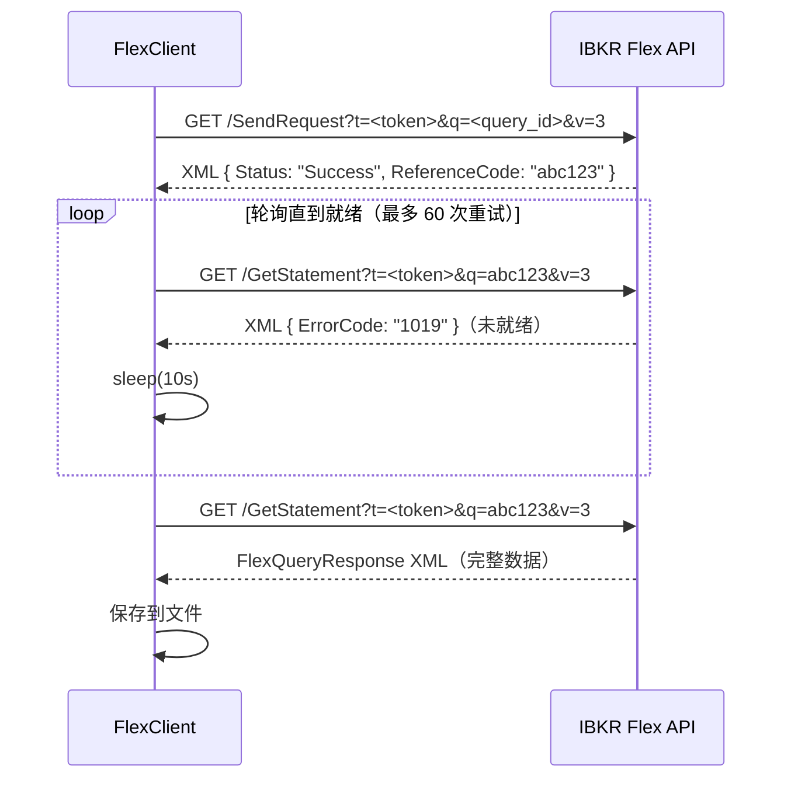
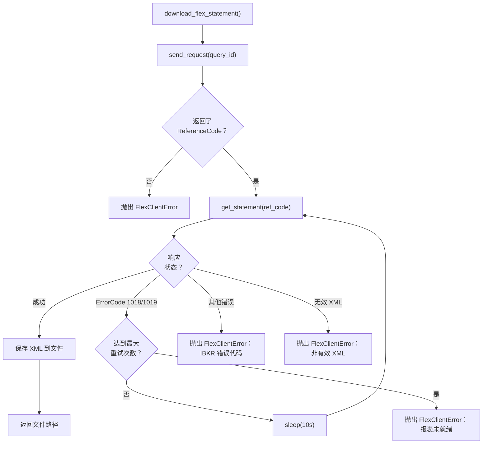

# IBKR Flex Web Service

IBKR Flex Web Service 是盈透证券提供的 HTTP API，用于以编程方式下载 Flex Query 报告。Worker 使用它在无需手动干预的情况下拉取每日投资组合数据。

## API 概览

Flex Web Service 有两个端点：

| 端点 | 方法 | 用途 |
|----------|--------|---------|
| `SendRequest` | GET | 提交 Flex Query 并获取参考代码。 |
| `GetStatement` | GET | 使用参考代码轮询报表结果。 |

基础 URL：`https://www.interactivebrokers.com/AccountManagement/FlexWebService`

## FlexClient 实现

**文件：** `worker/clients/flex_client.py`

`FlexClient` 类封装了 Flex 查询的完整生命周期：提交、轮询和下载。

```python
class FlexClient:
    def __init__(self, settings: Settings) -> None:
        self.session = requests.Session()
        self.session.headers.update({"User-Agent": "ibkr-dash-worker/0.1"})
```

### SendRequest -> Poll -> GetStatement 流程



### 步骤 1：发送请求

```python
# ibkr_dash_worker/worker/clients/flex_client.py
def send_request(self, query_id: str) -> str:
    """提交 flex 查询并返回参考代码。"""
    token = self._require_token()
    response = self.session.get(
        f"{self.settings.flex_base_url}/SendRequest",
        params={"t": token, "q": query_id, "v": "3"},
        timeout=30,
    )
    root = self._parse_xml(response.text)
    reference_code = self._extract_text(root, ("ReferenceCode",))
    return reference_code
```

响应为 XML：

```xml
<FlexStatementResponse>
  <Status>Success</Status>
  <ReferenceCode>abc123def456</ReferenceCode>
</FlexStatementResponse>
```

### 步骤 2：获取报表（轮询）

```python
def get_statement(self, reference_code: str) -> str:
    """使用参考代码轮询报表结果。"""
    token = self._require_token()
    response = self.session.get(
        f"{self.settings.flex_base_url}/GetStatement",
        params={"t": token, "q": reference_code, "v": "3"},
        timeout=60,
    )
    root = self._parse_xml(response.text)

    # 检查错误代码
    error_code = self._extract_text(root, ("ErrorCode",))
    if error_code in ("1018", "1019"):
        raise FlexStatementNotReady(f"Statement not ready: error {error_code}")
    if error_code:
        raise FlexClientError(f"IBKR returned error code: {error_code}")

    return response.text
```

### 步骤 3：带重试的下载

```python
def download_flex_statement(self, query_id: str, save_path: str | Path) -> Path:
    """带重试逻辑下载 flex 报表。"""
    save_target = Path(save_path)
    reference_code = self.send_request(query_id)

    for attempt in range(1, self.settings.flex_max_poll_retries + 1):
        try:
            statement = self.get_statement(reference_code)
            save_target.write_text(statement, encoding="utf-8")
            return save_target
        except FlexStatementNotReady:
            if attempt == self.settings.flex_max_poll_retries:
                raise FlexClientError(
                    f"Statement not ready after {self.settings.flex_max_poll_retries} retries."
                )
            time.sleep(self.settings.flex_poll_interval_seconds)
```

## 错误处理

### 错误处理流程图



### 错误代码

| 代码 | 含义 | 处理方式 |
|------|---------|----------|
| `1018` | 报表未就绪 | 轮询间隔后重试。 |
| `1019` | 报表仍在生成中 | 轮询间隔后重试。 |
| 其他 | 各种错误 | 抛出 `FlexClientError`。 |

### 异常层次结构

```python
class FlexClientError(RuntimeError):
    """当 IBKR Flex Web Service 返回错误时抛出。"""

class FlexStatementNotReady(FlexClientError):
    """当报表仍在生成中时抛出。"""
```

`FlexStatementNotReady` 是**可恢复**的错误 -- 重试循环会捕获它并等待。所有其他 `FlexClientError` 实例是**致命**的，会中止下载。

### XML 解析错误

如果响应不是有效的 XML，客户端抛出：

```python
FlexClientError("IBKR Flex response is not valid XML.")
```

### 令牌验证

客户端在发出任何请求之前检查是否配置了令牌：

```python
def _require_token(self) -> str:
    if not self.settings.flex_token:
        raise FlexClientError(
            "FLEX_TOKEN is missing. Please configure FLEX_TOKEN in Admin Settings."
        )
    return self.settings.flex_token
```

## 令牌配置

### 获取 Flex 令牌

1. 登录 [IBKR 账户管理](https://www.interactivebrokers.com/AccountManagement)。
2. 导航到 **Settings** > **Flex Web Service**。
3. 生成新令牌（或复制现有令牌）。
4. 在 Admin Settings UI (`/admin/settings`) 中配置 FLEX_TOKEN。

### 创建 Flex Query

1. 在 IBKR 账户管理中，进入 **Reports** > **Flex Queries**。
2. 创建新的自定义 Flex Query，包含所需的段落：
   - Account Information
   - Open Positions
   - Trades
   - Cash Transactions
   - Change in NAV
   - FIFO P/L
   - Mark-to-Market P/L
   - Net Position by Security
   - Price History
3. 从查询列表中记下 **Query ID**。
4. 在 Worker 中配置：

```bash
FLEX_QUERY_ID_DAILY=1532356
```

:::warning
Flex Web Service 有速率限制。轮询频率不要超过每 10 秒一次。默认配置（`FLEX_POLL_INTERVAL_SECONDS=10`、`FLEX_MAX_POLL_RETRIES=60`）允许最多 10 分钟的报表生成时间。
:::

## 配置摘要

| 变量 | 默认值 | 描述 |
|----------|---------|-------------|
| `FLEX_TOKEN` | `""` | IBKR Flex Web Service 认证令牌。 |
| `FLEX_BASE_URL` | `https://www.interactivebrokers.com/AccountManagement/FlexWebService` | API 基础 URL。 |
| `FLEX_QUERY_ID_DAILY` | `""` | 每日数据导入的 Flex Query ID。 |
| `FLEX_POLL_INTERVAL_SECONDS` | `10` | 轮询重试之间的秒数。 |
| `FLEX_MAX_POLL_RETRIES` | `60` | 最大轮询尝试次数。 |

### 通过 Admin Settings 配置

所有 Flex 相关设置通过管理面板 (`/admin/settings`) 的 UI 配置，存储在 `data/config.json` 中。

:::info
Worker 的默认 `daily_incremental_job.py` 使用硬编码的查询 ID 列表（`DEFAULT_QUERY_IDS = ["1532356", "1532359"]`）。更新此列表以匹配您的 Flex Query ID。
:::
