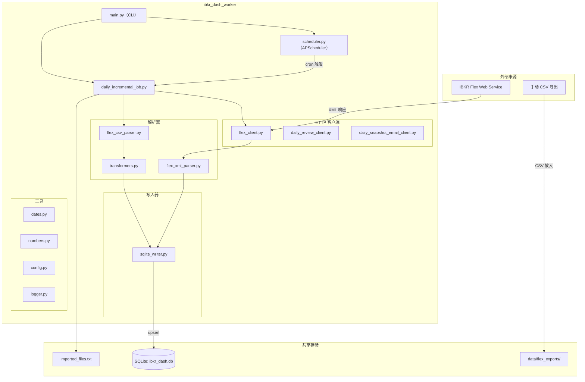
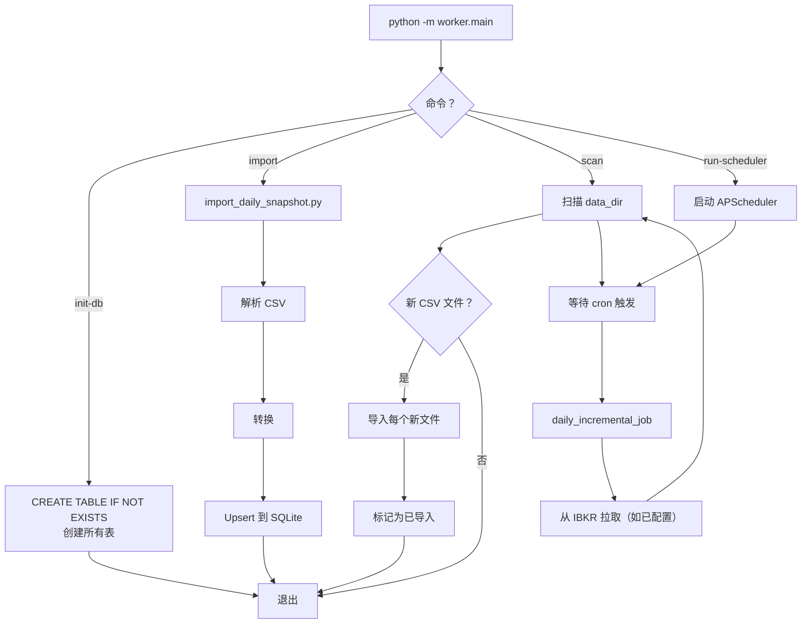
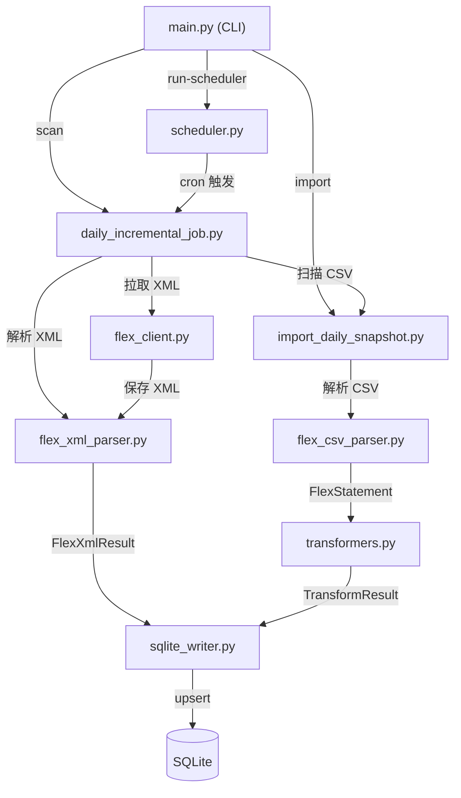
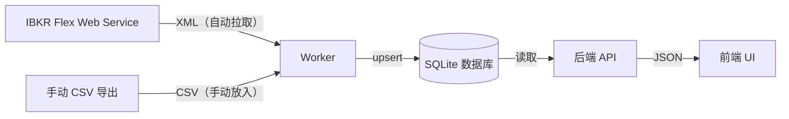

# Worker 概览

IBKR Dash worker 是一个独立的 Python 应用程序，负责从**盈透证券 (IBKR)** 导入金融数据到共享的 SQLite 数据库中。它处理 CSV 解析、XML 解析、数据转换和定时执行。

## 功能概述

1. **从 IBKR 拉取数据** 通过 Flex Web Service API（XML 响应）。
2. **解析 Flex CSV 文件** 从 IBKR 手动导出的文件。
3. **转换原始数据** 为规范化的 SQLite 就绪字典。
4. **写入 SQLite** 使用 upsert 语义（冲突时插入或更新）。
5. **定时运行**（APScheduler）进行每日增量导入。

## 系统架构图



## 目录布局

```
ibkr_dash_worker/
  worker/
    main.py                     # CLI 入口点（import, run-scheduler, init-db, scan）
    core/
      config.py                 # SettingsManager (JSON 配置)
      logger.py                 # 日志配置
      scheduler.py              # APScheduler 配置
    clients/
      flex_client.py            # IBKR Flex Web Service HTTP 客户端
      sqlite_writer.py          # 带 upsert 方法的 SQLite 写入器
      daily_review_client.py    # 后端 API 客户端，用于触发复盘
      daily_snapshot_email_client.py  # 邮件通知客户端
    parsers/
      flex_csv_parser.py        # IBKR Flex CSV 多段解析器
      flex_xml_parser.py        # IBKR Flex XML 解析器
      transformers.py           # 原始数据 -> SQLite 就绪字典转换
    importers/
      daily_snapshot_importer.py  # 高级导入流水线
    jobs/
      daily_incremental_job.py  # 主定时任务（拉取 + 扫描 + 导入）
      import_daily_snapshot.py  # 单文件导入流水线
    writers/
      sqlite_writer.py          # 备用 SQLite 写入器（导入器使用）
    utils/
      dates.py                  # 日期解析/转换辅助函数
      numbers.py                # 数字解析/清理辅助函数
  tests/                        # pytest 测试套件
```

## CLI 用法

Worker 通过 Python 模块调用，有四个命令：

### 初始化数据库

```bash
python -m worker.main init-db
```

使用 `CREATE TABLE IF NOT EXISTS` 创建所有 SQLite 表（`account_snapshots`、`position_snapshots`、`trade_records`、`cash_flows`、`price_history`、`admin_settings`）。可安全多次运行。

### 导入单个文件

```bash
python -m worker.main import /path/to/flex_export.csv
```

通过完整流水线导入单个 Flex CSV 文件：解析 -> 转换 -> upsert。

### 扫描新文件

```bash
python -m worker.main scan
```

一次性扫描 `data_dir` 中的新 CSV 文件。检查 `imported_files.txt` 以跳过已处理的文件。

### 运行调度器

```bash
python -m worker.main run-scheduler
```

启动 APScheduler 守护进程，在配置的时间运行每日增量导入任务（默认：12:30 Asia/Shanghai）。

## CLI 命令流程



## 模块关系



## Worker 与后端对比

Worker 和后端是共享同一 SQLite 数据库的独立进程：

| 方面 | Worker | 后端 |
|--------|--------|---------|
| **写入** | 金融数据（持仓、交易等） | AI 代理输出、Copilot 消息 |
| **读取** | `admin_settings` 获取 IBKR 配置 | 所有金融数据表 |
| **进程** | CLI / 调度器守护进程 | FastAPI Web 服务器 |
| **语言** | Python（相同） | Python（相同） |

:::tip
Worker 和后端可以在同一台机器或不同机器上运行，只要它们共享同一个 SQLite 文件（例如通过 Docker 中的共享卷）。
:::

## 数据流概览



## 两种导入路径

### 路径 1：从 IBKR 自动拉取（推荐）

Worker 在每日调度时直接从 IBKR Flex Web Service 拉取数据。这需要：

1. 有效的 `FLEX_TOKEN`（来自 IBKR 账户管理）。
2. 已配置的 Flex Query ID。
3. 调度器运行中（`python -m worker.main run-scheduler`）。

拉取的数据以 XML 格式到达，Worker 自动解析并导入。

### 路径 2：手动 CSV 放入

您也可以从 IBKR 网站手动导出 Flex Query 报告，并将 CSV 文件放入 `data_dir` 目录（默认为 `data/flex_exports/`）。Worker 将在下次调度器运行时或通过 `python -m worker.main scan` 拾取它们。

这适用于：
- 初始数据回填（导出历史报告）。
- 故障排除（重新导出和导入特定日期）。
- Flex Web Service 令牌不可用的场景。

## 技术栈

| 组件 | 技术 | 用途 |
|-----------|-----------|---------|
| CLI | argparse（标准库） | 命令行界面 |
| 调度器 | APScheduler (BackgroundScheduler) | 基于 cron 的任务调度 |
| HTTP 客户端 | requests | IBKR Flex Web Service 通信 |
| CSV 解析 | csv（标准库） | 多段 Flex CSV 解析 |
| XML 解析 | xml.etree.ElementTree（标准库） | Flex XML 响应解析 |
| 数据库 | SQLite（标准库） | 与后端共享的数据存储 |
| 配置 | SettingsManager (JSON) | JSON 配置文件加载 |

:::info
Worker 的外部依赖极少。只有 `requests` 和 `APScheduler` 是第三方包。其他所有模块都使用 Python 标准库。
:::

## 在 Docker 中运行

Worker 设计为与后端一起作为长时间运行的进程：

```yaml
# docker-compose.yml（摘录）
services:
  worker:
    build: ./ibkr_dash_worker
    command: python -m worker.main run-scheduler
    volumes:
      - ./data:/app/data
    environment:
      - SQLITE_PATH=/app/data/ibkr_dash.db
```

共享的 `data/` 卷包含：
- `ibkr_dash.db` -- SQLite 数据库（与后端共享）。
- `flex_exports/` -- CSV/XML 数据文件和导入跟踪文件。

## 故障排除

### 后端中没有数据显示

1. 检查 Worker 是否已导入数据：`python -m worker.main scan`
2. 验证 Worker 和后端之间的 SQLite 路径是否匹配（`SQLITE_PATH`）。
3. 检查 `imported_files.txt` 跟踪文件查看哪些文件已被处理。

### IBKR 拉取失败

1. 验证 Admin Settings 中的 `FLEX_TOKEN` 设置正确。
2. 检查 Flex Query ID 是否匹配 IBKR 中的有效查询。
3. 查看 Worker 日志中的 `FlexClientError` 消息。
4. 确保 IBKR Flex Web Service 可从您的网络访问。

### 重新导入文件

1. 从 `data/flex_exports/imported_files.txt` 中删除文件名。
2. 运行 `python -m worker.main scan` 或等待下次调度器运行。
