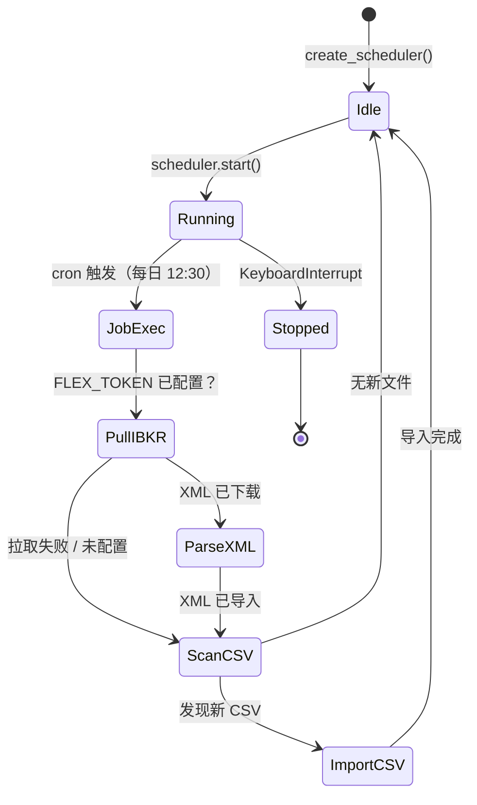
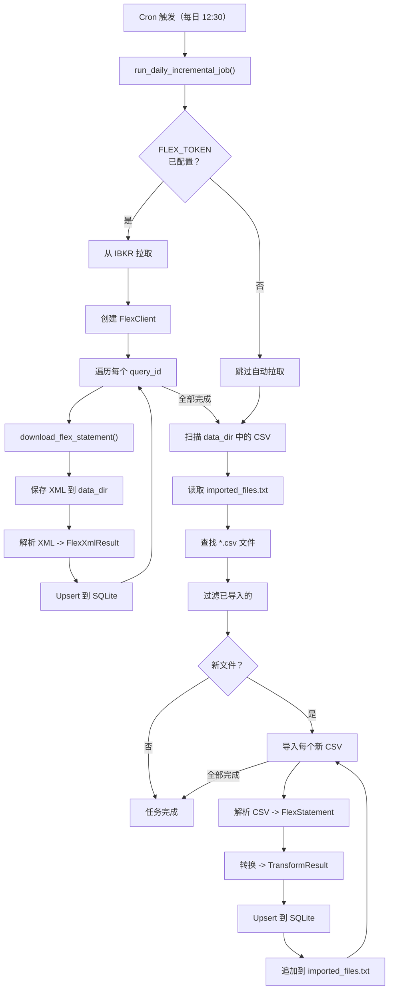

# 调度器

Worker 使用 **APScheduler**（Advanced Python Scheduler）自动运行每日增量导入任务。调度器作为后台守护线程运行。

## 调度器生命周期图



## 每日任务执行流程



## APScheduler 配置

**文件：** `worker/core/scheduler.py`

```python
# worker/worker/core/scheduler.py
from apscheduler.schedulers.background import BackgroundScheduler
from worker.core.config import get_settings
from worker.jobs.daily_incremental_job import run_daily_incremental_job

def create_scheduler() -> BackgroundScheduler:
    settings = get_settings()
    tz = ZoneInfo(settings.scheduler_timezone)

    scheduler = BackgroundScheduler(timezone=tz)
    scheduler.add_job(
        run_daily_incremental_job,
        trigger="cron",
        hour=settings.scheduler_hour,
        minute=settings.scheduler_minute,
        id="daily_incremental_job",
        replace_existing=True,
    )
    return scheduler
```

调度器使用**触发器**，可配置小时、分钟和时区。

## 启动调度器

从 CLI：

```bash
python -m worker.main run-scheduler
```

这会启动调度器并保持主线程活跃：

```python
# worker/worker/main.py（简化版）
scheduler.start()
try:
    while True:
        time.sleep(60)
except (KeyboardInterrupt, SystemExit):
    scheduler.shutdown(wait=False)
```

## 每日增量任务

**文件：** `worker/jobs/daily_incremental_job.py`

`run_daily_incremental_job()` 函数是主要的定时任务。它执行三个步骤：

### 步骤 1：从 IBKR 拉取（自动拉取）

如果配置了 `FLEX_TOKEN`，任务会：

1. 创建 `FlexClient` 实例。
2. 遍历配置的查询 ID（默认：`["1532356", "1532359"]`）。
3. 将每个 Flex 报表下载为 XML。
4. 将 XML 保存到 `data_dir`（如 `data/flex_exports/ibkr_flex_1532356_latest.xml`）。
5. 解析 XML 并导入 SQLite。

```python
# worker/worker/jobs/daily_incremental_job.py
def _pull_from_ibkr(flex_client: FlexClient, data_dir: Path) -> list[Path]:
    settings = get_settings()
    query_ids = DEFAULT_QUERY_IDS

    saved_files = []
    for query_id in query_ids:
        save_path = data_dir / f"ibkr_flex_{query_id}_latest.xml"
        flex_client.download_flex_statement(query_id, save_path)
        saved_files.append(save_path)
    return saved_files
```

### 步骤 2：扫描 CSV 文件

从 IBKR 拉取后，任务扫描 `data_dir` 中尚未导入的 CSV 文件：

```python
imported_names = _get_imported_files(data_dir)
csv_files = sorted(data_dir.glob("*.csv"))

for csv_file in csv_files:
    if csv_file.name in imported_names:
        continue  # 跳过已导入的
    counts = import_daily_snapshot_file(writer, csv_file)
    _mark_imported(data_dir, csv_file.name)
```

### 步骤 3：导入每个文件

每个文件（XML 或 CSV）经过流水线：

1. **解析** -- 从原始格式中提取段落/行。
2. **转换** -- 转换为规范化的 SQLite 就绪字典。
3. **写入** -- Upsert 到 SQLite 数据库。

## 文件跟踪 (`imported_files.txt`)

为避免在每次调度器运行时重复导入同一 CSV 文件，Worker 维护一个跟踪文件：

**位置：** `<data_dir>/imported_files.txt`

**格式：** 每行一个文件名：

```
flex_export_2025-06-01.csv
flex_export_2025-06-02.csv
```

### 读取跟踪文件

```python
def _get_imported_files(data_dir: Path) -> set[str]:
    log_path = data_dir / IMPORTED_FILES_LOG
    if not log_path.exists():
        return set()
    return {
        line.strip()
        for line in log_path.read_text(encoding="utf-8").splitlines()
        if line.strip()
    }
```

### 标记文件为已导入

```python
def _mark_imported(data_dir: Path, file_name: str) -> None:
    log_path = data_dir / IMPORTED_FILES_LOG
    with log_path.open("a", encoding="utf-8") as f:
        f.write(file_name + "\n")
```

:::tip
从 IBKR 拉取的 XML 文件在每次运行时被覆盖（相同文件名：`ibkr_flex_<query_id>_latest.xml`）。它们仍然被记录在 `imported_files.txt` 中，以避免在拉取成功但导入中途失败时重复解析。
:::

## 配置

| 变量 | 默认值 | 描述 |
|----------|---------|-------------|
| `SCHEDULER_ENABLED` | `true` | 启用/禁用调度器。 |
| `SCHEDULER_HOUR` | `12` | 运行每日任务的小时（24 小时制）。 |
| `SCHEDULER_MINUTE` | `30` | 运行每日任务的分钟。 |
| `SCHEDULER_TIMEZONE` | `Asia/Shanghai` | cron 调度的时区。 |
| `DATA_DIR` | `data/flex_exports` | Flex CSV/XML 文件和跟踪的目录。 |

### 通过 Admin Settings 配置

这些设置通过管理面板 (`/admin/settings`) 的 UI 配置，存储在 `data/config.json` 中。无需手动编辑配置文件。

### 不同调度示例

| 场景 | HOUR | MINUTE | TIMEZONE |
|------|------|--------|----------|
| 美国东部时间上午 9:00（开盘） | `9` | `0` | `America/New_York` |
| 香港时间下午 6:00（港股收盘后） | `18` | `0` | `Asia/Hong_Kong` |
| UTC 午夜 | `0` | `0` | `UTC` |

## 手动操作

### 一次性扫描

不启动调度器，运行一次导入任务：

```bash
python -m worker.main scan
```

### 单文件导入

导入特定的 CSV 文件：

```bash
python -m worker.main import /path/to/my_export.csv
```

### 初始化数据库

不导入任何数据，创建 SQLite 表：

```bash
python -m worker.main init-db
```

:::info
`init-db` 命令是幂等的 -- 它使用 `CREATE TABLE IF NOT EXISTS`，因此可以安全地多次运行。
:::

## Docker 用法

在 Docker 中运行时，调度器通常是 Worker 的主进程：

```dockerfile
CMD ["python", "-m", "worker.main", "run-scheduler"]
```

`data_dir` 应作为卷挂载，以便可以手动放入 CSV 文件，并且跟踪文件在容器重启后持续存在：

```yaml
volumes:
  - ./data:/app/backend/data
```
