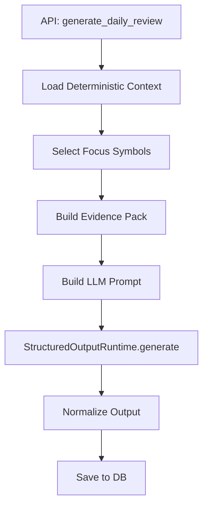

# Daily Position Review Agent

The Daily Position Review agent generates a comprehensive daily portfolio report. It combines deterministic account calculations with LLM-powered market analysis to explain what happened today and what to watch tomorrow.

## How It Works

The entry point is `generate_daily_review()` in `app/agents/daily_review/agent.py`. It follows a five-step pipeline:



## Step 1: Deterministic Context

The agent loads pre-computed data from the database:

- **Overview**: Account equity, daily PnL, daily return percentage, cash ratio
- **Rankings**: Profit contributors, loss drags, top weight positions (deterministic attribution)
- **Risk metrics**: Concentration ratios, posture flags, risk alerts
- **Benchmarks**: Index returns for comparison (e.g., S&P 500, NASDAQ)

All numbers in this step are **exact database values** -- the LLM never modifies them.

## Step 2: Focus Symbol Selection

Focus symbols are selected deterministically based on:

- Top profit contributors (highest daily PnL contribution)
- Top loss drags (lowest daily PnL contribution)
- Largest position weight changes
- Symbols with significant daily moves

This selection is **not** done by the LLM -- it is pure Python logic to ensure reproducibility.

## Step 3: Symbol Cards and Macro Card

In the sub-agent card mode, the system generates:

- **Symbol evidence cards**: One card per focus symbol, containing price action, news, valuation notes, and technical levels
- **Macro evidence card**: A card covering market regime, sector context, risk sentiment, and tech sentiment

Each card is produced by a separate LLM call with its own `StructuredOutputContract`, allowing parallel generation and independent repair.

## Step 4: LLM Composition

The main LLM call receives all the evidence and composes the final review. The prompt instructs the LLM to:

- Base account numbers on deterministic data only (do not modify PnL figures)
- Use public market data for explanations only (do not fabricate news)
- Treat tomorrow's watchlist as observation conditions, not buy/sell instructions

## Output Schema

```python
class DailyPositionReviewOutput(FlexibleModel):
    report_date: str
    summary: str | None = None
    account_conclusion: str | None = None
    attribution_summary: str | None = None
    major_contributors_analysis: list[dict[str, Any]]
    major_drags_analysis: list[dict[str, Any]]
    focus_symbol_analyses: list[dict[str, Any]]
    market_context: str | None = None
    risk_analysis: str | None = None
    tomorrow_watchlist: list[dict[str, Any]]
    operation_observation: str | None = None
    data_limitations: list[str]
    evidence_used: list[str]
```

### Key Sections

| Section | Description |
|---|---|
| `summary` | One-line summary of today's performance |
| `account_conclusion` | Detailed account-level conclusion |
| `attribution_summary` | PnL attribution explanation |
| `major_contributors_analysis` | Top profit contributors with analysis |
| `major_drags_analysis` | Top loss drags with analysis |
| `focus_symbol_analyses` | Detailed analysis of each focus symbol |
| `market_context` | Market and sector background |
| `risk_analysis` | Position risk changes |
| `tomorrow_watchlist` | Symbols and conditions to watch |
| `operation_observation` | Observation notes (not trading instructions) |

### Focus Symbol Analysis

Each focus symbol analysis includes:

```json
{
  "symbol": "AAPL.US",
  "price_action": "Gapped up 3.2% on strong earnings beat...",
  "account_impact": "Contributed +$2,400 to daily PnL, 0.8% of portfolio...",
  "possible_reasons": ["Earnings beat consensus by 12%", "iPhone 16 demand strong"],
  "valuation_note": "Trading at 28x forward PE, above 5-year average...",
  "cost_position_note": "Current cost basis $165, up 18% unrealized...",
  "watch_points": ["Monitor $195 resistance level", "Watch for post-earnings consolidation"],
  "data_limitations": ["No real-time options flow data"]
}
```

### Tomorrow Watchlist

Each watchlist item includes:

```json
{
  "symbol": "NVDA.US",
  "reason": "Approaching key support at 50-day MA",
  "key_levels": ["$120 support", "$135 resistance"],
  "events": ["AI conference next week"],
  "conditions": ["Monitor if support holds on volume"]
}
```

:::warning
The tomorrow watchlist contains **observation conditions only**, not buy/sell instructions. The system softens any forceful trading language (e.g., "must buy" becomes "observe pending preset conditions").
:::

## Normalization

`normalize_daily_position_review_output()` in `app/agents/invariants.py` enforces:

- **Report date validation**: Must match the requested date
- **Deterministic fallbacks**: Missing sections are filled from deterministic data (e.g., `summary` falls back to the overview summary)
- **Watchlist sanitization**: Forceful trading language is softened
- **Data limitation tracking**: Filled-from-fallback sections are noted in `data_limitations`

## Fallback Behavior

If the LLM fails, the fallback generates a report using only deterministic data:

```json
{
  "summary": "Daily review generated with fallback. PnL: +$1,234, Return: +0.42%.",
  "account_conclusion": "Account PnL +$1,234, return +0.42%. Contributors: AAPL, MSFT. Drags: NVDA.",
  "focus_symbol_analyses": [
    {"symbol": "AAPL.US", "price_action": "LLM output format error; price explanation pending."}
  ],
  "operation_observation": "Fallback review; no buy/sell conclusions. Regenerate when LLM output recovers."
}
```

## Email Integration

The daily review can be sent via email using the SMTP configuration in the Admin panel. The worker service (`ibkr_dash_worker`) can trigger daily review generation and email delivery on a schedule.

## API Usage

```
POST /api/daily-position-review
{
  "report_date": "2024-12-15"
}
```

The response includes the full review document with evidence pack, symbol analyses, and watchlist.
