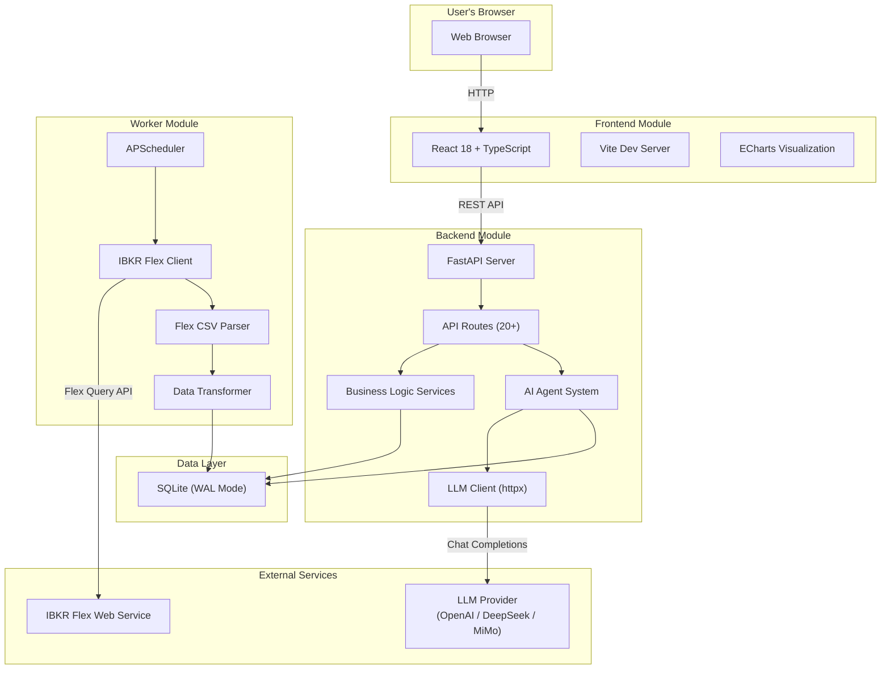
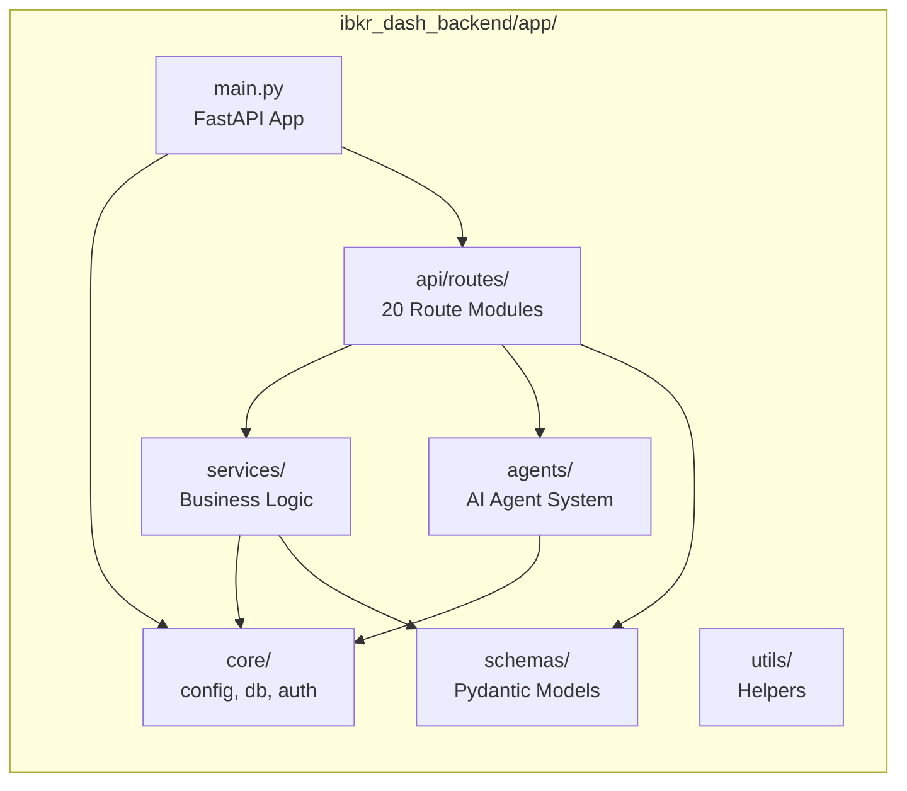
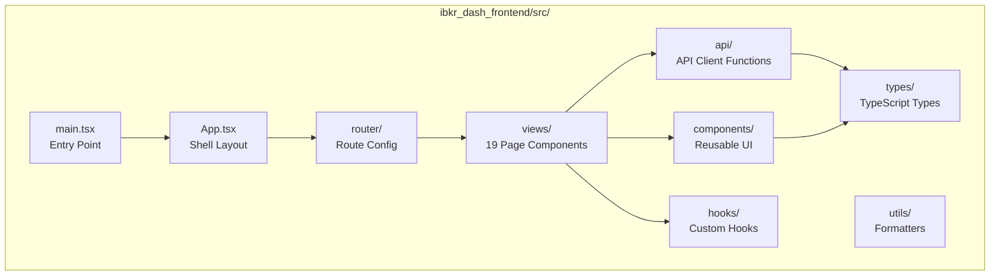
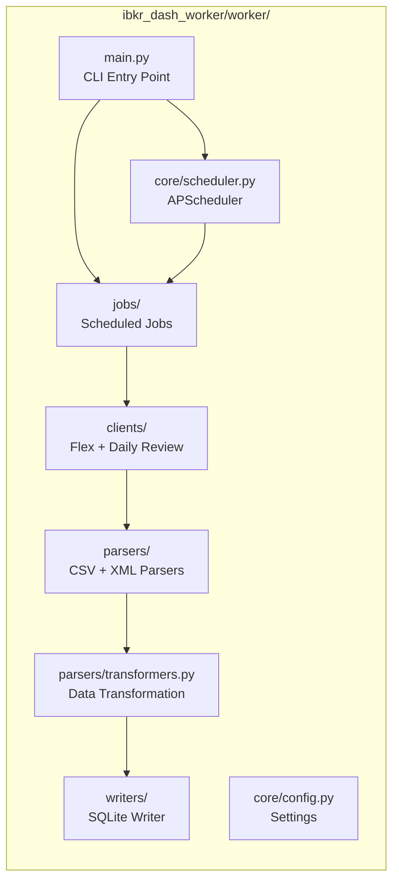
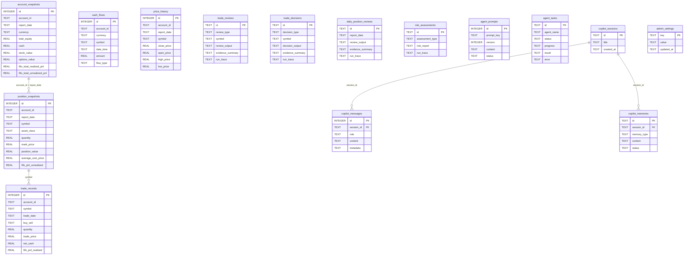
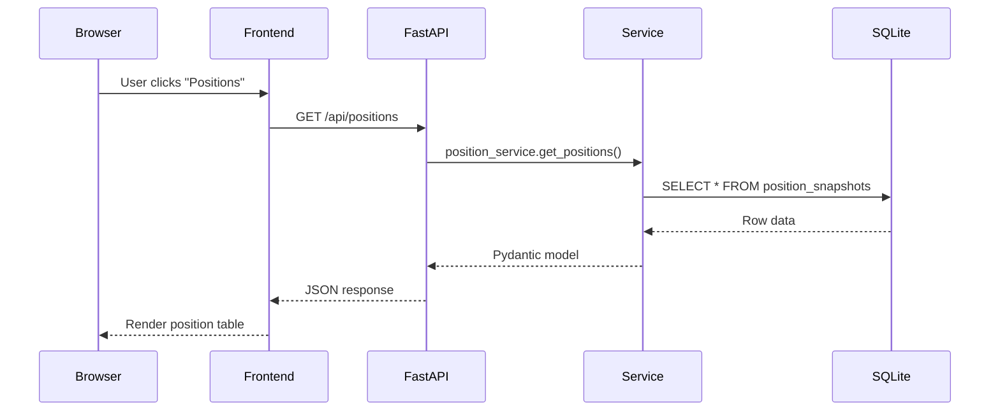
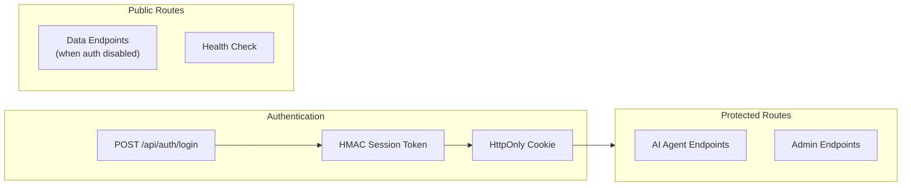

# Architecture Overview

This document explains how IBKR Dash is structured, how its modules interact, and why certain design decisions were made. By the end, you will understand the full system topology and be ready to explore the [data flow](./data-flow.md) and [tech stack](./tech-stack.md) details.

---

## High-Level Architecture

IBKR Dash follows a **three-module architecture** with a shared SQLite database as the single source of truth:



The key insight is that the **backend** and **worker** are completely decoupled. They share no code at runtime. They communicate only through the SQLite database file. This means you can run them independently, restart one without affecting the other, and even run them on different machines (as long as they can access the same SQLite file).

---

## Module Breakdown

### Backend Module (`ibkr_dash_backend/`)

The backend is the brain of the system. It serves the REST API, runs AI agents, and manages all business logic.



#### Directory Structure

```
ibkr_dash_backend/app/
├── main.py                    # FastAPI application factory
├── core/
│   ├── config.py              # Settings (pydantic-settings)
│   ├── database.py            # SQLite connection + schema DDL
│   ├── auth.py                # HMAC session tokens
│   ├── cors.py                # CORS configuration
│   ├── rate_limit.py          # Rate limiting middleware
│   └── logger.py              # Logging setup
├── api/
│   ├── deps.py                # Shared dependencies (get_current_user)
│   └── routes/
│       ├── health.py          # GET /api/health
│       ├── auth.py            # POST /api/auth/login, logout
│       ├── account.py         # Account overview endpoints
│       ├── positions.py       # Position data endpoints
│       ├── trades.py          # Trade history endpoints
│       ├── cash_flows.py      # Cash flow endpoints
│       ├── dividends.py       # Dividend endpoints
│       ├── charts.py          # Chart data endpoints
│       ├── copilot.py         # Copilot chat endpoints
│       ├── agent_tasks.py     # Agent task management
│       ├── daily_position_review.py
│       ├── trade_decision_agent.py
│       ├── trade_review_agent.py
│       ├── risk_assessment_agent.py
│       ├── symbols.py         # Symbol lookup
│       ├── admin_system.py    # System admin endpoints
│       ├── admin_llm.py       # LLM configuration
│       ├── admin_prompts.py   # Prompt management
│       ├── admin_ibkr.py      # IBKR settings
│       └── admin_email.py     # Email configuration
├── services/
│   ├── account_service.py     # Account data queries
│   ├── position_service.py    # Position queries
│   ├── trade_service.py       # Trade queries
│   ├── cash_flow_service.py   # Cash flow queries
│   ├── dividend_service.py    # Dividend queries
│   ├── chart_service.py       # Chart data generation
│   ├── llm_service.py         # LLM HTTP client
│   ├── ibkr_tool_service.py   # IBKR data tools for agents
│   └── agent_services.py      # Agent orchestration
├── agents/
│   ├── runtime.py             # ReAct tool-calling runtime
│   ├── structured_output/     # JSON parse/validate/repair pipeline
│   ├── account_copilot/       # Chat-based copilot agent
│   ├── daily_review/          # Daily position review agent
│   ├── trade_decision/        # Trade decision agent
│   ├── trade_review/          # Trade review agent
│   ├── risk_assessment/       # Risk assessment agent
│   ├── eval_cases/            # Evaluation test cases
│   ├── eval_harness.py        # Evaluation framework
│   ├── prompt_registry.py     # Prompt versioning
│   ├── evidence.py            # Evidence collection
│   └── sensitive.py           # Sensitive data filtering
├── schemas/                   # Pydantic request/response models
└── utils/                     # Date, pagination, JSON helpers
```

---

### Frontend Module (`ibkr_dash_frontend/`)

The frontend is a single-page application (SPA) built with React and TypeScript. It communicates with the backend exclusively through REST API calls.



#### Key Views

| View | Route | Description |
|------|-------|-------------|
| `DashboardView` | `/` | Portfolio overview with charts and stats |
| `PositionsView` | `/positions` | Detailed position table |
| `TradesView` | `/trades` | Trade history |
| `CashFlowsView` | `/cash-flows` | Cash flow tracking |
| `DividendsView` | `/dividends` | Dividend history |
| `AccountCopilotView` | `/copilot` | AI chat assistant |
| `DailyPositionReviewView` | `/daily-position-review` | AI daily reviews |
| `TradeDecisionAgentView` | `/trade-decision` | Pre-trade analysis |
| `TradeReviewAgentView` | `/trade-review` | Post-trade review |
| `StockResearchView` | `/stock-research` | Symbol research |
| `AdminSystemView` | `/admin/system` | System settings |
| `AdminLlmView` | `/admin/llm` | LLM configuration |
| `AdminPromptsView` | `/admin/prompts` | Prompt management |
| `AdminAgentMonitoringView` | `/admin/agent-monitoring` | Agent task history |
| `AdminIbkrView` | `/admin/ibkr` | IBKR settings |
| `AdminEmailView` | `/admin/email` | Email configuration |
| `AdminHarnessView` | `/admin/harness` | Agent evaluation |
| `AdminLongbridgeMcpView` | `/admin/longbridge-mcp` | Longbridge MCP config |
| `BootstrapView` | `/bootstrap` | First-time setup |

:::info
AI-powered views (Copilot, Daily Review, Trade Decision, Trade Review, Stock Research) require authentication. Data views (Dashboard, Positions, Trades, etc.) are accessible without login when auth is disabled.
:::

---

### Worker Module (`ibkr_dash_worker/`)

The worker is a standalone ETL (Extract, Transform, Load) pipeline. It reads IBKR Flex CSV exports and writes structured data into SQLite.



#### Worker CLI Commands

```bash
# Import a single Flex CSV file
python -m worker.main import <file.csv>

# Scan data_dir for new files and import them
python -m worker.main scan

# Run the background scheduler (auto-import on cron schedule)
python -m worker.main run-scheduler

# Initialize the database schema
python -m worker.main init-db
```

---

## Database Schema

The SQLite database is the central data store shared between the backend and worker. It contains **13 tables** organized into three groups:



### Table Groups

**Financial Data (written by Worker, read by Backend):**

| Table | Description | Unique Constraint |
|-------|-------------|-------------------|
| `account_snapshots` | Daily account-level summary (equity, cash, P&L) | `account_id + report_date` |
| `position_snapshots` | Daily position details (quantity, price, value) | `account_id + report_date + symbol` |
| `trade_records` | Individual trade transactions | `account_id + trade_date + symbol + trade_id` |
| `cash_flows` | Cash movements (deposits, withdrawals, dividends) | None (append-only) |
| `price_history` | Daily price data for symbols | `account_id + report_date + symbol` |

**AI Agent Outputs (written by Backend, read by Frontend):**

| Table | Description |
|-------|-------------|
| `trade_reviews` | Post-trade evaluation results |
| `trade_decisions` | Pre-trade analysis results |
| `daily_position_reviews` | Daily position review reports |
| `risk_assessments` | Portfolio risk analysis reports |

**Agent Infrastructure (managed by Backend):**

| Table | Description |
|-------|-------------|
| `agent_prompts` | Versioned prompt templates |
| `agent_tasks` | Agent execution history |
| `copilot_sessions` | Chat session metadata |
| `copilot_messages` | Chat message history |
| `copilot_memories` | Copilot memory facts |
| `admin_settings` | Key-value configuration store |

---

## Request Lifecycle

Here is how a typical request flows through the system:



---

## Design Decisions

### Why SQLite?

IBKR Dash uses SQLite as its sole data store. This is a deliberate choice:

| Factor | SQLite | PostgreSQL/MySQL |
|--------|--------|-----------------|
| **Setup** | Zero configuration | Requires server installation |
| **Deployment** | Single file | Separate service |
| **Concurrency** | WAL mode handles reads + single writer | Full concurrent writes |
| **Data Size** | Sufficient for personal portfolio (thousands of rows) | Designed for millions of rows |
| **Backup** | Copy one file | Requires pg_dump or similar |
| **Docker** | Shared via volume mount | Requires separate container |

For a personal investment dashboard, the data volume is modest -- a few hundred position snapshots, a few thousand trades, and a few hundred daily reviews per year. SQLite handles this comfortably.

:::tip
SQLite with WAL (Write-Ahead Logging) mode enabled allows concurrent reads while a write is in progress. This means the backend can serve API requests while the worker is importing data.
:::

### Why No LangGraph?

The original prototype used LangGraph for agent orchestration. It was replaced with a custom ReAct (Reason + Act) loop implemented in plain Python. The reasons:

1. **Simplicity** -- The custom runtime is ~400 lines of straightforward Python with no magic
2. **Control** -- Full control over tool execution, parallel dispatch, and error handling
3. **Dependencies** -- LangGraph pulled in many transitive dependencies
4. **Debugging** -- Plain Python is easier to debug than a graph framework
5. **Performance** -- ThreadPoolExecutor for parallel tool calls is simple and effective

The ReAct runtime (`app/agents/runtime.py`) implements the standard loop: **Plan (LLM) -> Execute Tools -> Observe -> Repeat**. On the final round, tool calls are blocked and the LLM is forced to synthesize a final answer.

### Why React Over Vue?

The frontend uses React 18 with TypeScript. The main reasons:

1. **Ecosystem** -- ECharts has excellent React bindings
2. **TypeScript** -- First-class TypeScript support in React
3. **Lazy Loading** -- React.lazy() for code-splitting 19 views
4. **Testing** -- Vitest + React Testing Library provide fast, reliable tests
5. **Developer Familiarity** -- The developer's preferred framework

### Why FastAPI Over Django?

The backend uses FastAPI instead of a full-stack framework like Django:

1. **Async Support** -- FastAPI is async-native, important for LLM API calls
2. **Auto Documentation** -- Swagger/OpenAPI docs generated automatically
3. **Pydantic Integration** -- Native request/response validation
4. **Lightweight** -- No ORM, no admin panel, no template engine (not needed)
5. **Performance** -- FastAPI is one of the fastest Python web frameworks

### Why httpx for LLM Calls?

The LLM service uses `httpx` instead of the official OpenAI Python SDK:

1. **Provider Agnostic** -- Works with any OpenAI-compatible endpoint
2. **No Vendor Lock-in** -- No dependency on a specific SDK version
3. **Simplicity** -- Single HTTP POST to `/chat/completions` is all that is needed
4. **Lightweight** -- Much smaller dependency tree

---

## Module Communication

The three modules communicate through two channels:

### 1. SQLite Database (Primary)

The backend and worker share the same SQLite database file. The worker writes financial data; the backend reads it and writes agent outputs.

```
Worker  --[writes]--> SQLite <--[reads/writes]-- Backend
```

### 2. HTTP API (Optional)

The worker can optionally call the backend API to trigger daily reviews after data import:

```
Worker --[POST /api/daily-position-review/generate]--> Backend
```

This is configured via `BACKEND_BASE_URL` in the worker's `.env` file.

---

## Security Model

IBKR Dash has a simple security model appropriate for a personal tool:



- **Session Tokens** -- HMAC-SHA256 signed tokens stored in HttpOnly cookies
- **7-Day Expiry** -- Sessions expire after 7 days
- **Optional Auth** -- If `AUTH_PASSWORD` is empty, all routes are public
- **Protected Routes** -- AI agent endpoints and admin routes require authentication
- **CORS** -- Configurable allowed origins

:::warning
IBKR Dash is designed for personal use on a trusted network. It does not implement rate limiting per user, CSRF protection, or OAuth. If you expose it to the internet, use a reverse proxy with proper security headers.
:::

---

## Next Steps

Now that you understand the architecture:

- **[Data Flow](./data-flow.md)** -- Follow data through every layer with detailed sequence diagrams
- **[Technology Stack](./tech-stack.md)** -- Deep dive into every technology choice and configuration
