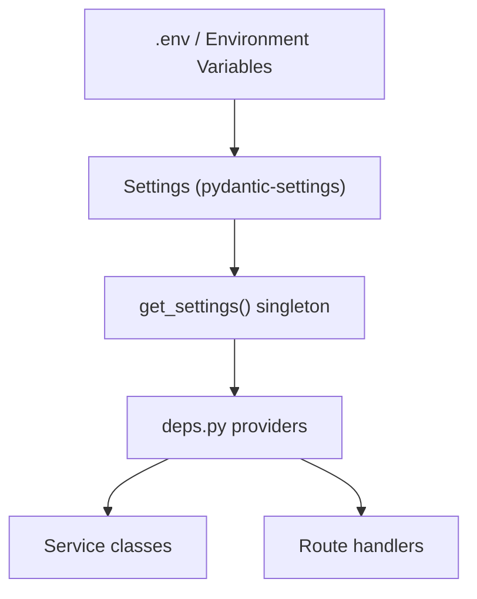

# Configuration

The backend uses **pydantic-settings** to load configuration from environment variables with sensible defaults. All settings are defined in a single `Settings` class.

## How pydantic-settings Works

```python
from pydantic_settings import BaseSettings

class Settings(BaseSettings):
    app_name: str = "IBKR Dash"
    debug: bool = False
    sqlite_path: str = "data/ibkr_dash.db"
    # ...

    model_config = {
        "env_prefix": "",
        "env_file": ".env",
        "env_file_encoding": "utf-8",
    }
```

Pydantic-settings automatically:
1. Reads values from environment variables (case-insensitive).
2. Falls back to `.env` file if the variable is not set.
3. Falls back to the default value if neither is available.
4. Validates types (e.g., `debug: bool` accepts `true`, `1`, `yes`).

The settings instance is a **cached singleton**:

```python
@lru_cache
def get_settings() -> Settings:
    return Settings()
```

## Environment Variables

### Application

| Variable | Default | Description |
|----------|---------|-------------|
| `APP_ENV` | `development` | Environment name (`development`, `production`). |
| `DEBUG` | `false` | Enable debug mode. |

### SQLite

| Variable | Default | Description |
|----------|---------|-------------|
| `SQLITE_PATH` | `data/ibkr_dash.db` | Path to the SQLite database file. Resolved relative to the backend root. |

### Cache

| Variable | Default | Description |
|----------|---------|-------------|
| `CACHE_TTL_SECONDS` | `86400` | In-memory cache TTL (24 hours). |

### LLM (OpenAI-compatible)

| Variable | Default | Description |
|----------|---------|-------------|
| `LLM_API_KEY` | `""` | API key for the LLM provider. |
| `LLM_BASE_URL` | `https://api.openai.com/v1` | Base URL for the chat completions endpoint. |
| `LLM_DEFAULT_MODEL` | `gpt-4o` | Default model name. |
| `LLM_TEMPERATURE` | `0.1` | Sampling temperature (0.0 = deterministic). |
| `LLM_MAX_TOKENS` | `8192` | Maximum tokens in the response. |

:::tip
Any OpenAI-compatible API works. Set `LLM_BASE_URL` and `LLM_API_KEY` to use providers like DeepSeek, Xiaomi MiMo, or a self-hosted model.
:::

### Authentication

| Variable | Default | Description |
|----------|---------|-------------|
| `AUTH_USERNAME` | `admin` | Username for HTTP Basic auth and login. |
| `AUTH_PASSWORD` | `""` | Password for auth. **Leave empty to disable authentication.** |

### CORS

| Variable | Default | Description |
|----------|---------|-------------|
| `CORS_ORIGINS` | `http://localhost:5173,http://localhost:3000` | Comma-separated list of allowed origins. |

### Longbridge (Optional)

| Variable | Default | Description |
|----------|---------|-------------|
| `LONGBRIDGE_APP_KEY` | `""` | Longbridge API app key (for public market data). |
| `LONGBRIDGE_APP_SECRET` | `""` | Longbridge API app secret. |
| `LONGBRIDGE_ACCESS_TOKEN` | `""` | Longbridge access token. |

## .env File Structure

Copy `.env.example` to `.env` and fill in your values:

```bash
# --- App ---
APP_ENV=development
DEBUG=true

# --- SQLite ---
SQLITE_PATH=data/ibkr_dash.db

# --- LLM ---
LLM_API_KEY=sk-your-key-here
LLM_BASE_URL=https://api.openai.com/v1
LLM_DEFAULT_MODEL=gpt-4o
LLM_TEMPERATURE=0.1
LLM_MAX_TOKENS=8192

# --- Auth ---
AUTH_USERNAME=admin
AUTH_PASSWORD=your-secret-password

# --- CORS ---
CORS_ORIGINS=http://localhost:5173,http://localhost:3000
```

:::warning
The `.env` file is gitignored. Never commit real credentials to version control.
:::

## How Settings Propagate to Services

Settings flow through the application via FastAPI's dependency injection:



**Direct usage in DI:**

```python
def get_app_settings() -> Settings:
    return get_settings()

def get_llm_service(settings: Settings = Depends(get_app_settings)) -> LLMService:
    return LLMService(settings)
```

**Indirect usage via Database:**

```python
def get_database(settings: Settings | None = None) -> Database:
    s = settings or get_settings()
    return Database(s.sqlite_path)
```

**Usage in routes:**

```python
@router.get("/status")
def system_status(
    settings: Settings = Depends(get_app_settings),
) -> dict:
    return {"model": settings.llm_default_model}
```

## Worker Configuration

The worker has its own `Settings` dataclass (not pydantic-based) with additional variables:

| Variable | Default | Description |
|----------|---------|-------------|
| `DATA_DIR` | `data/flex_exports` | Directory for Flex CSV/XML files. |
| `SCHEDULER_ENABLED` | `true` | Enable the background scheduler. |
| `SCHEDULER_HOUR` | `12` | Hour to run the daily job. |
| `SCHEDULER_MINUTE` | `30` | Minute to run the daily job. |
| `SCHEDULER_TIMEZONE` | `Asia/Shanghai` | Timezone for the scheduler. |
| `FLEX_TOKEN` | `""` | IBKR Flex Web Service token. |
| `FLEX_BASE_URL` | `https://www.interactivebrokers.com/AccountManagement/FlexWebService` | Flex API base URL. |
| `FLEX_POLL_INTERVAL_SECONDS` | `10` | Seconds between poll retries. |
| `FLEX_MAX_POLL_RETRIES` | `60` | Maximum poll attempts. |
| `BACKEND_BASE_URL` | `http://localhost:8000` | Backend URL for worker-to-backend calls. |
| `LOG_LEVEL` | `INFO` | Logging level. |

## Configuration Best Practices

### Development

```bash
APP_ENV=development
DEBUG=true
AUTH_PASSWORD=               # No auth for local dev
LLM_API_KEY=sk-dev-key
```

### Production

```bash
APP_ENV=production
DEBUG=false
AUTH_PASSWORD=strong-random-secret
CORS_ORIGINS=https://your-domain.com
LLM_API_KEY=sk-prod-key
```

:::warning
In production, always set a strong `AUTH_PASSWORD` and restrict `CORS_ORIGINS` to your actual domain. Never leave `DEBUG=true` in production.
:::

### Docker

When running in Docker, pass environment variables via `docker-compose.yml` or an `.env` file mounted into the container:

```yaml
services:
  backend:
    env_file:
      - .env
    environment:
      - SQLITE_PATH=data/ibkr_dash.db
```

The `SQLITE_PATH` should point to a path inside the container that is mounted as a volume, so the database persists across container restarts.
