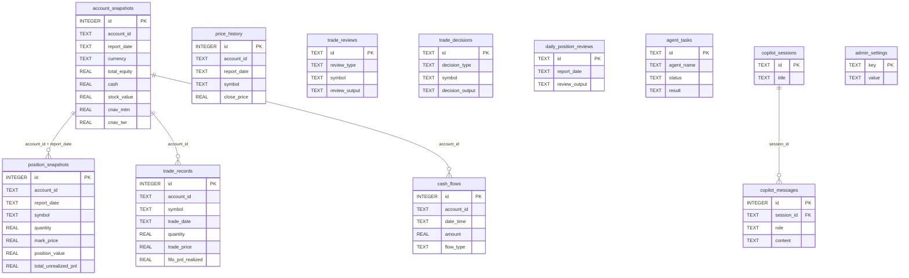

# Database

The IBKR Dash backend uses **SQLite** as its sole data store. Both the backend (reads) and the worker (writes) share the same `.db` file.

## Schema Overview

The database contains **16 tables** organized into four groups:

### Financial Data (Written by Worker)

These tables store raw IBKR data imported from Flex CSV/XML reports.

| Table | Purpose | Conflict Key |
|-------|---------|--------------|
| `account_snapshots` | Daily account-level equity, cash, and asset breakdown. | `(account_id, report_date)` |
| `position_snapshots` | Per-symbol position snapshots (quantity, price, PnL). | `(account_id, report_date, symbol)` |
| `trade_records` | Individual trade executions (append-only). | `(account_id, trade_date, symbol, trade_id)` |
| `cash_flows` | Deposits, withdrawals, dividends, and other cash movements. | -- |
| `price_history` | Daily OHLC price data per symbol. | `(account_id, report_date, symbol)` |

### AI Agent Outputs (Written by Backend)

| Table | Purpose | Primary Key |
|-------|---------|-------------|
| `trade_reviews` | AI-generated trade review results (JSON). | `id` (UUID) |
| `trade_decisions` | AI-generated trade decision analyses (JSON). | `id` (UUID) |
| `daily_position_reviews` | AI-generated daily portfolio reviews (JSON). | `id` (UUID) |
| `risk_assessments` | AI-generated risk assessment reports (JSON). | `id` (UUID) |

### Agent Infrastructure

| Table | Purpose |
|-------|---------|
| `agent_prompts` | Versioned prompt templates for AI agents. |
| `agent_tasks` | Background task tracking (status, progress, result). |
| `copilot_sessions` | Chat sessions for the Account Copilot. |
| `copilot_messages` | Individual messages within copilot sessions. |
| `copilot_memories` | Persistent memories extracted during copilot conversations. |

### Configuration

| Table | Purpose |
|-------|---------|
| `admin_settings` | Key-value store for admin configuration (IBKR tokens, email settings). |

## ER Diagram



## Indexes

Indexes are created on the most common query patterns:

```sql
CREATE INDEX idx_account_snapshots_date      ON account_snapshots(report_date);
CREATE INDEX idx_position_snapshots_date     ON position_snapshots(report_date);
CREATE INDEX idx_position_snapshots_symbol   ON position_snapshots(symbol);
CREATE INDEX idx_trade_records_date          ON trade_records(trade_date);
CREATE INDEX idx_trade_records_symbol        ON trade_records(symbol);
CREATE INDEX idx_cash_flows_date             ON cash_flows(date_time);
CREATE INDEX idx_price_history_symbol_date   ON price_history(symbol, report_date);
CREATE INDEX idx_copilot_messages_session    ON copilot_messages(session_id, created_at);
```

## Migration System

Migrations are defined as a simple list of `ALTER TABLE` / `CREATE INDEX` statements in `app/core/database.py`. They run automatically on startup:

```python
_MIGRATIONS = [
    "ALTER TABLE copilot_sessions ADD COLUMN title TEXT DEFAULT ''",
    "ALTER TABLE trade_records ADD COLUMN trade_id TEXT",
    "CREATE UNIQUE INDEX IF NOT EXISTS idx_trade_records_unique ...",
    "ALTER TABLE cash_flows ADD COLUMN flow_direction TEXT",
]
```

Each migration is wrapped in a `try/except` so that re-running them is safe (column-already-exists errors are silently ignored).

:::warning
There is no formal migration framework (like Alembic). Migrations are append-only SQL strings. If you need to add a column, append a new `ALTER TABLE` statement to the `_MIGRATIONS` list.
:::

## Query Patterns

### Upsert (INSERT or UPDATE)

The `Database.upsert()` method uses SQLite's `ON CONFLICT ... DO UPDATE SET` syntax:

```python
db.upsert("admin_settings", {"key": "ibkr_flex_token", "value": "abc123"}, conflict_cols=["key"])
```

Generated SQL:
```sql
INSERT INTO admin_settings (key, value) VALUES (?, ?)
ON CONFLICT(key) DO UPDATE SET value = excluded.value
```

### Bulk Upsert

For importing many rows at once (used by the worker):

```python
db.bulk_upsert("position_snapshots", rows, conflict_cols=["account_id", "report_date", "symbol"])
```

### Parameterized Queries

All queries use `?` placeholders to prevent SQL injection:

```python
rows = db.execute(
    "SELECT * FROM position_snapshots WHERE report_date = ? AND symbol = ?",
    ("2025-06-01", "AAPL"),
)
```

### Row Factory

All connections use `sqlite3.Row` as the row factory, so query results are returned as dictionaries:

```python
conn.row_factory = sqlite3.Row
# Later: dict(row) converts Row to a plain dict
```

## Connection Configuration

Every connection applies these PRAGMAs:

```sql
PRAGMA journal_mode = WAL;      -- Write-Ahead Logging for concurrent access
PRAGMA foreign_keys = ON;       -- Enforce FK constraints
PRAGMA busy_timeout = 5000;     -- Wait up to 5s if database is locked
```

:::tip
WAL mode is critical because the backend and worker access the same SQLite file concurrently. WAL allows multiple readers to proceed while a single writer is active.
:::

## Why SQLite Over ES/Redis?

The project deliberately chose SQLite to minimize operational complexity:

- **No infrastructure to manage**: No Docker containers for databases, no cluster configuration.
- **Single file backup**: Copy the `.db` file to back up all data.
- **Sufficient performance**: Personal portfolio data (thousands of records) is well within SQLite's capabilities.
- **Full SQL**: Complex queries (aggregations, joins, window functions) are supported natively.
