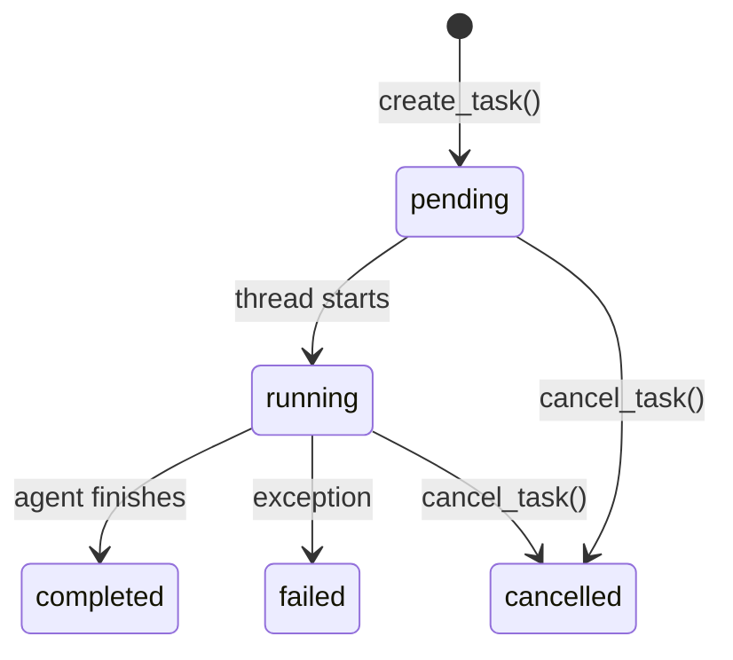
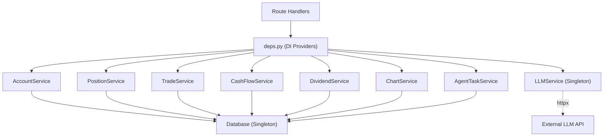

# Services

The service layer contains all business logic. Routes are thin -- they validate input via Pydantic schemas, call a service method, and return the result. Services receive a `Database` instance through their constructor.

## Service Layer Pattern

Every service follows the same structure:

```python
class SomeService:
    def __init__(self, db: Database) -> None:
        self.db = db

    def some_method(self, param: str) -> SomeResponse:
        rows = self.db.execute("SELECT ... WHERE ... = ?", (param,))
        return SomeResponse(items=[SomeItem(**row) for row in rows])
```

Services are instantiated by **dependency providers** in `app/api/deps.py`:

```python
def get_some_service(db: Database = Depends(get_db)) -> SomeService:
    return SomeService(db)
```

FastAPI creates a new service instance per request. The `Database` singleton is shared across all requests.

## Key Services

### AccountService

**File:** `app/services/account_service.py`

Provides account-level overview and snapshot queries.

**Methods:**
- `get_overview()` -- Returns the latest account snapshot with day-over-day deltas. Computes realized/unrealized PnL by aggregating from `trade_records` and `position_snapshots`.
- `get_snapshots(limit)` -- Returns recent account snapshots ordered by date descending.

**How it computes PnL:**
1. Realized PnL: `SUM(fifo_pnl_realized) FROM trade_records WHERE trade_date <= report_date`
2. Unrealized PnL: `SUM(total_unrealized_pnl) FROM position_snapshots WHERE report_date = ?`
3. Delta: Compares current vs. previous day's values.

### PositionService

**File:** `app/services/position_service.py`

The most complex service. Handles position listing, summary, and detail views.

**Methods:**
- `list_positions(...)` -- Full-featured listing with filtering (date, symbol, asset class), sorting (8 sort fields), and pagination. Enriches positions with realized PnL from trades when missing.
- `get_positions_summary(...)` -- Returns top 5 positions by value, asset class distribution, and aggregate totals.
- `get_position_detail(symbol)` -- Returns OHLC price bars and trade markers for a single symbol. Falls back to mark_price when price_history is unavailable.

**Sort fields:** `position_value`, `percent_of_nav`, `total_unrealized_pnl`, `total_realized_pnl`, `average_cost_price`, `previous_day_change_percent`, `symbol`, `quantity`.

### TradeService

**File:** `app/services/trade_service.py`

**Methods:**
- `list_trades(...)` -- Lists trades with date range, symbol, asset class, and direction filters. Supports sorting and pagination.
- `summarize_trades(...)` -- Aggregates trade statistics (total PnL, win rate, etc.) for the filtered set.

### CashFlowService

**File:** `app/services/cash_flow_service.py`

**Methods:**
- `list_cash_flows(...)` -- Lists cash flows with date range, currency, and direction filters.

### DividendService

**File:** `app/services/dividend_service.py`

**Methods:**
- `list_dividends(...)` -- Lists dividend payments with date range, currency, and symbol filters.

### ChartService

**File:** `app/services/chart_service.py`

Builds time-series data for the frontend charts.

**Methods:**
- `get_equity_curve(start_date, end_date)` -- Builds the equity curve with:
  - Total equity line
  - Net cost curve (cumulative deposits/withdrawals)
  - Total PnL (equity minus net cost)
  - Realized PnL curve
  - Daily MTM and TWR (only for the latest calendar month)
- `get_performance_calendar(view, anchor)` -- Builds a performance calendar in three views:
  - `month` -- Daily PnL/TWR for a single month
  - `year` -- Monthly PnL/TWR for a single year
  - `all-years` -- Yearly PnL/TWR across all years

**Key logic:**
- Cash flows of type `Deposits/Withdrawals` are used to build the net cost curve.
- Daily MTM is inferred from equity changes when `cnav_mtm` is not available in the data.
- TWR (Time-Weighted Return) is compounded from daily returns.

### LLMService

**File:** `app/services/llm_service.py`

A lightweight HTTP client for any OpenAI-compatible chat completions endpoint.

**Key features:**

- **Persistent `httpx.Client`**: Reuses TCP connections across requests (connection pool: 10 max, 5 keepalive).
- **60-second timeout**: Per-request timeout for LLM calls.
- **Structured error handling**: Raises `LLMClientError` with error codes: `TIMEOUT`, `AUTH_FAILED`, `RATE_LIMITED`, `PROVIDER_ERROR`.
- **Metadata tracking**: `chat_with_metadata()` returns content, token usage, and latency.

```python
class LLMService:
    def __init__(self, settings: Settings) -> None:
        self._client = httpx.Client(
            timeout=60.0,
            limits=httpx.Limits(max_connections=10, max_keepalive_connections=5),
        )

    def chat(self, messages, *, model=None, temperature=None, max_tokens=None) -> str:
        """Simple interface: returns the assistant content string."""

    def chat_with_metadata(self, messages, ...) -> dict:
        """Returns { "content": str, "usage": dict, "latency_ms": int }."""
```

**Usage pattern in agents:**

```python
result = llm_service.chat_with_metadata([
    {"role": "system", "content": system_prompt},
    {"role": "user", "content": user_message},
], response_format={"type": "json_object"})
```

:::tip
The LLMService is a process-wide singleton (cached via `lru_cache` in `deps.py`). This means the `httpx.Client` connection pool is shared across all requests, which is efficient for high-throughput scenarios.
:::

### AgentTaskService

**File:** `app/services/agent_services.py`

Manages background agent tasks with status tracking.

**Methods:**
- `create_task(agent_name)` -- Creates a task record in `agent_tasks` with status `pending`.
- `run_in_background(agent_name, func, *args)` -- Spawns a daemon thread that runs the async agent function. Returns the task ID immediately.
- `get_task(task_id)` -- Fetches task status, progress, and result.
- `list_tasks(agent_name, status, limit)` -- Lists tasks with optional filters.
- `cancel_task(task_id)` -- Cancels a pending or running task.
- `update_progress(task_id, progress)` -- Updates the progress field of a running task.

**Task lifecycle:** `pending` -> `running` -> `completed` / `failed` / `cancelled`



## How Services Use Database

All services interact with the database through the `Database` class methods:

| Method | Use Case |
|--------|----------|
| `db.execute(sql, params)` | SELECT queries returning multiple rows. |
| `db.execute_one(sql, params)` | SELECT queries returning a single row. |
| `db.insert(table, data)` | INSERT a single row, returns `lastrowid`. |
| `db.upsert(table, data, conflict_cols)` | INSERT or UPDATE on conflict. |
| `db.bulk_upsert(table, rows, conflict_cols)` | Batch INSERT or UPDATE. |

:::info
Services never manage connections directly. The `Database` class handles connection lifecycle, commit/rollback, and closing.
:::

## Service Dependency Graph



## Adding a New Service

To add a new service:

1. Create `app/services/my_service.py` with a class that takes `db: Database` in `__init__`.
2. Add a provider function in `app/api/deps.py`:

```python
def get_my_service(db: Database = Depends(get_db)) -> MyService:
    return MyService(db)
```

3. Use it in your route handler:

```python
@router.get("/my-endpoint")
def my_endpoint(
    service: MyService = Depends(get_my_service),
    _user: str | None = Depends(get_current_user),
) -> MyResponse:
    return service.my_method()
```

4. Define Pydantic schemas in `app/schemas/my_schema.py` for request/response types.
