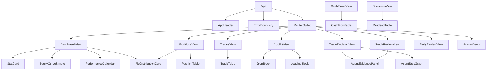

# Components

The frontend uses a library of reusable components in `src/components/`. These components follow the terminal-luxury design system and use CSS variables for consistent styling.

## Component Hierarchy



## Key Components

### AppHeader

**File**: `src/components/AppHeader.tsx`

The main navigation header displayed on every page. It includes:

- **Title and subtitle**: "IBKR Dashboard" / "Portfolio Analytics"
- **Account metrics strip**: Report date, total equity, total P&L (from `useAccountOverview` hook)
- **Navigation buttons**: Dashboard, Positions, Trades, Cash Flows, Dividends, AI Decision, AI Review, Copilot, Admin
- **Auth controls**: Login/Logout button, username display
- **Language toggle**: Switches between English and Chinese
- **Login modal**: Inline modal for username/password authentication

The header uses the `useAuth` hook for authentication state and the `useAccountOverview` hook for account metrics.

```tsx
<AppHeader />
// Renders inside <App /> as the first child
```

### StatCard

**File**: `src/components/StatCard.tsx`

A styled card displaying a single metric with title, value, helper text, and optional delta indicators.

```tsx
<StatCard
  title="Total Equity"
  value="$123,456"
  helper="As of 2024-12-15"
  tone="positive"
  deltaPercent="+2.3%"
  deltaAmount="+$2,800"
  deltaTone="positive"
/>
```

| Prop | Type | Description |
|---|---|---|
| `title` | string | Metric label (displayed in uppercase monospace) |
| `value` | string | Main metric value |
| `helper` | string? | Helper text below the value |
| `tone` | `'neutral' \| 'positive' \| 'negative' \| 'accent'` | Color tone for the accent bar and value |
| `deltaAmount` | string? | Delta amount badge (top-right) |
| `deltaPercent` | string? | Delta percent badge (top-right) |
| `deltaTone` | string? | Color for delta badges |
| `icon` | string? | Optional icon prefix |

### ErrorBoundary

**File**: `src/components/ErrorBoundary.tsx`

A React class component that catches rendering errors and displays a fallback UI instead of crashing the entire app.

```tsx
<ErrorBoundary>
  <SomeComponent />
</ErrorBoundary>
```

Features:
- Catches errors in child component tree
- Displays error message and "Reload Page" button
- Logs errors to console with component stack trace
- Supports custom fallback via `fallback` prop

Used in:
- `App.tsx`: Wraps the route outlet
- `router/index.tsx`: Wraps each lazy-loaded view

### PositionTable

**File**: `src/components/PositionTable.tsx`

A sortable data table displaying current portfolio positions. Supports click-to-sort on numeric columns (Daily Change, Realized P&L, Unrealized P&L, Cost, Market Value, % NAV).

Features:
- Client-side sorting with `useMemo`
- Click any row to view position detail chart
- P&L color coding (green for positive, red for negative)
- Monospace numbers with tabular-nums

### TradeTable

**File**: `src/components/TradeTable.tsx`

Displays trade history with date, symbol, side (BUY/SELL), quantity, price, and P&L columns.

### CashFlowTable

**File**: `src/components/CashFlowTable.tsx`

Displays cash flow records including deposits, withdrawals, and their details.

### DividendTable

**File**: `src/components/DividendTable.tsx`

Displays dividend income records with gross amount, withholding tax, and net received.

### PieDistributionCard

**File**: `src/components/PieDistributionCard.tsx`

An ECharts-based pie chart card showing distribution data (e.g., position concentration, asset class allocation). Supports interactive hover tooltips and legend.

### EquityCurveSimple

**File**: `src/components/EquityCurveSimple.tsx`

An ECharts line chart showing the equity curve over time. Supports multiple series (equity, P&L, cost basis) and range selection.

### PerformanceCalendar

**File**: `src/components/PerformanceCalendar.tsx`

An ECharts calendar heatmap showing daily P&L. Green cells for positive days, red for negative. Supports month view, year view, and all-years view.

### AgentEvidencePanel

**File**: `src/components/AgentEvidencePanel.tsx`

Displays the evidence pack from an AI agent run. Shows data sources, evidence sections with availability status, missing data, and data limitations. Used in Trade Decision, Trade Review, and Daily Review views.

### AgentTaskGraph

**File**: `src/components/AgentTaskGraph.tsx`

Visualizes the execution trace of an agent run as a timeline graph. Shows LLM calls, tool calls, latencies, and errors.

### JsonBlock

**File**: `src/components/JsonBlock.tsx`

A collapsible JSON viewer component. Shows a toggle button that expands to display formatted JSON. Used to show raw agent output, evidence packs, and debug data.

### LoadingBlock

**File**: `src/components/LoadingBlock.tsx`

A loading placeholder with a shimmer animation. Used while data is being fetched.

### ErrorBlock

**File**: `src/components/ErrorBlock.tsx`

An error display component with an error message and optional retry button.

### SymbolInput

**File**: `src/components/SymbolInput.tsx`

A text input for entering stock symbols with autocomplete suggestions.

### AdminTabs

**File**: `src/components/AdminTabs.tsx`

Navigation tabs for the admin section. Provides links to System, LLM, IBKR, Email, Longbridge, Prompts, Monitoring, and Harness views.

## How Components Use i18n

Components use the `useTranslation` hook from `react-i18next`:

```tsx
import { useTranslation } from 'react-i18next'

function MyComponent() {
  const { t } = useTranslation()

  return (
    <div>
      <h1>{t('dashboard.title')}</h1>
      <p>{t('dashboard.loading')}</p>
    </div>
  )
}
```

Translation keys follow a hierarchical structure matching the JSON locale files:
- `app.title` -> "IBKR Dashboard" (en) / "IBKR 仪表盘" (zh-CN)
- `nav.positions` -> "Positions" (en) / "持仓" (zh-CN)
- `dashboard.totalEquity` -> "Total Equity" (en) / "总权益" (zh-CN)

For interpolation (dynamic values):

```tsx
// en.json: "ytdTwrHelper": "{{startDate}} to date"
t('dashboard.ytdTwrHelper', { startDate: '2024-01-01' })
// -> "2024-01-01 to date"
```

## Styling Patterns

Components use three styling approaches:

1. **CSS classes** from `base.css` and `theme.css` (e.g., `.btn`, `.surface-panel`, `.data-table`)
2. **Inline styles** with CSS variables (e.g., `color: 'var(--color-text-muted)'`)
3. **Component-scoped inline styles** for layout-specific styling

The design system uses CSS custom properties defined in `theme.css` for colors, spacing, typography, and shadows. This makes it easy to maintain visual consistency across components.
