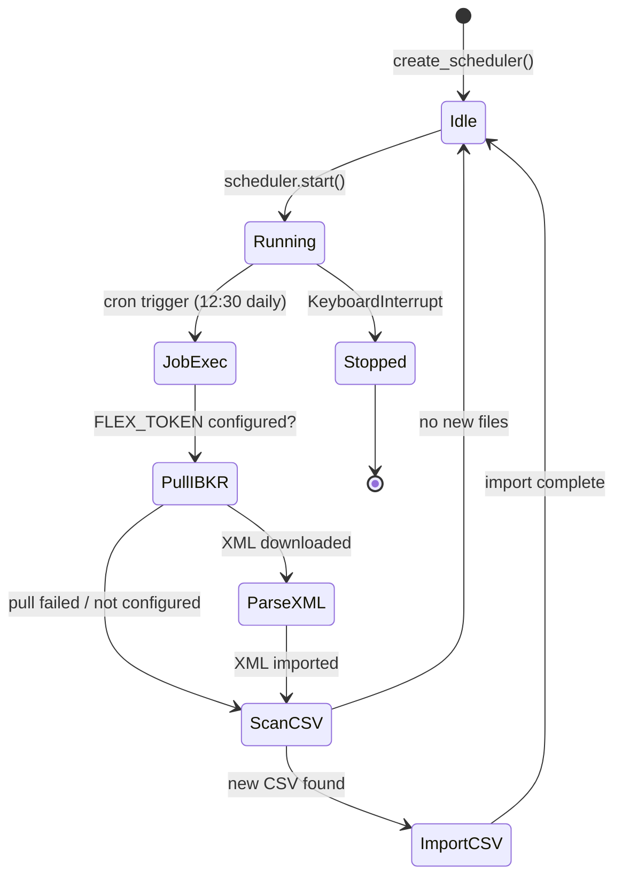

# Scheduler

The worker uses **APScheduler** (Advanced Python Scheduler) to run the daily incremental import job automatically. The scheduler runs as a background daemon thread.

## APScheduler Setup

**File:** `worker/core/scheduler.py`

```python
from apscheduler.schedulers.background import BackgroundScheduler
from worker.core.config import get_settings
from worker.jobs.daily_incremental_job import run_daily_incremental_job

def create_scheduler() -> BackgroundScheduler:
    settings = get_settings()
    tz = ZoneInfo(settings.scheduler_timezone)

    scheduler = BackgroundScheduler(timezone=tz)
    scheduler.add_job(
        run_daily_incremental_job,
        trigger="cron",
        hour=settings.scheduler_hour,
        minute=settings.scheduler_minute,
        id="daily_incremental_job",
        replace_existing=True,
    )
    return scheduler
```

The scheduler uses a **cron trigger** with configurable hour, minute, and timezone.

## Starting the Scheduler

From the CLI:

```bash
python -m worker.main run-scheduler
```

This starts the scheduler and keeps the main thread alive:

```python
scheduler.start()
try:
    while True:
        time.sleep(60)
except (KeyboardInterrupt, SystemExit):
    scheduler.shutdown(wait=False)
```

## Daily Incremental Job

**File:** `worker/jobs/daily_incremental_job.py`

The `run_daily_incremental_job()` function is the main scheduled task. It performs three steps:

### Step 1: Pull from IBKR (Auto-Pull)

If `FLEX_TOKEN` is configured, the job:

1. Creates a `FlexClient` instance.
2. Iterates over configured query IDs (default: `["1532356", "1532359"]`).
3. Downloads each Flex statement as XML.
4. Saves the XML to `data_dir` (e.g., `data/flex_exports/ibkr_flex_1532356_latest.xml`).
5. Parses the XML and imports into SQLite.

```python
def _pull_from_ibkr(flex_client: FlexClient, data_dir: Path) -> list[Path]:
    settings = get_settings()
    query_ids = DEFAULT_QUERY_IDS

    saved_files = []
    for query_id in query_ids:
        save_path = data_dir / f"ibkr_flex_{query_id}_latest.xml"
        flex_client.download_flex_statement(query_id, save_path)
        saved_files.append(save_path)
    return saved_files
```

### Step 2: Scan for CSV Files

After pulling from IBKR, the job scans `data_dir` for CSV files that have not been imported yet:

```python
imported_names = _get_imported_files(data_dir)
csv_files = sorted(data_dir.glob("*.csv"))

for csv_file in csv_files:
    if csv_file.name in imported_names:
        continue  # Skip already imported
    counts = import_daily_snapshot_file(writer, csv_file)
    _mark_imported(data_dir, csv_file.name)
```

### Step 3: Import Each File

Each file (XML or CSV) goes through the pipeline:

1. **Parse** -- Extract sections/rows from the raw format.
2. **Transform** -- Convert to normalized SQLite-ready dicts.
3. **Write** -- Upsert into the SQLite database.

## File Tracking (`imported_files.txt`)

To avoid re-importing the same CSV file on every scheduler run, the worker maintains a tracking file:

**Location:** `<data_dir>/imported_files.txt`

**Format:** One filename per line:

```
flex_export_2025-06-01.csv
flex_export_2025-06-02.csv
```

### Reading the Tracking File

```python
def _get_imported_files(data_dir: Path) -> set[str]:
    log_path = data_dir / IMPORTED_FILES_LOG
    if not log_path.exists():
        return set()
    return {
        line.strip()
        for line in log_path.read_text(encoding="utf-8").splitlines()
        if line.strip()
    }
```

### Marking a File as Imported

```python
def _mark_imported(data_dir: Path, file_name: str) -> None:
    log_path = data_dir / IMPORTED_FILES_LOG
    with log_path.open("a", encoding="utf-8") as f:
        f.write(file_name + "\n")
```

:::tip
XML files pulled from IBKR are overwritten on each run (same filename: `ibkr_flex_<query_id>_latest.xml`). They are still tracked in `imported_files.txt` to avoid re-parsing if the pull succeeds but the import fails partway through.
:::

## Configuration

| Variable | Default | Description |
|----------|---------|-------------|
| `SCHEDULER_ENABLED` | `true` | Enable/disable the scheduler. |
| `SCHEDULER_HOUR` | `12` | Hour to run the daily job (24h format). |
| `SCHEDULER_MINUTE` | `30` | Minute to run the daily job. |
| `SCHEDULER_TIMEZONE` | `Asia/Shanghai` | Timezone for the cron schedule. |
| `DATA_DIR` | `data/flex_exports` | Directory for Flex CSV/XML files and tracking. |

## Scheduler Lifecycle



## Manual Operations

### One-Shot Scan

Run the import job once without starting the scheduler:

```bash
python -m worker.main scan
```

### Single File Import

Import a specific CSV file:

```bash
python -m worker.main import /path/to/my_export.csv
```

### Initialize Database

Create the SQLite tables without importing any data:

```bash
python -m worker.main init-db
```

:::info
The `init-db` command is idempotent -- it uses `CREATE TABLE IF NOT EXISTS`, so it is safe to run multiple times.
:::

## Docker Usage

When running in Docker, the scheduler is typically the worker's main process:

```dockerfile
CMD ["python", "-m", "worker.main", "run-scheduler"]
```

The `data_dir` should be mounted as a volume so that CSV files can be dropped in manually and the tracking file persists across container restarts:

```yaml
volumes:
  - ./data:/app/data
```
